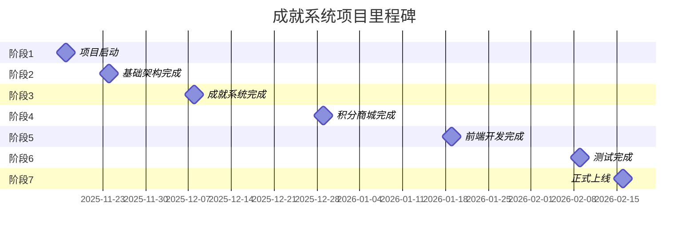
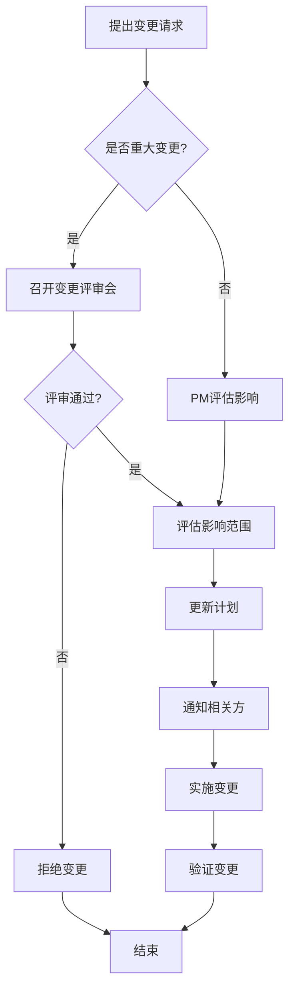

# 成就系统与积分系统 - 实施计划

## 文档信息
- **版本**: v1.0
- **创建日期**: 2025-11-09
- **项目周期**: 14周（约3.5个月）
- **预计开始**: 2025-11-11
- **预计结束**: 2026-02-21
- **关联文档**:
  - ACHIEVEMENT_SYSTEM_DESIGN.md
  - ACHIEVEMENT_TRIGGER_MECHANISM.md

---

## 目录
1. [项目概述](#1-项目概述)
2. [项目组织](#2-项目组织)
3. [项目分解结构 (WBS)](#3-项目分解结构-wbs)
4. [详细实施计划](#4-详细实施计划)
5. [资源需求与分配](#5-资源需求与分配)
6. [里程碑与交付物](#6-里程碑与交付物)
7. [风险管理计划](#7-风险管理计划)
8. [质量保证计划](#8-质量保证计划)
9. [变更管理](#9-变更管理)
10. [项目监控](#10-项目监控)

---

## 1. 项目概述

### 1.1 项目目标

**总体目标**：
为贵阳市小学生测评平台开发一套完整的成就系统和积分系统，通过游戏化机制激发学生学习兴趣，提升平台活跃度和用户满意度。

**具体目标**：
- ✅ 实现100+个成就的规则配置和触发检测
- ✅ 搭建完整的积分获得、管理、消费体系
- ✅ 开发积分商城，支持20+种奖励商品
- ✅ 建立日常任务系统，培养学习习惯
- ✅ 实现多维度排行榜系统
- ✅ 提升平台DAU 30%、学习时长40%

### 1.2 项目范围

**包含内容**：
- 成就系统（定义、触发、颁发、展示）
- 积分系统（获得、管理、消费、统计）
- 积分商城（商品管理、兑换流程、订单管理）
- 日常任务系统（任务定义、进度跟踪、奖励发放）
- 排行榜系统（多维度排名、奖励机制）
- 管理后台（规则配置、数据统计、运营工具）

**不包含内容**：
- 第三方平台数据对接（后续阶段）
- 移动端原生APP（后续阶段）
- AI智能推荐（后续阶段）
- 社交互动功能增强（后续阶段）

### 1.3 成功标准

| 维度 | 指标 | 目标值 | 验收标准 |
|------|------|--------|---------|
| 功能完整性 | 功能实现率 | 100% | 所有设计功能已实现 |
| 系统性能 | 接口响应时间 | <500ms | 95%的请求在500ms内响应 |
| 系统性能 | 并发处理能力 | 1000+用户 | 支持1000用户同时在线 |
| 数据准确性 | 成就触发准确率 | 99.9% | 无误触发或漏触发 |
| 数据准确性 | 积分计算准确率 | 100% | 积分计算无误差 |
| 用户体验 | 成就获得反馈延迟 | <3秒 | 实时成就3秒内通知 |
| 业务效果 | DAU提升 | +30% | 对比上线前3个月 |
| 业务效果 | 学习时长提升 | +40% | 对比上线前平均值 |

---

## 2. 项目组织

### 2.1 项目团队

**核心团队** (7人)

| 角色 | 姓名 | 工作量 | 主要职责 |
|------|------|--------|---------|
| 项目经理 | PM | 100% | 项目整体协调、进度控制、风险管理 |
| 后端负责人 | 后端Leader | 100% | 后端架构设计、核心模块开发、代码审查 |
| 后端开发1 | 后端Dev1 | 100% | 成就系统、事件总线开发 |
| 后端开发2 | 后端Dev2 | 100% | 积分系统、商城系统开发 |
| 前端负责人 | 前端Leader | 100% | 前端架构设计、UI组件开发、代码审查 |
| 前端开发 | 前端Dev | 100% | 页面开发、交互实现 |
| UI设计师 | UI Designer | 60% | 界面设计、成就图标设计 |
| 测试工程师 | QA | 100% | 测试用例设计、功能测试、性能测试 |

**支持团队**

| 角色 | 参与度 | 职责 |
|------|--------|------|
| DBA | 20% | 数据库设计审查、性能优化 |
| 运维工程师 | 20% | 服务器配置、部署支持 |
| 产品经理 | 40% | 需求确认、用户体验优化 |

### 2.2 沟通机制

**会议安排**：

| 会议类型 | 频率 | 参与人 | 时长 | 目的 |
|---------|------|--------|------|------|
| 项目启动会 | 1次 | 全员 | 2小时 | 项目介绍、目标对齐 |
| 每日站会 | 每日 | 开发团队 | 15分钟 | 同步进度、解决阻塞 |
| 周例会 | 每周 | 全员 | 1小时 | 周总结、下周计划 |
| 设计评审会 | 按需 | 技术团队 | 1-2小时 | 技术方案评审 |
| 演示会 | 双周 | 全员+产品 | 1小时 | 功能演示、反馈收集 |
| 复盘会 | 项目结束 | 全员 | 2小时 | 总结经验教训 |

**沟通工具**：
- 即时通讯：微信/钉钉
- 项目管理：Jira/Trello
- 文档协作：腾讯文档/Notion
- 代码协作：Git/GitHub
- 设计协作：Figma/蓝湖

---

## 3. 项目分解结构 (WBS)

```
成就系统与积分系统项目
├─ 1. 项目启动阶段 (第1周)
│  ├─ 1.1 项目启动会
│  ├─ 1.2 技术方案评审
│  ├─ 1.3 开发环境搭建
│  └─ 1.4 数据库设计确认
│
├─ 2. 基础架构阶段 (第2周)
│  ├─ 2.1 数据库表设计与创建
│  ├─ 2.2 后端API基础框架
│  ├─ 2.3 事件总线实现
│  └─ 2.4 Redis缓存配置
│
├─ 3. 成就系统开发 (第3-4周)
│  ├─ 3.1 成就规则引擎
│  ├─ 3.2 实时触发检测
│  ├─ 3.3 定时扫描引擎
│  ├─ 3.4 成就颁发服务
│  └─ 3.5 成就进度跟踪
│
├─ 4. 积分系统开发 (第5周)
│  ├─ 4.1 积分账户管理
│  ├─ 4.2 积分交易引擎
│  ├─ 4.3 积分有效期管理
│  └─ 4.4 积分统计服务
│
├─ 5. 商城系统开发 (第6周)
│  ├─ 5.1 商品管理模块
│  ├─ 5.2 兑换流程实现
│  ├─ 5.3 订单管理系统
│  └─ 5.4 库存管理
│
├─ 6. 日常任务系统 (第7周)
│  ├─ 6.1 任务定义管理
│  ├─ 6.2 任务重置机制
│  ├─ 6.3 任务进度跟踪
│  └─ 6.4 任务奖励发放
│
├─ 7. 前端开发 - 学生端 (第8-9周)
│  ├─ 7.1 成就展示厅
│  ├─ 7.2 积分中心
│  ├─ 7.3 积分商城
│  ├─ 7.4 日常任务面板
│  ├─ 7.5 成就获得动效
│  └─ 7.6 排行榜页面
│
├─ 8. 前端开发 - 管理端 (第10周)
│  ├─ 8.1 成就管理后台
│  ├─ 8.2 商城管理后台
│  ├─ 8.3 数据统计大屏
│  └─ 8.4 规则配置器
│
├─ 9. 成就内容设计 (第11周)
│  ├─ 9.1 设计100个成就
│  ├─ 9.2 配置触发规则
│  ├─ 9.3 设计成就图标
│  └─ 9.4 测试成就触发
│
├─ 10. 测试阶段 (第12-13周)
│  ├─ 10.1 单元测试
│  ├─ 10.2 API测试
│  ├─ 10.3 E2E测试
│  ├─ 10.4 性能测试
│  ├─ 10.5 安全测试
│  └─ 10.6 Bug修复
│
└─ 11. 上线准备 (第14周)
   ├─ 11.1 数据迁移
   ├─ 11.2 生产环境部署
   ├─ 11.3 用户培训
   ├─ 11.4 运营活动策划
   └─ 11.5 正式上线
```

---

## 4. 详细实施计划

### 第1周：项目启动阶段 (11/11 - 11/17)

**目标**：明确项目目标，完成技术方案设计，搭建开发环境

#### 周一 (11/11)
- [ ] **AM** 项目启动会（2小时）
  - 项目背景和目标介绍
  - 团队成员介绍和职责分工
  - 开发规范和流程说明
  - 工具和环境介绍
- [ ] **PM** 技术方案初步设计
  - 后端：架构设计、技术栈选型
  - 前端：组件规划、状态管理方案

#### 周二 (11/12)
- [ ] **全天** 详细设计评审会（4小时）
  - 数据库表结构设计评审
  - API接口设计评审
  - 前端组件设计评审
  - 性能和安全设计评审

#### 周三-周四 (11/13-11/14)
- [ ] 开发环境搭建
  - [ ] Git仓库创建和分支策略
  - [ ] 开发服务器配置
  - [ ] Redis服务器配置
  - [ ] 测试环境准备
- [ ] 项目框架搭建
  - [ ] 后端项目初始化
  - [ ] 前端项目初始化
  - [ ] CI/CD流程配置

#### 周五 (11/15)
- [ ] 数据库设计确认
  - [ ] 数据库ER图绘制
  - [ ] SQL脚本编写
  - [ ] 数据库创建和初始化
- [ ] 第一周总结会

**交付物**：
- ✅ 项目启动文档
- ✅ 技术方案设计文档
- ✅ 数据库设计文档（ER图 + SQL）
- ✅ 开发环境就绪

---

### 第2周：基础架构阶段 (11/18 - 11/24)

**目标**：搭建系统基础架构，完成核心基础服务

#### 任务清单

**后端 - 数据库层**
- [ ] **周一** 创建所有数据表
  - [ ] `achievements` 成就定义表
  - [ ] `student_achievements` 学生成就记录表
  - [ ] `achievement_progress` 成就进度表
  - [ ] `achievement_rule_versions` 规则版本表
  - [ ] `student_points` 学生积分账户表
  - [ ] `points_transactions` 积分交易明细表
  - [ ] `points_shop_items` 商城商品表
  - [ ] `redemption_orders` 兑换订单表
  - [ ] `daily_tasks` 日常任务定义表
  - [ ] `student_daily_tasks` 学生任务完成记录表
  - [ ] `leaderboards` 排行榜缓存表
- [ ] **周一** 创建索引和约束
- [ ] **周二** 编写数据库迁移脚本
- [ ] **周二** 准备种子数据（测试用）

**后端 - API基础框架**
- [ ] **周二-周三** 基础服务搭建
  - [ ] 数据库连接池配置
  - [ ] Redis客户端配置
  - [ ] JWT认证中间件（复用现有）
  - [ ] 错误处理中间件
  - [ ] 日志服务配置
- [ ] **周三-周四** 事件总线实现
  - [ ] EventBus类实现
  - [ ] 事件发布/订阅机制
  - [ ] 事件持久化（可选）
  - [ ] 事件总线测试
- [ ] **周四-周五** 缓存服务
  - [ ] Redis缓存工具类
  - [ ] 规则缓存管理器
  - [ ] 缓存预热机制
  - [ ] 缓存失效策略

**交付物**：
- ✅ 数据库表全部创建完成
- ✅ 事件总线服务就绪
- ✅ 缓存服务就绪
- ✅ 基础框架代码审查通过

---

### 第3-4周：成就系统核心开发 (11/25 - 12/08)

**目标**：完成成就系统的核心功能

#### 第3周任务 (11/25 - 12/01)

**后端 - 成就规则引擎**
- [ ] **周一** 规则定义和存储
  - [ ] Achievement模型类
  - [ ] 规则JSON Schema验证
  - [ ] 规则CRUD接口
- [ ] **周二** 规则解析器
  - [ ] 条件类型解析器（count/threshold/state/and/or）
  - [ ] 公式计算器
  - [ ] 变量提取和替换
- [ ] **周三** 规则缓存优化
  - [ ] 按事件类型索引规则
  - [ ] 规则预加载
  - [ ] 缓存失效通知

**后端 - 实时触发检测**
- [ ] **周四** RealtimeAchievementDetector类
  - [ ] 事件监听器注册
  - [ ] 规则匹配逻辑
  - [ ] 条件检测实现
- [ ] **周五** 条件检测器
  - [ ] checkStateCondition
  - [ ] checkCountCondition
  - [ ] checkThresholdCondition
  - [ ] checkAndCondition / checkOrCondition

#### 第4周任务 (12/02 - 12/08)

**后端 - 定时扫描引擎**
- [ ] **周一** ScheduledAchievementDetector类
  - [ ] Cron任务配置（node-cron）
  - [ ] 每日扫描任务
  - [ ] 每周扫描任务
  - [ ] 每月扫描任务
- [ ] **周二** 批量处理逻辑
  - [ ] 获取待检测学生列表
  - [ ] 批量处理（100人/批）
  - [ ] 并发控制
- [ ] **周三** 复杂条件检测
  - [ ] checkConsecutive（连续性）
  - [ ] checkComparison（比较计算）
  - [ ] evaluateFormula（公式计算）

**后端 - 成就颁发服务**
- [ ] **周四** AchievementService类
  - [ ] award() 颁发成就方法
  - [ ] 防重复检查
  - [ ] 事务处理
  - [ ] 积分奖励集成
- [ ] **周五** 进度跟踪
  - [ ] updateProgress() 更新进度
  - [ ] getProgress() 查询进度
  - [ ] 进度百分比计算

**API接口开发**
- [ ] **周五** 成就相关API
  - [ ] `GET /api/achievements` - 获取成就列表
  - [ ] `GET /api/achievements/:id` - 获取成就详情
  - [ ] `GET /api/students/:id/achievements` - 获取学生成就
  - [ ] `GET /api/students/:id/achievements/progress` - 获取进度
  - [ ] `POST /api/achievements` - 创建成就（管理员）
  - [ ] `PUT /api/achievements/:id` - 更新成就（管理员）
  - [ ] `POST /api/achievements/:id/test` - 测试规则（管理员）

**集成测试**
- [ ] **周末** 成就触发端到端测试
  - [ ] 实时触发测试
  - [ ] 定时触发测试
  - [ ] 边界条件测试

**交付物**：
- ✅ 成就规则引擎完成
- ✅ 实时触发检测完成
- ✅ 定时扫描引擎完成
- ✅ 成就颁发服务完成
- ✅ 成就API全部完成
- ✅ 集成测试通过

---

### 第5周：积分系统开发 (12/09 - 12/15)

**目标**：完成积分系统的全部功能

#### 任务清单

**后端 - 积分账户管理**
- [ ] **周一** PointsService类
  - [ ] StudentPoints模型
  - [ ] 积分账户初始化
  - [ ] addPoints() 增加积分
  - [ ] deductPoints() 扣除积分
  - [ ] freezePoints() 冻结积分
  - [ ] unfreezePoints() 解冻积分

**后端 - 积分交易引擎**
- [ ] **周二** PointsTransaction模型
  - [ ] 交易记录创建
  - [ ] 交易类型分类（achievement/task/activity/redemption）
  - [ ] 余额变动计算
  - [ ] 交易并发控制（乐观锁）

**后端 - 积分有效期管理**
- [ ] **周三** 有效期服务
  - [ ] 积分过期检测（定时任务）
  - [ ] 过期积分自动清零
  - [ ] 过期提醒通知（30天/7天）

**后端 - 积分统计服务**
- [ ] **周四** 统计服务
  - [ ] 学生积分统计（当前/总计/已消费）
  - [ ] 班级积分统计
  - [ ] 学校积分统计
  - [ ] 积分来源分析

**API接口开发**
- [ ] **周五** 积分相关API
  - [ ] `GET /api/students/:id/points` - 获取积分余额
  - [ ] `GET /api/students/:id/points/transactions` - 积分明细
  - [ ] `GET /api/students/:id/points/stats` - 积分统计
  - [ ] `POST /api/points/award` - 手动奖励积分（教师）

**单元测试**
- [ ] **周五** 积分系统单元测试
  - [ ] 积分计算测试
  - [ ] 并发扣积分测试
  - [ ] 有效期测试

**交付物**：
- ✅ 积分账户管理完成
- ✅ 积分交易引擎完成
- ✅ 积分有效期管理完成
- ✅ 积分统计服务完成
- ✅ 积分API全部完成
- ✅ 单元测试通过

---

### 第6周：商城系统开发 (12/16 - 12/22)

**目标**：完成积分商城的全部功能

#### 任务清单

**后端 - 商品管理模块**
- [ ] **周一** ShopItem模型
  - [ ] 商品CRUD操作
  - [ ] 商品分类管理
  - [ ] 商品上下架
  - [ ] 商品搜索和筛选

**后端 - 兑换流程**
- [ ] **周二-周三** RedemptionService类
  - [ ] 兑换前检查（积分/库存）
  - [ ] 创建订单
  - [ ] 冻结积分
  - [ ] 扣减库存
  - [ ] 扣除积分
  - [ ] 发放虚拟奖励
  - [ ] 事务处理

**后端 - 订单管理**
- [ ] **周四** RedemptionOrder模型
  - [ ] 订单状态管理（pending/processing/shipped/completed/cancelled）
  - [ ] 订单查询
  - [ ] 订单取消（退积分/退库存）
  - [ ] 订单完成

**后端 - 库存管理**
- [ ] **周五** StockService类
  - [ ] 库存查询
  - [ ] 库存扣减（乐观锁）
  - [ ] 库存补充
  - [ ] 库存预警

**API接口开发**
- [ ] **周五** 商城相关API
  - [ ] `GET /api/shop/items` - 获取商品列表
  - [ ] `GET /api/shop/items/:id` - 获取商品详情
  - [ ] `POST /api/shop/items` - 创建商品（管理员）
  - [ ] `PUT /api/shop/items/:id` - 更新商品（管理员）
  - [ ] `POST /api/shop/redeem` - 兑换商品
  - [ ] `GET /api/students/:id/orders` - 获取兑换订单
  - [ ] `PUT /api/orders/:id/cancel` - 取消订单

**交付物**：
- ✅ 商品管理模块完成
- ✅ 兑换流程完成
- ✅ 订单管理完成
- ✅ 库存管理完成
- ✅ 商城API全部完成

---

### 第7周：日常任务系统 (12/23 - 12/29)

**目标**：完成日常任务系统

#### 任务清单

**后端 - 任务定义管理**
- [ ] **周一** DailyTask模型
  - [ ] 任务CRUD操作
  - [ ] 任务触发条件配置
  - [ ] 任务奖励配置

**后端 - 任务重置机制**
- [ ] **周二** TaskResetService
  - [ ] 每日凌晨重置任务
  - [ ] 生成当日任务记录
  - [ ] 重置进度

**后端 - 任务进度跟踪**
- [ ] **周三** TaskProgressService
  - [ ] 任务进度更新
  - [ ] 任务完成检测
  - [ ] 全勤奖励检测

**后端 - 任务奖励发放**
- [ ] **周四** TaskRewardService
  - [ ] 任务完成奖励
  - [ ] 全勤额外奖励
  - [ ] 连续完成加成

**API接口开发**
- [ ] **周五** 任务相关API
  - [ ] `GET /api/students/:id/tasks/daily` - 获取今日任务
  - [ ] `POST /api/tasks/:id/complete` - 完成任务
  - [ ] `GET /api/tasks` - 获取任务列表（管理员）
  - [ ] `POST /api/tasks` - 创建任务（管理员）

**交付物**：
- ✅ 任务定义管理完成
- ✅ 任务重置机制完成
- ✅ 任务进度跟踪完成
- ✅ 任务奖励发放完成
- ✅ 任务API全部完成

---

### 第8-9周：前端开发 - 学生端 (12/30 - 01/12)

**目标**：完成学生端所有界面和交互

#### 第8周任务 (12/30 - 01/05)

**前端 - 成就展示厅**
- [ ] **周一-周二** AchievementGallery组件
  - [ ] 成就列表展示
  - [ ] 分类筛选（全部/测评/学习/社交/特殊）
  - [ ] 成就卡片组件
  - [ ] 已获得/进行中/未解锁状态
  - [ ] 进度条展示
  - [ ] 成就详情弹窗

**前端 - 积分中心**
- [ ] **周三** PointsCenter组件
  - [ ] 积分余额展示
  - [ ] 积分统计卡片（当前/总计/已消费）
  - [ ] 最近积分记录列表
  - [ ] 积分明细页面
  - [ ] 积分来源分析图表

**前端 - 积分商城**
- [ ] **周四-周五** PointsShop组件
  - [ ] 商品列表展示
  - [ ] 商品分类筛选
  - [ ] 商品搜索
  - [ ] 商品详情页
  - [ ] 兑换确认弹窗
  - [ ] 兑换成功动效

#### 第9周任务 (01/06 - 01/12)

**前端 - 日常任务面板**
- [ ] **周一** DailyTaskPanel组件
  - [ ] 今日任务列表
  - [ ] 任务进度展示
  - [ ] 任务完成状态
  - [ ] 全勤奖励提示
  - [ ] 快速跳转按钮

**前端 - 成就获得动效**
- [ ] **周二** AchievementPopup组件
  - [ ] 普通/稀有成就弹窗
  - [ ] 史诗成就动画效果
  - [ ] 传说/神话全屏庆祝动画
  - [ ] 分享功能
  - [ ] 音效配合

**前端 - 排行榜页面**
- [ ] **周三** Leaderboard组件
  - [ ] 排行榜类型切换（全校/班级/周榜/月榜）
  - [ ] 排名列表展示
  - [ ] 自己的排名高亮
  - [ ] 奖励说明

**前端 - 个人主页整合**
- [ ] **周四** Profile页面增强
  - [ ] 成就墙（展示精选成就）
  - [ ] 积分概览
  - [ ] 学习统计
  - [ ] 成长曲线图

**前端 - Redux状态管理**
- [ ] **周五** 状态管理
  - [ ] achievementsSlice
  - [ ] pointsSlice
  - [ ] tasksSlice
  - [ ] shopSlice

**交付物**：
- ✅ 成就展示厅完成
- ✅ 积分中心完成
- ✅ 积分商城完成
- ✅ 日常任务面板完成
- ✅ 成就获得动效完成
- ✅ 排行榜页面完成
- ✅ 状态管理完成

---

### 第10周：前端开发 - 管理端 (01/13 - 01/19)

**目标**：完成管理后台所有功能

#### 任务清单

**前端 - 成就管理后台**
- [ ] **周一-周二** AchievementManagement组件
  - [ ] 成就列表页
  - [ ] 成就创建/编辑表单
  - [ ] 规则可视化配置器
  - [ ] 规则测试器
  - [ ] 成就预览

**前端 - 商城管理后台**
- [ ] **周三** ShopManagement组件
  - [ ] 商品列表页
  - [ ] 商品创建/编辑表单
  - [ ] 订单管理页
  - [ ] 库存管理
  - [ ] 兑换统计

**前端 - 数据统计大屏**
- [ ] **周四** DataDashboard组件
  - [ ] 成就统计图表
  - [ ] 积分统计图表
  - [ ] 用户活跃度分析
  - [ ] 热门成就TOP10
  - [ ] 商城销售统计

**前端 - 规则配置器**
- [ ] **周五** RuleConfigurator组件
  - [ ] 触发配置表单
  - [ ] 条件配置表单
  - [ ] 奖励配置表单
  - [ ] JSON预览
  - [ ] 模板选择

**交付物**：
- ✅ 成就管理后台完成
- ✅ 商城管理后台完成
- ✅ 数据统计大屏完成
- ✅ 规则配置器完成

---

### 第11周：成就内容设计 (01/20 - 01/26)

**目标**：设计和配置100个初始成就

#### 任务分工

**测评认证类成就 (40个) - 后端Dev1**
- [ ] **周一** 设计首次突破类成就 (15个)
  - 首次通过1级、2级...7级认证
  - 首次获得满分
  - 首次完成测评
  - 等...
- [ ] **周二** 设计连续成功类成就 (10个)
  - 连续通过3次、5次、10次认证
  - 连续3次满分
  - 等...
- [ ] **周三** 设计速度效率类成就 (8个)
  - 速通大师、极速答题
  - 等...
- [ ] **周四** 设计全面发展类成就 (7个)
  - 全科学霸、均衡发展
  - 等...

**学习成长类成就 (35个) - 后端Dev2**
- [ ] **周一** 设计学习时长类成就 (12个)
  - 累计学习10小时、50小时、100小时...1000小时
  - 单日学习4小时
  - 等...
- [ ] **周二** 设计学习频次类成就 (10个)
  - 连续登录7天、30天、100天
  - 本月登录20天
  - 等...
- [ ] **周三** 设计学习质量类成就 (8个)
  - 练习正确率90%
  - 知识点掌握度95%
  - 等...
- [ ] **周四** 设计持续进步类成就 (5个)
  - 进步之星、超越自我
  - 等...

**社交协作类成就 (15个) - 前端Leader**
- [ ] **周一** 设计助人为乐类成就 (8个)
  - 帮助50人、100人
  - 分享达人
  - 等...
- [ ] **周二** 设计团队协作类成就 (7个)
  - 团队之星、班级荣誉
  - 等...

**特殊事件类成就 (10个) - UI Designer**
- [ ] **周三** 设计节日成就 (6个)
  - 新年新气象、中秋团圆
  - 等...
- [ ] **周四** 设计探索成就 (4个)
  - 隐藏探索者、幸运儿
  - 等...

**成就图标设计 - UI Designer**
- [ ] **周一-周五** 设计100个成就图标
  - 不同稀有度的视觉风格
  - 动态效果设计
  - 切图和导出

**成就配置和测试 - 全员**
- [ ] **周五** 配置所有成就规则
  - 导入成就到数据库
  - 配置触发条件
  - 测试成就触发
  - 调整参数

**交付物**：
- ✅ 100个成就设计完成
- ✅ 100个成就图标完成
- ✅ 所有成就配置完成
- ✅ 成就触发测试通过

---

### 第12-13周：测试阶段 (01/27 - 02/09)

**目标**：全面测试，确保质量

#### 第12周任务 (01/27 - 02/02)

**单元测试**
- [ ] **周一** 后端单元测试（后端团队）
  - [ ] 成就规则引擎测试
  - [ ] 积分计算测试
  - [ ] 商城兑换测试
  - [ ] 任务系统测试
  - [ ] 目标覆盖率：80%+

**API测试**
- [ ] **周二-周三** API集成测试（QA + 后端）
  - [ ] 编写API测试用例
  - [ ] 测试所有API接口
  - [ ] 边界条件测试
  - [ ] 异常处理测试
  - [ ] 并发测试

**E2E测试**
- [ ] **周四-周五** E2E测试（QA + 前端）
  - [ ] 编写E2E测试用例
  - [ ] 学生端完整流程测试
  - [ ] 管理端功能测试
  - [ ] 跨浏览器测试

#### 第13周任务 (02/03 - 02/09)

**性能测试**
- [ ] **周一** 压力测试（QA + 运维）
  - [ ] 并发用户测试（目标1000用户）
  - [ ] 接口响应时间测试（目标<500ms）
  - [ ] 数据库查询优化
  - [ ] 缓存效果验证

**安全测试**
- [ ] **周二** 安全扫描（QA）
  - [ ] SQL注入测试
  - [ ] XSS攻击测试
  - [ ] CSRF防护测试
  - [ ] 权限控制测试
  - [ ] 积分作弊防护测试

**兼容性测试**
- [ ] **周三** 多端测试（QA）
  - [ ] Chrome/Firefox/Safari/Edge
  - [ ] PC/平板/手机
  - [ ] 不同分辨率

**Bug修复**
- [ ] **周四-周五** Bug修复（全员）
  - [ ] 按优先级修复Bug
  - [ ] 回归测试
  - [ ] 代码审查

**交付物**：
- ✅ 单元测试覆盖率80%+
- ✅ API测试全部通过
- ✅ E2E测试全部通过
- ✅ 性能测试达标
- ✅ 安全测试通过
- ✅ 兼容性测试通过
- ✅ 所有严重Bug修复

---

### 第14周：上线准备 (02/10 - 02/16)

**目标**：完成上线准备，正式发布

#### 任务清单

**数据准备**
- [ ] **周一** 数据迁移（后端团队）
  - [ ] 编写数据迁移脚本
  - [ ] 测试环境数据迁移
  - [ ] 生产环境数据准备
  - [ ] 初始成就数据导入

**部署准备**
- [ ] **周二** 生产环境部署（运维 + 后端）
  - [ ] 服务器配置检查
  - [ ] 数据库备份
  - [ ] Redis配置
  - [ ] Nginx配置
  - [ ] SSL证书配置
  - [ ] 代码部署

**用户培训**
- [ ] **周三** 培训材料准备（PM + 产品）
  - [ ] 学生使用手册
  - [ ] 教师使用手册
  - [ ] 管理员使用手册
  - [ ] 视频教程录制
- [ ] **周三** 培训会议
  - [ ] 教师培训（1小时）
  - [ ] 管理员培训（2小时）

**运营活动策划**
- [ ] **周四** 上线活动（PM + 产品）
  - [ ] 新人福利活动
  - [ ] 首周积分双倍活动
  - [ ] 限时成就活动
  - [ ] 宣传海报和文案

**灰度发布**
- [ ] **周五** 小范围试运行
  - [ ] 开放10%用户访问
  - [ ] 监控系统运行
  - [ ] 收集用户反馈
  - [ ] 快速修复问题

**正式上线**
- [ ] **周日晚** 全量发布
  - [ ] 所有用户开放
  - [ ] 系统监控
  - [ ] 值班安排

**交付物**：
- ✅ 生产环境部署完成
- ✅ 用户培训完成
- ✅ 运营活动就绪
- ✅ 系统正式上线

---

## 5. 资源需求与分配

### 5.1 人力资源

**总工作量估算**：

| 角色 | 周投入 | 总周数 | 总人天 |
|------|--------|--------|--------|
| 项目经理 | 5天 | 14周 | 70天 |
| 后端Leader | 5天 | 14周 | 70天 |
| 后端Dev1 | 5天 | 14周 | 70天 |
| 后端Dev2 | 5天 | 14周 | 70天 |
| 前端Leader | 5天 | 14周 | 70天 |
| 前端Dev | 5天 | 14周 | 70天 |
| UI Designer | 3天 | 14周 | 42天 |
| QA | 5天 | 14周 | 70天 |
| **合计** | - | - | **532人天** |

**支持团队**：

| 角色 | 参与周数 | 周投入 | 总人天 |
|------|---------|--------|--------|
| DBA | 14周 | 1天 | 14天 |
| 运维工程师 | 14周 | 1天 | 14天 |
| 产品经理 | 14周 | 2天 | 28天 |

### 5.2 技术资源

**开发环境**：
- 开发服务器：2台（后端/前端）
- 测试服务器：2台
- 数据库服务器：1台（PostgreSQL）
- Redis服务器：1台

**生产环境**：
- 应用服务器：3台（负载均衡）
- 数据库服务器：2台（主从复制）
- Redis集群：3台
- Nginx服务器：2台

**第三方服务**：
- 云存储：OSS/S3（存储成就图标、商品图片）
- CDN：加速静态资源
- 监控服务：性能监控、日志分析

**预算估算**：
- 服务器成本：约10,000元/月
- 第三方服务：约5,000元/月
- 总计（4个月）：约60,000元

---

## 6. 里程碑与交付物

### 6.1 关键里程碑



| 里程碑 | 日期 | 验收标准 |
|--------|------|---------|
| **M1: 项目启动** | 2025-11-17 | 技术方案评审通过，开发环境就绪 |
| **M2: 基础架构完成** | 2025-11-24 | 数据库、事件总线、缓存服务就绪 |
| **M3: 成就系统完成** | 2025-12-08 | 规则引擎、触发检测、颁发服务完成 |
| **M4: 积分商城完成** | 2025-12-29 | 积分、商城、任务系统完成 |
| **M5: 前端开发完成** | 2026-01-19 | 学生端、管理端界面完成 |
| **M6: 测试完成** | 2026-02-09 | 所有测试通过，Bug修复完成 |
| **M7: 正式上线** | 2026-02-16 | 系统正式发布，运营活动启动 |

### 6.2 交付物清单

**设计阶段交付物**：
- [ ] 技术方案设计文档
- [ ] 数据库设计文档（ER图 + DDL）
- [ ] API接口设计文档
- [ ] 前端组件设计文档
- [ ] UI设计稿（Figma）

**开发阶段交付物**：
- [ ] 后端源代码
- [ ] 前端源代码
- [ ] 数据库迁移脚本
- [ ] API文档（Swagger/Postman）
- [ ] 单元测试代码
- [ ] E2E测试代码

**测试阶段交付物**：
- [ ] 测试用例文档
- [ ] 测试报告
- [ ] 性能测试报告
- [ ] 安全测试报告
- [ ] Bug列表和修复记录

**上线阶段交付物**：
- [ ] 部署文档
- [ ] 用户使用手册
- [ ] 运维手册
- [ ] 培训材料
- [ ] 上线检查清单

---

## 7. 风险管理计划

### 7.1 风险识别与应对

| 风险类别 | 风险描述 | 概率 | 影响 | 应对策略 | 责任人 |
|---------|---------|------|------|---------|--------|
| **技术风险** | 成就触发逻辑复杂，实现难度高 | 中 | 高 | 提前技术预研，分阶段实现 | 后端Leader |
| **技术风险** | 高并发下积分计算错误 | 中 | 高 | 使用事务和分布式锁，充分测试 | 后端Dev2 |
| **技术风险** | 性能不达标 | 中 | 高 | 早期性能测试，多级缓存优化 | 后端Leader |
| **技术风险** | 数据库瓶颈 | 低 | 中 | 索引优化，读写分离 | DBA |
| **进度风险** | 需求变更导致延期 | 中 | 中 | 需求冻结，变更控制流程 | PM |
| **进度风险** | 关键人员请假 | 低 | 中 | 交叉培训，备份方案 | PM |
| **进度风险** | 第三方依赖延迟 | 低 | 低 | 提前确认依赖，预留缓冲时间 | PM |
| **质量风险** | Bug率过高 | 中 | 高 | 代码审查，充分测试 | QA |
| **质量风险** | 用户体验不佳 | 中 | 中 | 早期Demo演示，收集反馈 | 前端Leader |
| **安全风险** | 积分作弊 | 中 | 高 | 风控规则，异常检测 | 后端Leader |
| **安全风险** | 数据泄露 | 低 | 高 | 权限控制，数据加密 | 后端Leader |
| **业务风险** | 成就设计不受欢迎 | 中 | 中 | 用户调研，AB测试 | 产品经理 |
| **业务风险** | 商城商品供应不足 | 中 | 中 | 建立供应商合作 | PM |

### 7.2 风险应对措施

**技术风险应对**：
1. **成就规则引擎复杂度**
   - 预防措施：提前技术预研，参考成熟方案
   - 缓解措施：分阶段实现，先简单后复杂
   - 应急措施：简化规则，后续迭代

2. **高并发积分计算**
   - 预防措施：使用数据库事务，乐观锁
   - 缓解措施：充分的并发测试
   - 应急措施：限流降级

3. **性能问题**
   - 预防措施：设计阶段考虑性能，多级缓存
   - 缓解措施：第8周开始性能测试，及时优化
   - 应急措施：扩容服务器

**进度风险应对**：
1. **需求变更**
   - 预防措施：需求评审，需求冻结（第2周后）
   - 缓解措施：变更控制流程，评估影响
   - 应急措施：调整优先级，推迟低优先级功能

2. **关键人员缺席**
   - 预防措施：交叉培训，文档完善
   - 缓解措施：任务重新分配
   - 应急措施：外部支援

**质量风险应对**：
1. **Bug率高**
   - 预防措施：代码审查制度，单元测试
   - 缓解措施：增加测试资源
   - 应急措施：延长测试时间

2. **用户体验差**
   - 预防措施：UI设计评审，用户调研
   - 缓解措施：早期Demo演示
   - 应急措施：快速迭代优化

---

## 8. 质量保证计划

### 8.1 代码质量标准

**代码规范**：
- 遵循ESLint规则
- 统一代码风格（Prettier）
- 变量命名规范
- 注释完整性

**代码审查**：
- 所有代码必须经过Code Review
- 至少1人审查通过才能合并
- 关键模块由Leader审查

**单元测试要求**：
- 核心业务逻辑覆盖率 ≥ 80%
- 关键函数必须有测试
- 边界条件测试

### 8.2 测试策略

**测试金字塔**：
```
        E2E测试 (10%)
      ────────────
     API测试 (30%)
    ────────────────
   单元测试 (60%)
  ──────────────────
```

**测试类型**：

| 测试类型 | 覆盖率目标 | 工具 | 负责人 |
|---------|-----------|------|--------|
| 单元测试 | 80% | Jest | 开发人员 |
| API测试 | 100% API | Postman/Jest | QA + 后端 |
| E2E测试 | 核心流程100% | Playwright | QA + 前端 |
| 性能测试 | 关键接口100% | JMeter | QA + 运维 |
| 安全测试 | 全面扫描 | OWASP ZAP | QA |

### 8.3 质量检查点

**每周质量检查**：
- [ ] 代码审查完成率
- [ ] 单元测试覆盖率
- [ ] 新增Bug数量
- [ ] Bug修复率
- [ ] 代码规范检查

**阶段质量门禁**：

| 阶段 | 质量门禁 | 不通过处理 |
|------|---------|-----------|
| 基础架构 | 架构设计评审通过 | 重新设计 |
| 后端开发 | 单元测试覆盖率≥80% | 补充测试 |
| 前端开发 | UI设计评审通过 | 调整设计 |
| 集成测试 | API测试100%通过 | 修复Bug |
| E2E测试 | 核心流程测试通过 | 修复Bug |
| 性能测试 | 性能指标达标 | 性能优化 |
| 上线前 | 无严重/高优先级Bug | 修复后上线 |

---

## 9. 变更管理

### 9.1 变更控制流程



### 9.2 变更分类

| 变更类型 | 定义 | 审批流程 | 示例 |
|---------|------|---------|------|
| **重大变更** | 影响架构、进度、范围 | 项目组评审会 | 架构调整、功能删减 |
| **中等变更** | 影响模块设计 | PM + Leader评估 | 接口调整、流程优化 |
| **轻微变更** | 局部优化 | PM确认 | UI调整、文案修改 |

### 9.3 变更冻结期

**需求冻结**：第2周结束后
- 不再接受新功能需求
- 仅接受Bug修复和优化

**代码冻结**：第13周结束后
- 不再接受新功能开发
- 仅接受严重Bug修复

---

## 10. 项目监控

### 10.1 进度监控

**每日监控**：
- 每日站会同步进度
- 更新任务看板（Jira/Trello）
- 识别阻塞问题

**每周监控**：
- 周例会总结进度
- 对比计划进度
- 调整下周计划

**监控指标**：

| 指标 | 计算方式 | 目标值 | 预警阈值 |
|------|---------|--------|---------|
| 任务完成率 | 已完成任务/计划任务 | 100% | <90% |
| 进度偏差 | (实际进度-计划进度)/计划进度 | 0% | ±10% |
| Bug数量 | 新增Bug-已修复Bug | 0 | >20 |
| 代码提交率 | 实际提交/计划提交 | 100% | <80% |

### 10.2 质量监控

**质量仪表板**：
- 代码覆盖率趋势
- Bug统计（新增/修复/待修复）
- 测试通过率
- 代码审查完成率

**质量报告**：
- 每周质量报告（QA）
- 每月质量总结（PM）

### 10.3 风险监控

**风险雷达**：
- 每周评估风险等级
- 高风险项重点关注
- 制定应对措施

**风险报告**：
- 风险识别和更新
- 风险应对措施执行情况
- 风险趋势分析

### 10.4 沟通监控

**沟通效率**：
- 会议准时率
- 问题响应时间
- 决策效率

**沟通质量**：
- 信息传递准确性
- 文档完整性
- 反馈及时性

---

## 11. 附录

### 11.1 缩写词汇表

| 缩写 | 全称 | 中文 |
|------|------|------|
| WBS | Work Breakdown Structure | 工作分解结构 |
| API | Application Programming Interface | 应用程序接口 |
| CRUD | Create, Read, Update, Delete | 增删改查 |
| E2E | End-to-End | 端到端 |
| PM | Project Manager | 项目经理 |
| QA | Quality Assurance | 质量保证 |
| DAU | Daily Active Users | 日活跃用户数 |
| JSON | JavaScript Object Notation | JSON数据格式 |
| SQL | Structured Query Language | 结构化查询语言 |
| UI | User Interface | 用户界面 |

### 11.2 项目关键联系人

| 角色 | 姓名 | 邮箱 | 电话 | 备注 |
|------|------|------|------|------|
| 项目经理 | [姓名] | pm@example.com | 138xxxx | 项目总负责人 |
| 后端Leader | [姓名] | backend-lead@example.com | 138xxxx | 后端技术负责人 |
| 前端Leader | [姓名] | frontend-lead@example.com | 138xxxx | 前端技术负责人 |
| 测试负责人 | [姓名] | qa@example.com | 138xxxx | 测试负责人 |
| 产品经理 | [姓名] | product@example.com | 138xxxx | 需求确认 |

### 11.3 参考文档

| 文档名称 | 位置 | 说明 |
|---------|------|------|
| 成就系统业务设计 | docs/ACHIEVEMENT_SYSTEM_DESIGN.md | 业务功能设计 |
| 成就触发机制设计 | docs/ACHIEVEMENT_TRIGGER_MECHANISM.md | 技术实现方案 |
| 数据库设计文档 | docs/DATABASE_DESIGN.md | 数据库详细设计 |
| API接口文档 | docs/API_DOCUMENT.md | API接口说明 |
| 开发规范文档 | docs/DEVELOPMENT_GUIDELINES.md | 代码规范 |

### 11.4 变更记录

| 版本 | 日期 | 变更内容 | 变更人 |
|------|------|---------|--------|
| v1.0 | 2025-11-09 | 初始版本 | PM |

---

**文档结束**

*本实施计划为成就系统和积分系统项目提供详细的执行指导，所有团队成员应严格遵守计划执行，确保项目按时高质量交付。*
