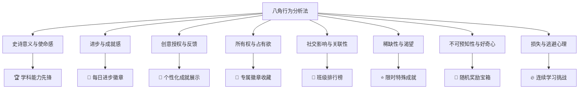
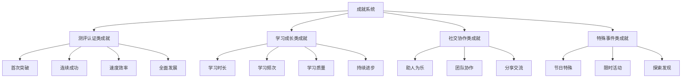
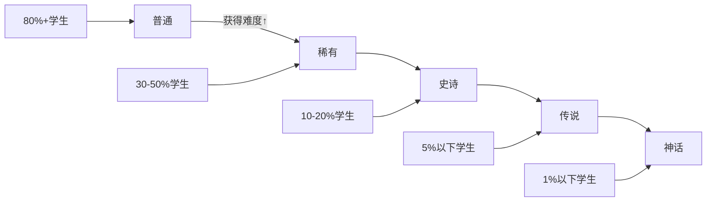
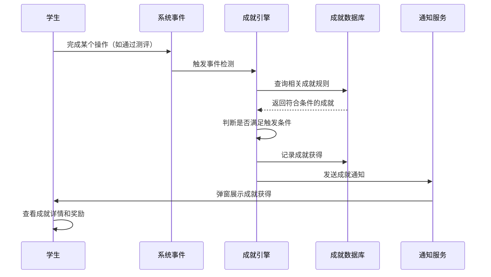
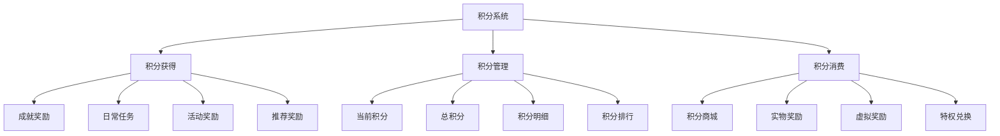
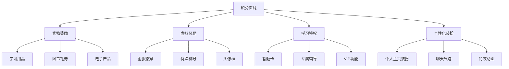
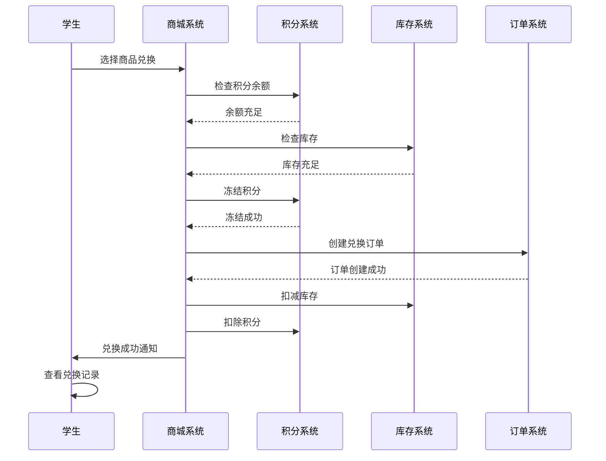
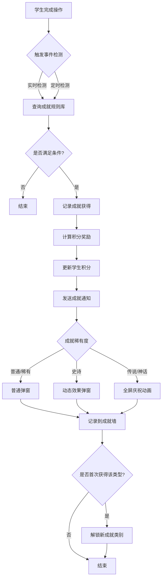
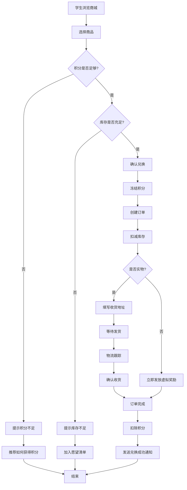
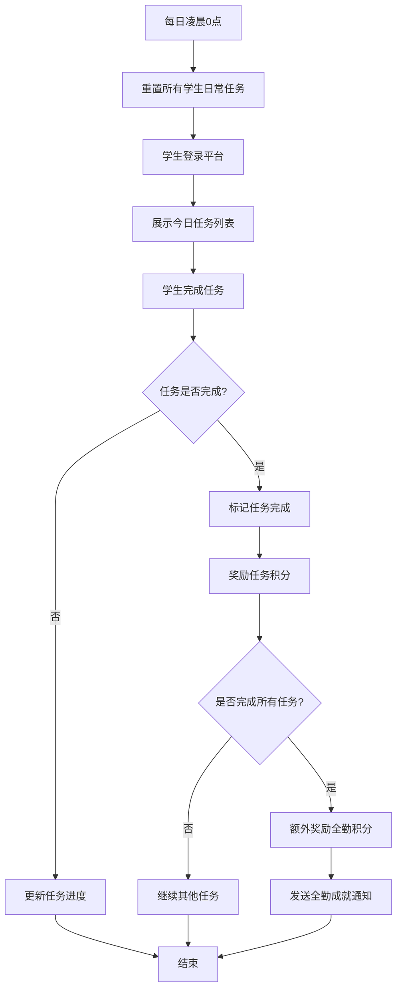

# 成就系统与积分系统 - 业务功能设计方案

## 文档信息
- **版本**: v1.0
- **创建日期**: 2025-11-09
- **文档状态**: 设计稿
- **设计目标**: 为贵阳市小学生测评平台设计游戏化激励机制

---

## 目录
1. [业务背景与目标](#1-业务背景与目标)
2. [核心设计理念](#2-核心设计理念)
3. [成就系统设计](#3-成就系统设计)
4. [积分系统设计](#4-积分系统设计)
5. [用户角色与权限](#5-用户角色与权限)
6. [业务流程设计](#6-业务流程设计)
7. [数据模型设计](#7-数据模型设计)
8. [界面交互设计](#8-界面交互设计)
9. [实施路线图](#9-实施路线图)

---

## 1. 业务背景与目标

### 1.1 业务痛点分析

**当前系统已实现**：
- ✅ 完整的测评系统（考试、评分、证书）
- ✅ 多维度数据统计分析
- ✅ 九级用户权限体系

**存在的问题**：
- ❌ 学生学习动力不足，仅依赖考试成绩驱动
- ❌ 学习过程缺乏即时反馈和正向激励
- ❌ 学生之间缺乏良性竞争和互动
- ❌ 家长和教师难以直观感受学生的进步
- ❌ 学习成果单一，仅体现在成绩和证书上

### 1.2 系统目标

**业务目标**：
1. **激发学习兴趣**：通过游戏化机制提升学生学习主动性
2. **可视化成长**：让学生、家长、教师直观看到学习进步
3. **多元化激励**：建立成绩之外的多维度激励体系
4. **培养学习习惯**：鼓励持续学习、规律学习
5. **促进良性竞争**：通过排行榜激发向上动力
6. **增强平台黏性**：提升学生使用平台的频次和时长

**核心价值主张**：
> "让每一次学习努力都被看见，让每一点进步都值得庆祝"

### 1.3 成功指标 (KPI)

| 指标类别 | 具体指标 | 目标值 | 说明 |
|---------|---------|--------|------|
| 用户活跃度 | 日活跃用户数 (DAU) | 提升30% | 成就系统上线后3个月 |
| 学习时长 | 平均学习时长 | 提升40% | 相比上线前 |
| 学习频次 | 周均登录次数 | 提升50% | 连续学习激励 |
| 测评参与 | 模拟测评参与率 | 提升60% | 成就驱动 |
| 用户满意度 | 学生满意度评分 | 4.5/5.0 | 问卷调查 |

---

## 2. 核心设计理念

### 2.1 基于八角行为分析法 (Octalysis Framework)

本系统设计基于周郁凯的**八角行为分析法**，从8个核心驱动力激发学生学习动机：

#### 2.1.1 核心驱动力映射



| 驱动力 | 在系统中的体现 | 具体功能设计 |
|--------|--------------|------------|
| **1️⃣ 史诗意义与使命感** | 为学科能力发展做贡献 | - "学科能力先锋"成就<br>- "知识探索者"荣誉称号<br>- 全市学科能力榜单 |
| **2️⃣ 进步与成就感** | 完成目标获得成就 | - 分级认证成就<br>- 学习里程碑<br>- 进步速度奖励 |
| **3️⃣ 创意授权与反馈** | 自定义学习目标 | - 个性化成就页面<br>- 自定义学习计划<br>- 即时学习反馈 |
| **4️⃣ 所有权与占有欲** | 收集和展示成就 | - 成就徽章收藏馆<br>- 专属称号系统<br>- 成就展示墙 |
| **5️⃣ 社交影响与关联性** | 与同学比较互动 | - 班级排行榜<br>- 好友成就分享<br>- 团队协作成就 |
| **6️⃣ 稀缺性与渴望** | 获得稀有成就 | - 限时节日成就<br>- 隐藏成就<br>- 稀有度等级系统 |
| **7️⃣ 不可预知性与好奇心** | 探索未知奖励 | - 随机奖励宝箱<br>- 惊喜成就<br>- 探索类成就 |
| **8️⃣ 损失与逃避心理** | 保持连续学习 | - 连续登录挑战<br>- 学习习惯养成<br>- 连击系统 |

### 2.2 设计原则

#### 原则1：正向激励为主
- ✅ 强调奖励而非惩罚
- ✅ 每个学生都能获得基础成就
- ✅ 多维度认可学生努力

#### 原则2：公平性
- ✅ 不同能力水平学生都有机会
- ✅ 成就难度分级设计
- ✅ 避免"赢家通吃"

#### 原则3：可持续性
- ✅ 长期和短期目标结合
- ✅ 成就体系可扩展
- ✅ 避免用户疲劳

#### 原则4：教育价值
- ✅ 成就设计符合教育目标
- ✅ 引导良好学习习惯
- ✅ 鼓励知识深度而非刷题

---

## 3. 成就系统设计

### 3.1 成就分类体系



#### 3.1.1 测评认证类成就 (40%)

**目的**：激励学生参与测评，追求更高等级认证

| 子分类 | 成就数量 | 难度分布 | 说明 |
|--------|---------|---------|------|
| 首次突破类 | 15个 | 普通-稀有 | 首次通过各级别认证 |
| 连续成功类 | 10个 | 稀有-史诗 | 连续通过多次认证 |
| 速度效率类 | 8个 | 史诗-传说 | 高效完成测评 |
| 全面发展类 | 12个 | 史诗-传说 | 多学科均衡发展 |

**典型成就示例**：

| 成就名称 | 触发条件 | 稀有度 | 积分奖励 | 设计理念 |
|---------|---------|--------|----------|----------|
| 🎯 **第一滴血** | 首次通过任意级别认证 | 普通 | 50积分 | 降低门槛，建立信心 |
| 🏆 **百战百胜** | 连续通过4次认证（任意级别） | 稀有 | 200积分 | 鼓励持续参与 |
| ⚡ **龙卷风** | 同一天通过2次不同级别认证 | 史诗 | 400积分 | 奖励高效学习 |
| 👑 **王者降临** | 首次通过7级以上高级认证 | 史诗 | 500积分 | 认可卓越成就 |
| 💎 **钻石品质** | 连续10次认证全部一次通过 | 传说 | 1000积分 | 奖励学习质量 |
| 🌟 **全科学霸** | 数学、语文、英语均达到5级 | 传说 | 1200积分 | 鼓励全面发展 |
| 🔥 **速通大师** | 用低于平均时间30%完成测评且满分 | 史诗 | 600积分 | 奖励高效率 |

#### 3.1.2 学习成长类成就 (35%)

**目的**：激励持续学习、规律学习、深度学习

| 子分类 | 成就数量 | 难度分布 | 说明 |
|--------|---------|---------|------|
| 学习时长类 | 12个 | 普通-传说 | 累计学习时长里程碑 |
| 学习频次类 | 10个 | 普通-史诗 | 连续登录、学习天数 |
| 学习质量类 | 8个 | 稀有-传说 | 练习正确率、知识点掌握 |
| 持续进步类 | 10个 | 稀有-史诗 | 成绩提升、能力成长 |

**典型成就示例**：

| 成就名称 | 触发条件 | 稀有度 | 积分奖励 | 设计理念 |
|---------|---------|--------|----------|----------|
| 📚 **初入学堂** | 累计学习时长达到10小时 | 普通 | 30积分 | 快速获得，建立习惯 |
| ⏰ **时间大师** | 累计学习时长达到1000小时 | 传说 | 800积分 | 千小时定律 |
| 🔥 **连续登录7天** | 连续7天登录学习平台 | 普通 | 80积分 | 养成学习习惯 |
| 💪 **连续登录100天** | 连续100天登录学习平台 | 传说 | 1000积分 | 毅力的完美展现 |
| 🎓 **满分学霸** | 单次模拟测评获得满分 | 稀有 | 150积分 | 鼓励追求卓越 |
| 📈 **进步之星** | 本月成绩比上月提升20%以上 | 稀有 | 200积分 | 关注进步而非绝对值 |
| 🧠 **知识点大师** | 单个知识点掌握度达到95% | 稀有 | 120积分 | 鼓励深度学习 |

#### 3.1.3 社交协作类成就 (15%)

**目的**：培养团队精神、乐于助人品质

| 成就名称 | 触发条件 | 稀有度 | 积分奖励 | 设计理念 |
|---------|---------|--------|----------|----------|
| 🤝 **助人为乐** | 帮助其他同学解答问题累计50次 | 稀有 | 200积分 | 鼓励互助学习 |
| 👥 **团队之星** | 参与班级协作活动10次 | 稀有 | 180积分 | 培养团队精神 |
| 💬 **分享达人** | 分享学习心得被点赞100次 | 史诗 | 300积分 | 鼓励知识分享 |
| 🏅 **班级荣誉** | 帮助班级获得年级第一 | 史诗 | 500积分 | 集体荣誉感 |

#### 3.1.4 特殊事件类成就 (10%)

**目的**：增加趣味性、新鲜感，保持用户活跃

| 成就名称 | 触发条件 | 稀有度 | 积分奖励 | 设计理念 |
|---------|---------|--------|----------|----------|
| 🎊 **新年新气象** | 春节期间连续7天学习 | 稀有 | 150积分 | 节日限时成就 |
| 🌙 **中秋团圆** | 中秋节当天完成学习任务 | 稀有 | 100积分 | 节日氛围 |
| 🎁 **周年庆典** | 平台周年庆期间登录 | 普通 | 50积分 | 平台活动 |
| 🔍 **隐藏探索者** | 发现隐藏彩蛋 | 史诗 | 400积分 | 增加探索乐趣 |
| 🎲 **幸运儿** | 抽奖获得特殊奖励 | 稀有 | 随机 | 不可预知性 |

### 3.2 成就稀有度等级系统



| 稀有度 | 获得难度 | 预期获得比例 | 积分奖励 | 徽章特效 | 示例成就 |
|--------|---------|-------------|----------|----------|----------|
| ⚪ **普通** | 较容易 | 80%以上学生 | 10-50积分 | 基础徽章 | 第一滴血、初入学堂 |
| 🔵 **稀有** | 中等 | 30-50%学生 | 100-200积分 | 发光边框 | 百战百胜、助人为乐 |
| 🟣 **史诗** | 较难 | 10-20%学生 | 300-500积分 | 动态效果 | 王者降临、龙卷风 |
| 🟠 **传说** | 很难 | 5%以下学生 | 800-1000积分 | 特殊动画 | 钻石品质、时间大师 |
| 🔴 **神话** | 极难 | 1%以下学生 | 1500-2000积分 | 全屏庆祝 | 全科状元、完美学霸 |

**稀有度设计原则**：
1. **金字塔结构**：普通成就占60%，稀有20%，史诗15%，传说4%，神话1%
2. **动态调整**：根据实际获得情况调整难度
3. **视觉差异化**：不同稀有度有明显视觉区分
4. **心理满足**：即使是普通成就也有获得感

### 3.3 成就触发机制

#### 3.3.1 实时触发成就



**触发时机**：
- ✅ 完成测评后
- ✅ 完成模拟测评后
- ✅ 完成学习任务后
- ✅ 达成时长/频次里程碑
- ✅ 节日特殊日期

#### 3.3.2 批量扫描成就

**目的**：处理需要长期统计的成就（如累计学习1000小时）

**执行方式**：
- 每日凌晨批量扫描
- 检查累计类、连续类成就
- 异步处理，不影响系统性能

### 3.4 成就进度跟踪

**功能**：让学生看到接近完成的成就，增强目标感

**展示内容**：
- 成就名称和描述
- 当前进度和目标（如：45/100 学习小时）
- 进度条可视化
- 预计完成时间（基于当前速度）
- 完成后可获得的积分

**示例界面**：
```
🎯 进行中的成就

📚 时间管理者 [██████████░░░░░░░░░░] 65%
   累计学习时长达到500小时
   当前进度：325/500 小时
   预计还需：35天（按当前速度）
   奖励：500积分 + "学霸"称号

🔥 坚持不懈 [████████████████░░░░] 80%
   连续登录80天
   当前进度：64/80 天
   预计还需：16天
   奖励：400积分
```

---

## 4. 积分系统设计

### 4.1 积分体系架构



### 4.2 积分获得机制

#### 4.2.1 成就奖励积分 (主要来源 60%)

| 成就稀有度 | 积分范围 | 占比 |
|-----------|---------|------|
| 普通 | 10-50积分 | 60% |
| 稀有 | 100-200积分 | 20% |
| 史诗 | 300-500积分 | 15% |
| 传说 | 800-1000积分 | 4% |
| 神话 | 1500-2000积分 | 1% |

#### 4.2.2 日常任务积分 (30%)

**目的**：鼓励每日活跃，养成学习习惯

| 任务类型 | 任务内容 | 积分奖励 | 频次 |
|---------|---------|---------|------|
| 🌅 每日登录 | 登录平台 | 5积分 | 每日 |
| 📖 完成学习 | 学习时长≥30分钟 | 10积分 | 每日 |
| 📝 完成练习 | 完成至少1套练习题 | 15积分 | 每日 |
| 🎯 模拟测评 | 完成1次模拟测评 | 20积分 | 每日 |
| ✅ 全部完成 | 完成所有日常任务 | 额外20积分 | 每日 |

**每日可获得积分**：5+10+15+20+20 = **70积分/天**

#### 4.2.3 活动奖励积分 (10%)

| 活动类型 | 积分奖励 | 说明 |
|---------|---------|------|
| 节日活动 | 50-200积分 | 春节、中秋等特殊活动 |
| 限时挑战 | 100-500积分 | 周末挑战、月度竞赛 |
| 平台活动 | 30-100积分 | 周年庆、新功能体验 |
| 推荐好友 | 100积分/人 | 成功邀请好友注册并完成首次测评 |

### 4.3 积分管理机制

#### 4.3.1 积分账户结构

```sql
学生积分账户 {
    当前积分 (current_points): 可用于兑换的剩余积分
    总积分 (total_points): 历史累计获得的所有积分（永久记录）
    已消费积分 (spent_points): 已兑换奖励消耗的积分
    冻结积分 (frozen_points): 临时冻结的积分（兑换处理中）
}
```

**计算公式**：
```
当前积分 = 总积分 - 已消费积分 - 冻结积分
```

#### 4.3.2 积分有效期规则

| 积分来源 | 有效期 | 说明 |
|---------|--------|------|
| 成就奖励积分 | 永久有效 | 鼓励长期积累 |
| 日常任务积分 | 1年有效 | 避免无限积累 |
| 活动奖励积分 | 3个月有效 | 临时活动 |
| 推荐奖励积分 | 永久有效 | 鼓励推广 |

**过期提醒**：
- 积分到期前30天提醒
- 积分到期前7天再次提醒
- 过期后自动清零

#### 4.3.3 积分明细记录

**记录内容**：
- 积分变动时间
- 积分数量（+/-）
- 积分来源/用途
- 关联成就/商品
- 操作前后余额

**查询功能**：
- 按时间范围筛选
- 按类型筛选（获得/消费）
- 导出积分明细

### 4.4 积分商城系统

#### 4.4.1 商城商品分类



#### 4.4.2 商品定价策略

**定价原则**：
1. **日常任务可达成**：每周日常任务积分可兑换小奖励
2. **中期目标可期待**：1-2个月积累可兑换中等奖励
3. **长期目标有价值**：半年-1年积累可兑换大奖

| 奖励类别 | 积分价格 | 所需时间 | 商品示例 |
|---------|---------|---------|----------|
| **小奖励** | 100-500积分 | 1-2周 | 虚拟徽章、头像框、小文具 |
| **中等奖励** | 1000-3000积分 | 1-2个月 | 图书券、学习用品套装 |
| **大奖励** | 5000-10000积分 | 3-6个月 | 平板电脑、高级辅导课程 |
| **超级大奖** | 20000+积分 | 1年+ | 笔记本电脑、海外研学 |

#### 4.4.3 商品示例

**实物奖励**：

| 商品名称 | 积分价格 | 库存管理 | 说明 |
|---------|---------|---------|------|
| 📒 精美笔记本 | 150积分 | 无限 | 学习必备 |
| 🎨 绘画套装 | 500积分 | 限量100份/月 | 培养兴趣 |
| 📚 图书券50元 | 1000积分 | 无限 | 鼓励阅读 |
| 🎧 蓝牙耳机 | 3000积分 | 限量20份/月 | 高价值奖励 |
| 💻 iPad | 15000积分 | 限量5份/月 | 超级大奖 |

**虚拟奖励**：

| 商品名称 | 积分价格 | 有效期 | 说明 |
|---------|---------|--------|------|
| 🌟 "学霸"称号 | 500积分 | 30天 | 个人主页展示 |
| 👑 "全科状元"称号 | 2000积分 | 永久 | 稀有称号 |
| 🖼️ 专属头像框 | 300积分 | 永久 | 个性化展示 |
| ✨ 特殊聊天气泡 | 400积分 | 永久 | 社交特权 |

**学习特权**：

| 商品名称 | 积分价格 | 有效期 | 说明 |
|---------|---------|--------|------|
| 🎫 答题卡×3 | 200积分 | 30天 | 测评中可跳过3道题 |
| 👨‍🏫 名师一对一辅导1小时 | 3000积分 | 预约使用 | 高价值学习资源 |
| 🔓 VIP会员1个月 | 1000积分 | 30天 | 解锁高级功能 |
| 📊 专属学习报告 | 500积分 | 永久 | 深度数据分析 |

#### 4.4.4 商城功能设计

**基础功能**：
- ✅ 商品分类浏览
- ✅ 搜索和筛选
- ✅ 商品详情页
- ✅ 积分余额显示
- ✅ 一键兑换
- ✅ 兑换历史查询

**高级功能**：
- 📋 愿望清单（收藏心仪商品）
- 🔔 积分足够自动提醒
- 🎁 随机宝箱抽奖
- 🏆 限时秒杀活动
- 📦 物流跟踪（实物奖励）

#### 4.4.5 兑换流程



### 4.5 积分排行榜

#### 4.5.1 排行榜类型

| 排行榜类型 | 统计维度 | 更新频率 | 奖励机制 |
|-----------|---------|---------|----------|
| 📊 **全校积分榜** | 学校内总积分排名 | 实时 | 前10名额外奖励 |
| 🏫 **班级积分榜** | 班级内总积分排名 | 实时 | 前5名班级荣誉 |
| 📅 **本周积分榜** | 本周新增积分排名 | 每周一清零 | 周冠军特殊徽章 |
| 📆 **本月积分榜** | 本月新增积分排名 | 每月1日清零 | 月冠军称号 |
| 🌐 **全市积分榜** | 全市总积分排名 | 实时 | 展示优秀学生 |

#### 4.5.2 排行榜奖励

**周榜奖励**：
- 🥇 第1名：200积分 + "周冠军"徽章
- 🥈 第2名：150积分
- 🥉 第3名：100积分
- 🏅 第4-10名：50积分

**月榜奖励**：
- 🥇 第1名：1000积分 + "月度学霸"称号
- 🥈 第2名：700积分
- 🥉 第3名：500积分
- 🏅 第4-10名：300积分

---

## 5. 用户角色与权限

### 5.1 学生角色

**成就系统权限**：
- ✅ 查看个人成就列表
- ✅ 查看成就进度
- ✅ 查看成就详情
- ✅ 分享成就到社交平台
- ✅ 设置成就展示墙
- ✅ 查看好友成就（可选）

**积分系统权限**：
- ✅ 查看积分余额和明细
- ✅ 兑换商城商品
- ✅ 查看兑换历史
- ✅ 设置愿望清单
- ✅ 查看积分排行榜
- ✅ 参与积分活动

### 5.2 教师角色

**成就系统权限**：
- ✅ 查看班级学生成就统计
- ✅ 查看学生个人成就
- ✅ 颁发"教师特别奖"成就（手动）
- ✅ 查看班级成就排行

**积分系统权限**：
- ✅ 查看班级积分统计
- ✅ 查看学生积分明细
- ✅ 奖励学生额外积分（有限额度）
- ✅ 查看班级积分排行

### 5.3 校级管理员

**成就系统权限**：
- ✅ 查看全校成就统计
- ✅ 查看学校成就排行
- ✅ 配置校内特殊成就（需审核）
- ✅ 颁发学校荣誉成就

**积分系统权限**：
- ✅ 查看全校积分统计
- ✅ 配置校内积分活动
- ✅ 审核大额积分奖励
- ✅ 管理学校兑换商品

### 5.4 市级管理员

**成就系统权限**：
- ✅ 配置成就规则和参数
- ✅ 创建、编辑、删除成就
- ✅ 调整成就稀有度
- ✅ 查看全市成就数据统计
- ✅ 手动颁发特殊成就

**积分系统权限**：
- ✅ 配置积分规则和参数
- ✅ 管理积分商城商品
- ✅ 设置商品价格和库存
- ✅ 审核兑换订单
- ✅ 查看全市积分数据统计
- ✅ 发起全市积分活动

---

## 6. 业务流程设计

### 6.1 成就获得流程



### 6.2 积分兑换流程



### 6.3 日常任务流程



---

## 7. 数据模型设计

### 7.1 成就系统数据表

#### 7.1.1 成就定义表 (achievements)

```sql
CREATE TABLE achievements (
    achievement_id SERIAL PRIMARY KEY,              -- 成就ID
    achievement_code VARCHAR(50) UNIQUE NOT NULL,   -- 成就代码（唯一标识）
    achievement_name VARCHAR(100) NOT NULL,         -- 成就名称
    achievement_desc TEXT,                          -- 成就描述
    achievement_icon VARCHAR(255),                  -- 成就图标URL
    category VARCHAR(50),                           -- 成就分类
    rarity VARCHAR(20),                             -- 稀有度（common/rare/epic/legendary/mythic）
    points_reward INTEGER DEFAULT 0,                -- 积分奖励
    trigger_type VARCHAR(50),                       -- 触发类型（real_time/scheduled）
    trigger_condition JSON,                         -- 触发条件（JSON格式）
    is_hidden BOOLEAN DEFAULT FALSE,                -- 是否隐藏成就
    is_active BOOLEAN DEFAULT TRUE,                 -- 是否启用
    display_order INTEGER DEFAULT 0,                -- 显示顺序
    created_at TIMESTAMP DEFAULT CURRENT_TIMESTAMP,
    updated_at TIMESTAMP DEFAULT CURRENT_TIMESTAMP
);
```

**成就示例数据**：
```json
{
    "achievement_code": "FIRST_BLOOD",
    "achievement_name": "第一滴血",
    "achievement_desc": "首次通过任意级别认证",
    "rarity": "common",
    "points_reward": 50,
    "trigger_condition": {
        "event": "exam_passed",
        "count": 1,
        "first_time": true
    }
}
```

#### 7.1.2 学生成就记录表 (student_achievements)

```sql
CREATE TABLE student_achievements (
    id SERIAL PRIMARY KEY,
    student_id INTEGER NOT NULL REFERENCES students(student_id),
    achievement_id INTEGER NOT NULL REFERENCES achievements(achievement_id),
    achieved_at TIMESTAMP DEFAULT CURRENT_TIMESTAMP,  -- 获得时间
    points_awarded INTEGER DEFAULT 0,                 -- 获得积分
    is_displayed BOOLEAN DEFAULT TRUE,                -- 是否展示在成就墙
    display_order INTEGER DEFAULT 0,                  -- 展示顺序
    UNIQUE(student_id, achievement_id)                -- 同一成就只能获得一次
);

CREATE INDEX idx_student_achievements_student ON student_achievements(student_id);
CREATE INDEX idx_student_achievements_time ON student_achievements(achieved_at);
```

#### 7.1.3 成就进度表 (achievement_progress)

```sql
CREATE TABLE achievement_progress (
    id SERIAL PRIMARY KEY,
    student_id INTEGER NOT NULL REFERENCES students(student_id),
    achievement_id INTEGER NOT NULL REFERENCES achievements(achievement_id),
    current_value DECIMAL(10,2) DEFAULT 0,    -- 当前进度值
    target_value DECIMAL(10,2) NOT NULL,      -- 目标值
    progress_percentage INTEGER DEFAULT 0,     -- 进度百分比
    last_updated TIMESTAMP DEFAULT CURRENT_TIMESTAMP,
    UNIQUE(student_id, achievement_id)
);

CREATE INDEX idx_progress_student ON achievement_progress(student_id);
```

### 7.2 积分系统数据表

#### 7.2.1 学生积分账户表 (student_points)

```sql
CREATE TABLE student_points (
    student_id INTEGER PRIMARY KEY REFERENCES students(student_id),
    current_points INTEGER DEFAULT 0,          -- 当前可用积分
    total_points INTEGER DEFAULT 0,            -- 总累计积分
    spent_points INTEGER DEFAULT 0,            -- 已消费积分
    frozen_points INTEGER DEFAULT 0,           -- 冻结积分
    last_updated TIMESTAMP DEFAULT CURRENT_TIMESTAMP
);

CREATE INDEX idx_points_current ON student_points(current_points DESC);
```

#### 7.2.2 积分明细表 (points_transactions)

```sql
CREATE TABLE points_transactions (
    transaction_id SERIAL PRIMARY KEY,
    student_id INTEGER NOT NULL REFERENCES students(student_id),
    points_change INTEGER NOT NULL,            -- 积分变动（正数=获得，负数=消费）
    transaction_type VARCHAR(50),              -- 类型（achievement/daily_task/activity/redemption）
    source_id INTEGER,                         -- 来源ID（成就ID/任务ID/商品ID等）
    source_type VARCHAR(50),                   -- 来源类型
    description TEXT,                          -- 描述
    balance_before INTEGER,                    -- 交易前余额
    balance_after INTEGER,                     -- 交易后余额
    expires_at TIMESTAMP,                      -- 积分过期时间
    created_at TIMESTAMP DEFAULT CURRENT_TIMESTAMP
);

CREATE INDEX idx_transactions_student ON points_transactions(student_id);
CREATE INDEX idx_transactions_time ON points_transactions(created_at DESC);
CREATE INDEX idx_transactions_type ON points_transactions(transaction_type);
```

#### 7.2.3 积分商品表 (points_shop_items)

```sql
CREATE TABLE points_shop_items (
    item_id SERIAL PRIMARY KEY,
    item_name VARCHAR(100) NOT NULL,           -- 商品名称
    item_desc TEXT,                            -- 商品描述
    item_image VARCHAR(255),                   -- 商品图片
    category VARCHAR(50),                      -- 分类（physical/virtual/privilege）
    points_price INTEGER NOT NULL,             -- 积分价格
    stock_quantity INTEGER,                    -- 库存数量（NULL=无限）
    monthly_limit INTEGER,                     -- 每月限购数量
    is_active BOOLEAN DEFAULT TRUE,            -- 是否上架
    validity_days INTEGER,                     -- 有效期（天）
    display_order INTEGER DEFAULT 0,
    created_at TIMESTAMP DEFAULT CURRENT_TIMESTAMP,
    updated_at TIMESTAMP DEFAULT CURRENT_TIMESTAMP
);

CREATE INDEX idx_shop_items_category ON points_shop_items(category);
CREATE INDEX idx_shop_items_price ON points_shop_items(points_price);
```

#### 7.2.4 兑换订单表 (redemption_orders)

```sql
CREATE TABLE redemption_orders (
    order_id SERIAL PRIMARY KEY,
    order_number VARCHAR(50) UNIQUE NOT NULL,  -- 订单编号
    student_id INTEGER NOT NULL REFERENCES students(student_id),
    item_id INTEGER NOT NULL REFERENCES points_shop_items(item_id),
    points_spent INTEGER NOT NULL,             -- 消费积分
    status VARCHAR(20),                        -- 状态（pending/processing/shipped/completed/cancelled）
    shipping_address TEXT,                     -- 收货地址（实物商品）
    tracking_number VARCHAR(100),              -- 物流单号
    created_at TIMESTAMP DEFAULT CURRENT_TIMESTAMP,
    shipped_at TIMESTAMP,
    completed_at TIMESTAMP
);

CREATE INDEX idx_orders_student ON redemption_orders(student_id);
CREATE INDEX idx_orders_status ON redemption_orders(status);
CREATE INDEX idx_orders_time ON redemption_orders(created_at DESC);
```

### 7.3 日常任务数据表

#### 7.3.1 任务定义表 (daily_tasks)

```sql
CREATE TABLE daily_tasks (
    task_id SERIAL PRIMARY KEY,
    task_name VARCHAR(100) NOT NULL,
    task_desc TEXT,
    task_icon VARCHAR(255),
    points_reward INTEGER DEFAULT 0,
    trigger_condition JSON,                    -- 完成条件
    is_active BOOLEAN DEFAULT TRUE,
    display_order INTEGER DEFAULT 0
);
```

#### 7.3.2 学生任务完成记录表 (student_daily_tasks)

```sql
CREATE TABLE student_daily_tasks (
    id SERIAL PRIMARY KEY,
    student_id INTEGER NOT NULL REFERENCES students(student_id),
    task_id INTEGER NOT NULL REFERENCES daily_tasks(task_id),
    task_date DATE NOT NULL,                   -- 任务日期
    is_completed BOOLEAN DEFAULT FALSE,
    completed_at TIMESTAMP,
    progress_value INTEGER DEFAULT 0,          -- 进度值
    target_value INTEGER NOT NULL,             -- 目标值
    UNIQUE(student_id, task_id, task_date)
);

CREATE INDEX idx_daily_tasks_student_date ON student_daily_tasks(student_id, task_date);
```

### 7.4 排行榜数据表

#### 7.4.1 排行榜缓存表 (leaderboards)

```sql
CREATE TABLE leaderboards (
    id SERIAL PRIMARY KEY,
    leaderboard_type VARCHAR(50) NOT NULL,     -- 类型（weekly/monthly/total/school/class）
    scope VARCHAR(50),                         -- 范围（school_id/class_id/city）
    student_id INTEGER NOT NULL REFERENCES students(student_id),
    points INTEGER NOT NULL,                   -- 积分
    rank INTEGER NOT NULL,                     -- 排名
    period_start DATE,                         -- 周期开始
    period_end DATE,                           -- 周期结束
    last_updated TIMESTAMP DEFAULT CURRENT_TIMESTAMP,
    UNIQUE(leaderboard_type, scope, student_id, period_start)
);

CREATE INDEX idx_leaderboard_type_rank ON leaderboards(leaderboard_type, scope, rank);
```

---

## 8. 界面交互设计

### 8.1 学生端界面

#### 8.1.1 成就展示厅

**页面布局**：
```
┌─────────────────────────────────────────────────┐
│  🏆 我的成就展示厅                               │
├─────────────────────────────────────────────────┤
│  [全部] [测评认证] [学习成长] [社交协作] [特殊]  │
├─────────────────────────────────────────────────┤
│                                                 │
│  ┌───────┐  ┌───────┐  ┌───────┐  ┌───────┐   │
│  │  🎯   │  │  📚   │  │  ⏰   │  │  🔥   │   │
│  │第一滴血│  │初入学堂│  │时间管理者│  │连续7天 │   │
│  │ 50积分 │  │ 30积分 │  │500积分│  │ 80积分 │   │
│  │已获得  │  │已获得  │  │65%进度│  │已获得  │   │
│  └───────┘  └───────┘  └───────┘  └───────┘   │
│                                                 │
│  ┌───────┐  ┌───────┐  ┌───────┐  ┌───────┐   │
│  │  👑   │  │  💎   │  │  🌟   │  │  ⚡   │   │
│  │王者降临│  │钻石品质│  │全科学霸│  │龙卷风  │   │
│  │500积分│  │1000积分│  │1200积分│  │400积分 │   │
│  │未获得  │  │ 20%进度│  │未解锁  │  │已获得  │   │
│  └───────┘  └───────┘  └───────┘  └───────┘   │
└─────────────────────────────────────────────────┘
```

**交互功能**：
- ✅ 鼠标悬停显示成就详情
- ✅ 点击查看获得时间和奖励
- ✅ 已获得成就高亮显示
- ✅ 进行中成就显示进度条
- ✅ 未解锁成就显示条件
- ✅ 支持分享到社交平台

#### 8.1.2 积分中心

**页面布局**：
```
┌─────────────────────────────────────────────────┐
│  💰 我的积分中心                                 │
├─────────────────────────────────────────────────┤
│                                                 │
│  ┌─────────────┬─────────────┬─────────────┐   │
│  │ 当前积分     │  总积分      │  已消费积分  │   │
│  │   3,580    │   8,200     │    4,620    │   │
│  │   积分      │   积分       │    积分      │   │
│  └─────────────┴─────────────┴─────────────┘   │
│                                                 │
│  📊 本周新增：+420积分  🔥 连续签到：7天          │
│                                                 │
│  ─────────────────────────────────────────────  │
│                                                 │
│  📅 最近积分记录                                 │
│                                                 │
│  🎯 完成成就"第一滴血"           +50   11-09 14:23 │
│  ✅ 完成日常任务"每日学习"       +10   11-09 10:15 │
│  🎁 兑换商品"精美笔记本"        -150   11-08 16:30 │
│  🏆 获得周榜第3名              +100   11-06 00:00 │
│                                                 │
│  [查看完整明细]                                  │
└─────────────────────────────────────────────────┘
```

#### 8.1.3 积分商城

**页面布局**：
```
┌─────────────────────────────────────────────────┐
│  🛒 积分商城            我的积分：3,580 积分       │
├─────────────────────────────────────────────────┤
│  [全部] [实物奖励] [虚拟奖励] [学习特权] [🔍搜索] │
├─────────────────────────────────────────────────┤
│                                                 │
│  ┌─────────┐  ┌─────────┐  ┌─────────┐         │
│  │ 📒      │  │ 🎨      │  │ 📚      │         │
│  │精美笔记本│  │绘画套装  │  │图书券50元│         │
│  │ 150积分  │  │ 500积分  │  │1000积分 │         │
│  │ 无限供应 │  │ 限量100份│  │ 无限供应│         │
│  │[立即兑换]│  │[立即兑换]│  │[立即兑换]│         │
│  └─────────┘  └─────────┘  └─────────┘         │
│                                                 │
│  ┌─────────┐  ┌─────────┐  ┌─────────┐         │
│  │ 🌟      │  │ 👑      │  │ 🎫      │         │
│  │"学霸"称号│  │全科状元  │  │答题卡×3 │         │
│  │ 500积分  │  │2000积分 │  │ 200积分 │         │
│  │ 30天有效 │  │ 永久有效 │  │ 30天有效│         │
│  │[立即兑换]│  │[立即兑换]│  │[立即兑换]│         │
│  └─────────┘  └─────────┘  └─────────┘         │
└─────────────────────────────────────────────────┘
```

#### 8.1.4 日常任务面板

**页面布局**：
```
┌─────────────────────────────────────────────────┐
│  📋 今日任务 (2/4已完成)          全部完成+20积分  │
├─────────────────────────────────────────────────┤
│                                                 │
│  ✅ 🌅 每日登录                       +5积分     │
│     今日已登录                                   │
│                                                 │
│  ✅ 📖 完成学习（学习时长≥30分钟）    +10积分     │
│     今日已学习 45分钟                            │
│                                                 │
│  ⬜ 📝 完成练习（至少1套练习题）      +15积分     │
│     今日已完成 0/1 套                            │
│     [去完成]                                     │
│                                                 │
│  ⬜ 🎯 模拟测评（完成1次模拟测评）    +20积分     │
│     今日已完成 0/1 次                            │
│     [去完成]                                     │
│                                                 │
│  💡 提示：完成所有任务额外奖励20积分！            │
└─────────────────────────────────────────────────┘
```

#### 8.1.5 成就获得弹窗

**普通/稀有成就弹窗**：
```
┌───────────────────────────┐
│     🎉 恭喜获得成就！      │
├───────────────────────────┤
│                           │
│         🎯                │
│      第一滴血              │
│                           │
│  首次通过任意级别认证       │
│                           │
│    稀有度：⚪ 普通          │
│    积分奖励：+50积分        │
│                           │
│  [查看详情]  [分享]  [确定] │
└───────────────────────────┘
```

**传说/神话成就全屏动画**：
```
╔═══════════════════════════════════════════════╗
║                                               ║
║          ✨✨✨✨✨✨✨✨✨✨✨✨            ║
║                                               ║
║              🏆 传说成就解锁！                 ║
║                                               ║
║                  💎                           ║
║              钻石品质                          ║
║                                               ║
║        连续10次认证全部一次通过                ║
║                                               ║
║           稀有度：🟠 传说                      ║
║          积分奖励：+1000积分                   ║
║                                               ║
║      [炫耀一下]  [查看详情]  [收下奖励]         ║
║                                               ║
║          ✨✨✨✨✨✨✨✨✨✨✨✨            ║
╚═══════════════════════════════════════════════╝
```

### 8.2 教师端界面

#### 8.2.1 班级成就统计

**页面布局**：
```
┌─────────────────────────────────────────────────┐
│  📊 班级成就统计 - 五年级3班                      │
├─────────────────────────────────────────────────┤
│                                                 │
│  班级概况：                                      │
│  👥 学生人数：42人                               │
│  🏆 班级总成就：238个                            │
│  💰 班级总积分：85,600积分                       │
│  📈 平均积分：2,038积分/人                       │
│                                                 │
│  ─────────────────────────────────────────────  │
│                                                 │
│  成就分布：                                      │
│  [柱状图显示各稀有度成就数量]                    │
│                                                 │
│  ⚪ 普通：180个 (75.6%)                         │
│  🔵 稀有：42个 (17.6%)                          │
│  🟣 史诗：14个 (5.9%)                           │
│  🟠 传说：2个 (0.8%)                            │
│                                                 │
│  ─────────────────────────────────────────────  │
│                                                 │
│  🌟 优秀学生（本周积分TOP5）：                    │
│  🥇 张小明  +320积分  总积分：5,680              │
│  🥈 李小红  +280积分  总积分：4,920              │
│  🥉 王小刚  +250积分  总积分：4,550              │
│     ...                                         │
└─────────────────────────────────────────────────┘
```

#### 8.2.2 教师特别奖励

**功能**：教师可手动奖励表现优秀的学生额外积分

**限制**：
- 每周最多奖励10次
- 单次奖励10-50积分
- 需要填写奖励理由

**界面**：
```
┌───────────────────────────┐
│    🎁 教师特别奖励         │
├───────────────────────────┤
│                           │
│  学生姓名：[选择学生]      │
│  奖励积分：[输入积分]      │
│  (10-50积分)              │
│                           │
│  奖励理由：                │
│  ┌─────────────────────┐  │
│  │                     │  │
│  │                     │  │
│  └─────────────────────┘  │
│                           │
│  本周剩余奖励次数：7/10    │
│                           │
│  [取消]        [确认奖励] │
└───────────────────────────┘
```

### 8.3 管理员端界面

#### 8.3.1 成就管理面板

**功能**：
- ✅ 创建新成就
- ✅ 编辑现有成就
- ✅ 设置成就参数
- ✅ 查看成就统计

**页面布局**：
```
┌─────────────────────────────────────────────────┐
│  ⚙️ 成就系统管理                                 │
├─────────────────────────────────────────────────┤
│  [添加新成就]  [批量导入]  [数据统计]  [日志]    │
├─────────────────────────────────────────────────┤
│                                                 │
│  成就列表：                                      │
│                                                 │
│  ID  成就名称    分类    稀有度  积分  获得人数   操作 │
│  ───────────────────────────────────────────   │
│  1   第一滴血    测评    普通    50    1,234   [编辑][删除] │
│  2   百战百胜    测评    稀有   200      89    [编辑][删除] │
│  3   时间大师    学习    传说   800       3    [编辑][停用] │
│  ...                                            │
│                                                 │
│  [上一页] 1/15 [下一页]                          │
└─────────────────────────────────────────────────┘
```

#### 8.3.2 添加/编辑成就

**表单界面**：
```
┌─────────────────────────────────────────────────┐
│  ✏️ 编辑成就                                     │
├─────────────────────────────────────────────────┤
│                                                 │
│  基本信息：                                      │
│  成就代码：[FIRST_BLOOD        ]               │
│  成就名称：[第一滴血            ]               │
│  成就描述：[首次通过任意级别认证]               │
│  成就图标：[上传图片]                           │
│                                                 │
│  分类设置：                                      │
│  成就分类：[测评认证类 ▼]                       │
│  子分类：  [首次突破类 ▼]                       │
│  稀有度：  [⚪ 普通 ▼]                          │
│                                                 │
│  奖励设置：                                      │
│  积分奖励：[50] 积分                            │
│  额外奖励：[无 ▼]                               │
│                                                 │
│  触发条件：                                      │
│  触发类型：[◉ 实时触发  ○ 定时扫描]             │
│  触发事件：[exam_passed ▼]                      │
│  触发条件JSON：                                 │
│  ┌─────────────────────────────────────────┐   │
│  │ {                                       │   │
│  │   "event": "exam_passed",               │   │
│  │   "count": 1,                           │   │
│  │   "first_time": true                    │   │
│  │ }                                       │   │
│  └─────────────────────────────────────────┘   │
│                                                 │
│  其他设置：                                      │
│  □ 隐藏成就（在获得前不显示）                    │
│  ☑ 启用该成就                                   │
│  显示顺序：[1]                                  │
│                                                 │
│  [取消]  [保存草稿]  [保存并发布]                │
└─────────────────────────────────────────────────┘
```

#### 8.3.3 积分商城管理

**页面布局**：
```
┌─────────────────────────────────────────────────┐
│  🛒 积分商城管理                                 │
├─────────────────────────────────────────────────┤
│  [添加商品]  [批量导入]  [订单管理]  [统计报表]  │
├─────────────────────────────────────────────────┤
│                                                 │
│  商品列表：                                      │
│                                                 │
│  ID  商品名称      分类    价格  库存  销量   操作   │
│  ───────────────────────────────────────────   │
│  1   精美笔记本    实物    150   无限   234   [编辑] │
│  2   绘画套装      实物    500    45    12   [编辑] │
│  3   "学霸"称号    虚拟    500   无限    89   [编辑] │
│  ...                                            │
│                                                 │
│  [上一页] 1/8 [下一页]                           │
└─────────────────────────────────────────────────┘
```

#### 8.3.4 数据统计大屏

**展示内容**：
- 📊 全市成就获得总数
- 👥 参与学生总数
- 💰 发放积分总额
- 🔥 最热门成就TOP10
- 📈 成就获得趋势图（按日/周/月）
- 🏆 各学校成就排行
- 📉 成就难度分析（获得率）

---

## 9. 实施路线图

### 9.1 阶段划分

#### 阶段1：基础架构（2周）

**目标**：搭建成就和积分系统的基础框架

**任务清单**：
- ✅ 数据库表设计和创建
- ✅ 后端API基础架构
- ✅ 成就规则引擎框架
- ✅ 积分计算引擎框架
- ✅ 基础权限验证

**交付物**：
- 数据库schema文件
- API接口文档
- 后端框架代码

#### 阶段2：核心功能开发（4周）

**第1周：成就系统核心**
- ✅ 成就定义和管理
- ✅ 成就触发检测
- ✅ 成就获得记录
- ✅ 成就进度跟踪

**第2周：积分系统核心**
- ✅ 积分账户管理
- ✅ 积分交易记录
- ✅ 积分计算逻辑
- ✅ 积分有效期管理

**第3周：商城系统**
- ✅ 商品管理功能
- ✅ 兑换流程实现
- ✅ 订单管理系统
- ✅ 库存管理

**第4周：日常任务系统**
- ✅ 任务定义管理
- ✅ 任务重置机制
- ✅ 任务进度跟踪
- ✅ 任务奖励发放

#### 阶段3：前端界面开发（3周）

**第1周：学生端界面**
- ✅ 成就展示厅页面
- ✅ 积分中心页面
- ✅ 积分商城页面
- ✅ 日常任务面板

**第2周：教师/管理员界面**
- ✅ 班级成就统计
- ✅ 教师奖励功能
- ✅ 管理员成就管理
- ✅ 商城管理后台

**第3周：特效和优化**
- ✅ 成就获得动画
- ✅ 排行榜动态更新
- ✅ 响应式布局优化
- ✅ 性能优化

#### 阶段4：成就内容设计（2周）

**任务**：
- ✅ 设计100个初始成就
- ✅ 配置触发条件
- ✅ 设计成就图标
- ✅ 测试触发逻辑

**成就分布**：
- 测评认证类：40个
- 学习成长类：35个
- 社交协作类：15个
- 特殊事件类：10个

#### 阶段5：测试与优化（2周）

**第1周：功能测试**
- ✅ 成就触发测试
- ✅ 积分计算测试
- ✅ 兑换流程测试
- ✅ 边界条件测试

**第2周：性能优化**
- ✅ 数据库查询优化
- ✅ 缓存策略实施
- ✅ 并发测试
- ✅ 安全测试

#### 阶段6：上线与运营（持续）

**上线准备**：
- ✅ 数据迁移脚本
- ✅ 用户培训文档
- ✅ 运营活动策划
- ✅ 监控告警配置

**运营优化**：
- 📊 数据分析
- 📈 效果评估
- 🔄 迭代优化
- 📣 营销推广

### 9.2 里程碑

| 里程碑 | 预计时间 | 完成标准 |
|--------|---------|---------|
| M1 - 基础架构完成 | 第2周末 | 数据库和API框架搭建完成 |
| M2 - 核心功能完成 | 第6周末 | 成就、积分、商城、任务功能可用 |
| M3 - 前端界面完成 | 第9周末 | 所有页面开发完成并联调 |
| M4 - 成就内容完成 | 第11周末 | 100个成就配置并测试 |
| M5 - 测试完成 | 第13周末 | 测试通过，性能达标 |
| M6 - 正式上线 | 第14周末 | 生产环境部署，开始运营 |

### 9.3 资源需求

**开发团队**：
- 后端开发：2人
- 前端开发：2人
- UI设计：1人
- 测试：1人
- 产品经理：1人

**技术资源**：
- 服务器：扩容20% CPU和内存
- 存储：增加50GB数据库空间
- CDN：用于成就图标和动画资源

---

## 10. 风险与应对

### 10.1 技术风险

| 风险 | 影响 | 概率 | 应对措施 |
|------|------|------|---------|
| 高并发下积分计算错误 | 高 | 中 | 使用数据库事务，加分布式锁 |
| 成就重复触发 | 中 | 高 | 幂等性设计，唯一索引约束 |
| 数据库性能瓶颈 | 高 | 中 | 读写分离，缓存热点数据 |
| 积分作弊风险 | 高 | 中 | 风控规则，异常检测机制 |

### 10.2 业务风险

| 风险 | 影响 | 概率 | 应对措施 |
|------|------|------|---------|
| 用户对成就不感兴趣 | 高 | 低 | 前期调研，AB测试 |
| 积分贬值 | 中 | 中 | 动态调整奖励，限时活动 |
| 商城商品供应不足 | 中 | 中 | 建立供应商合作，虚实结合 |
| 用户疲劳 | 中 | 高 | 持续更新成就，创新玩法 |

### 10.3 运营风险

| 风险 | 影响 | 概率 | 应对措施 |
|------|------|------|---------|
| 成就获得率过低 | 中 | 中 | 数据监控，动态调整难度 |
| 兑换流程复杂 | 低 | 低 | 简化流程，用户引导 |
| 投诉商品质量 | 中 | 低 | 严格把控供应商，建立评价机制 |

---

## 11. 附录

### 11.1 成就代码示例

**成就JSON配置示例**：

```json
{
  "achievement_code": "TIME_MASTER",
  "achievement_name": "时间大师",
  "achievement_desc": "累计学习时长达到1000小时",
  "achievement_icon": "/images/achievements/time_master.png",
  "category": "learning_growth",
  "subcategory": "learning_duration",
  "rarity": "legendary",
  "points_reward": 800,
  "trigger_type": "scheduled",
  "trigger_condition": {
    "metric": "total_learning_minutes",
    "operator": ">=",
    "target_value": 60000,
    "check_frequency": "daily"
  },
  "is_hidden": false,
  "is_active": true,
  "display_order": 50
}
```

### 11.2 积分计算公式

**成就积分公式**：
```
成就积分 = 基础积分 × 稀有度系数 × 活动加成

稀有度系数：
- 普通：1.0
- 稀有：2.0
- 史诗：4.0
- 传说：8.0
- 神话：15.0

活动加成：
- 平时：1.0
- 周末：1.2
- 节日：1.5
```

**日常任务积分公式**：
```
日常任务积分 = 基础积分 × 连续完成天数加成

连续完成天数加成：
- 1-6天：1.0
- 7-13天：1.1
- 14-29天：1.2
- 30天以上：1.5
```

### 11.3 参考资料

- **八角行为分析法**：《游戏化实战》周郁凯
- **游戏化设计**：《游戏改变世界》简·麦戈尼格尔
- **积分系统设计**：参考各大在线学习平台（Khan Academy, Duolingo等）
- **成就系统案例**：参考Steam成就系统、Xbox Gamerscore

---

**文档结束**

*本设计方案旨在为贵阳市小学生测评平台构建一套科学、有趣、可持续的激励机制，通过游戏化的方式激发学生学习兴趣，提升平台活跃度和用户满意度。*
