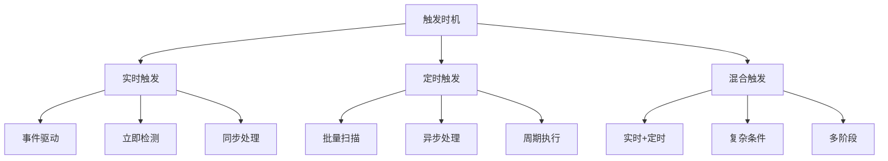
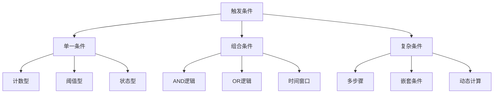
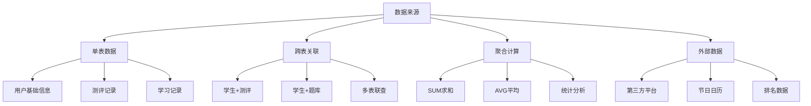
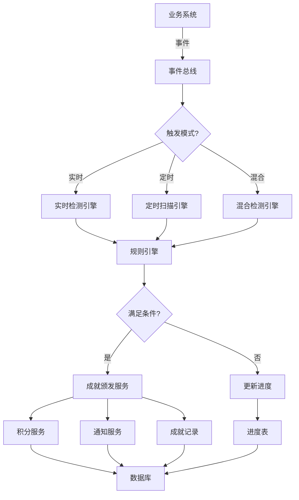
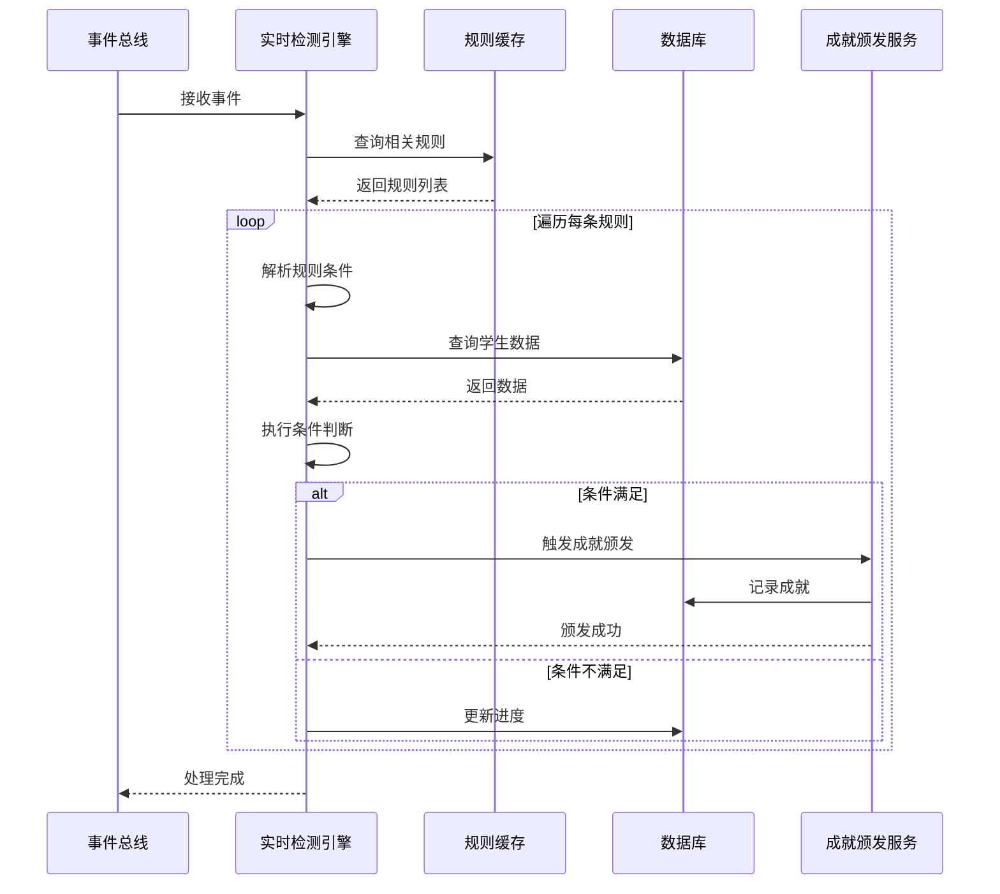

# 成就系统触发机制与实现方案

## 文档信息
- **版本**: v1.0
- **创建日期**: 2025-11-09
- **文档类型**: 技术设计文档
- **关联文档**: ACHIEVEMENT_SYSTEM_DESIGN.md

---

## 目录
1. [触发机制分类体系](#1-触发机制分类体系)
2. [成就规则配置系统](#2-成就规则配置系统)
3. [触发检测架构设计](#3-触发检测架构设计)
4. [实现方案详解](#4-实现方案详解)
5. [性能优化策略](#5-性能优化策略)
6. [代码示例](#6-代码示例)

---

## 1. 触发机制分类体系

### 1.1 按触发时机分类



#### 1.1.1 实时触发 (Real-time Trigger)

**特点**：
- ⚡ 用户操作后立即检测
- ✅ 即时反馈，用户体验好
- ⚠️ 对系统性能有要求

**适用场景**：
- 单次事件类成就（首次通过测评）
- 即时操作类成就（完成答题）
- 阈值突破类成就（达到某个分数）

**实现方式**：
```javascript
// 事件发生 → 触发检测 → 判断条件 → 颁发成就
事件监听器 → 成就检测服务 → 规则引擎 → 成就颁发
```

**示例成就**：
| 成就名称 | 触发事件 | 检测时机 |
|---------|---------|---------|
| 第一滴血 | exam_passed | 考试通过时 |
| 满分学霸 | exam_completed | 考试提交时 |
| 快速答题 | question_answered | 每道题作答时 |

#### 1.1.2 定时触发 (Scheduled Trigger)

**特点**：
- 🕐 按固定周期批量检测
- 📊 适合统计类成就
- 💪 减轻系统实时压力

**适用场景**：
- 累计类成就（学习时长达到1000小时）
- 连续类成就（连续登录30天）
- 统计类成就（本月成绩提升20%）

**实现方式**：
```javascript
// 定时任务 → 批量扫描 → 条件判断 → 批量颁发
Cron Job → 数据聚合 → 规则匹配 → 成就通知
```

**定时策略**：
| 频率 | 执行时间 | 适用成就类型 |
|------|---------|------------|
| 每日 | 凌晨00:10 | 连续登录、日常任务 |
| 每周 | 周一00:30 | 周榜奖励、周活跃度 |
| 每月 | 1号01:00 | 月度统计、进步分析 |
| 实时计算 | 每5分钟 | 学习时长、在线时长 |

**示例成就**：
| 成就名称 | 统计周期 | 检测频率 |
|---------|---------|---------|
| 时间大师（1000小时） | 累计统计 | 每日凌晨 |
| 连续登录100天 | 连续性统计 | 每日凌晨 |
| 进步之星（月提升20%） | 月度对比 | 每月1日 |

#### 1.1.3 混合触发 (Hybrid Trigger)

**特点**：
- 🔄 结合实时和定时
- 🎯 适合复杂条件
- ⚖️ 平衡性能和体验

**适用场景**：
- 多步骤成就（需要多个事件配合）
- 复杂统计成就（需要实时累加+定期验证）
- 有时间窗口的成就（特定时间段内完成）

**实现方式**：
```javascript
// 实时记录进度 + 定时最终验证
实时事件 → 更新进度表 → 定时任务 → 验证完成 → 颁发成就
```

**示例成就**：
| 成就名称 | 实时部分 | 定时部分 |
|---------|---------|---------|
| 新年新气象（春节7天连续学习） | 记录每日学习 | 每日验证连续性 |
| 全科学霸（3科均达5级） | 记录每次认证 | 定期验证是否全满足 |
| 龙卷风（一天2次不同级别认证） | 记录每次认证 | 当天结束前验证 |

---

### 1.2 按触发条件分类



#### 1.2.1 单一条件型

**A. 计数型 (Count-based)**

**定义**：某个动作累计次数达到目标

**JSON配置示例**：
```json
{
    "type": "count",
    "metric": "exam_passed",
    "operator": ">=",
    "target": 10,
    "description": "通过测评次数达到10次"
}
```

**适用成就**：
- 通过10次测评
- 完成100道题目
- 帮助50个同学

**B. 阈值型 (Threshold-based)**

**定义**：某个数值达到或超过特定值

**JSON配置示例**：
```json
{
    "type": "threshold",
    "metric": "total_learning_minutes",
    "operator": ">=",
    "target": 60000,
    "description": "累计学习时长达到60000分钟（1000小时）"
}
```

**适用成就**：
- 学习时长达到1000小时
- 积分达到10000分
- 成绩达到95分以上

**C. 状态型 (State-based)**

**定义**：某个状态发生变化或首次出现

**JSON配置示例**：
```json
{
    "type": "state",
    "event": "exam_passed",
    "first_time": true,
    "description": "首次通过任意级别测评"
}
```

**适用成就**：
- 首次通过测评
- 首次获得满分
- 首次登录系统

#### 1.2.2 组合条件型

**A. AND逻辑（必须同时满足）**

**JSON配置示例**：
```json
{
    "type": "and",
    "conditions": [
        {
            "metric": "math_level",
            "operator": ">=",
            "target": 5
        },
        {
            "metric": "chinese_level",
            "operator": ">=",
            "target": 5
        },
        {
            "metric": "english_level",
            "operator": ">=",
            "target": 5
        }
    ],
    "description": "数学、语文、英语均达到5级"
}
```

**适用成就**：
- 全科学霸（多学科均达标）
- 全面发展（多维度能力达标）

**B. OR逻辑（满足任一条件）**

**JSON配置示例**：
```json
{
    "type": "or",
    "conditions": [
        {
            "metric": "exam_score",
            "operator": ">=",
            "target": 100
        },
        {
            "metric": "exam_time_percentage",
            "operator": "<=",
            "target": 50
        }
    ],
    "description": "获得满分或用时低于平均的50%"
}
```

**适用成就**：
- 速通大师（满分或极快完成）
- 多样学习（多种学习方式任一达标）

**C. 时间窗口型**

**JSON配置示例**：
```json
{
    "type": "time_window",
    "window": "same_day",
    "conditions": [
        {
            "event": "exam_passed",
            "level_type": "different",
            "count": 2
        }
    ],
    "description": "同一天通过2次不同级别的测评"
}
```

**适用成就**：
- 龙卷风（一天内2次不同级别认证）
- 新年新气象（春节期间连续7天学习）

#### 1.2.3 复杂条件型

**A. 多步骤型**

**定义**：需要按特定顺序完成多个步骤

**JSON配置示例**：
```json
{
    "type": "multi_step",
    "steps": [
        {
            "step": 1,
            "event": "practice_completed",
            "description": "完成练习"
        },
        {
            "step": 2,
            "event": "exam_registered",
            "time_window": "7_days",
            "description": "7天内报名测评"
        },
        {
            "step": 3,
            "event": "exam_passed",
            "time_window": "30_days",
            "description": "30天内通过测评"
        }
    ],
    "description": "完成完整学习闭环"
}
```

**适用成就**：
- 学习闭环达人（练习→报名→通过）
- 进阶路线（1级→2级→3级逐级通过）

**B. 动态计算型**

**定义**：需要实时计算对比的成就

**JSON配置示例**：
```json
{
    "type": "dynamic_calculation",
    "formula": "(current_month_avg - last_month_avg) / last_month_avg",
    "operator": ">=",
    "target": 0.2,
    "description": "本月平均成绩比上月提升20%以上"
}
```

**适用成就**：
- 进步之星（成绩提升20%）
- 超越自我（超过个人历史最佳）
- 逆袭成功（从后50%进入前20%）

---

### 1.3 按数据来源分类



#### 1.3.1 单表数据型

**特点**：数据来自单张表，查询简单高效

**示例SQL**：
```sql
-- 统计学生通过测评次数
SELECT COUNT(*)
FROM student_exams
WHERE student_id = ? AND status = 'passed'
```

**适用成就**：
- 通过N次测评
- 完成N次学习
- 登录N天

#### 1.3.2 跨表关联型

**特点**：需要关联多张表获取数据

**示例SQL**：
```sql
-- 统计学生在不同学科的等级认证
SELECT
    e.subject,
    MAX(c.level) as max_level
FROM student_exams se
JOIN exams e ON se.exam_id = e.exam_id
JOIN certificates c ON se.certificate_id = c.certificate_id
WHERE se.student_id = ? AND se.status = 'passed'
GROUP BY e.subject
```

**适用成就**：
- 全科学霸（多学科认证）
- 均衡发展（多类型题目掌握）

#### 1.3.3 聚合计算型

**特点**：需要复杂的统计和计算

**示例SQL**：
```sql
-- 计算本月成绩提升幅度
WITH current_month AS (
    SELECT AVG(score) as avg_score
    FROM student_exams
    WHERE student_id = ?
      AND MONTH(completed_at) = MONTH(CURRENT_DATE)
),
last_month AS (
    SELECT AVG(score) as avg_score
    FROM student_exams
    WHERE student_id = ?
      AND MONTH(completed_at) = MONTH(CURRENT_DATE - INTERVAL 1 MONTH)
)
SELECT
    (c.avg_score - l.avg_score) / l.avg_score * 100 as improvement_rate
FROM current_month c, last_month l
```

**适用成就**：
- 进步之星（成绩提升计算）
- 效率提升（答题速度对比）

#### 1.3.4 外部数据型

**特点**：需要引入外部数据源

**数据来源**：
- 节日日历API（判断特殊日期）
- 天气数据（特殊天气学习）
- 排行榜服务（全市排名）

**示例成就**：
- 新年新气象（春节期间）
- 风雨无阻（恶劣天气仍学习）
- 全市前100（需要全市排名数据）

---

### 1.4 按复杂度分类

| 复杂度 | 特征 | 检测方式 | 性能影响 | 示例 |
|--------|------|---------|---------|------|
| **低** | 单一条件，单表查询 | 实时触发 | 极低 | 首次登录、完成任务 |
| **中** | 组合条件，多表关联 | 实时或定时 | 中等 | 全科达标、连续登录 |
| **高** | 复杂计算，聚合统计 | 定时触发 | 较高 | 成绩提升、效率对比 |
| **极高** | 多步骤，外部数据 | 混合触发 | 高 | 学习闭环、节日成就 |

---

## 2. 成就规则配置系统

### 2.1 规则定义结构

#### 2.1.1 标准规则格式 (JSON Schema)

```json
{
  "$schema": "achievement_rule_v1",
  "achievement_id": "TIME_MASTER",
  "achievement_name": "时间大师",
  "trigger_config": {
    "trigger_mode": "scheduled",        // 触发模式: real_time/scheduled/hybrid
    "trigger_frequency": "daily",       // 检测频率: real_time/daily/weekly/monthly
    "trigger_time": "00:10:00"          // 执行时间（定时触发专用）
  },
  "condition_config": {
    "condition_type": "threshold",      // 条件类型
    "logic_operator": "and",            // 逻辑运算: and/or/not
    "conditions": [
      {
        "data_source": "learning_stats", // 数据源
        "metric": "total_learning_minutes", // 指标名
        "operator": ">=",               // 比较运算符: >=, >, <=, <, ==, !=
        "target_value": 60000,          // 目标值
        "data_type": "number"           // 数据类型: number/string/boolean
      }
    ]
  },
  "reward_config": {
    "points": 800,                      // 积分奖励
    "badge": "time_master_badge",       // 徽章ID
    "title": "时间管理大师",            // 称号
    "extra_rewards": []                 // 额外奖励
  },
  "constraint_config": {
    "max_times": 1,                     // 最多获得次数
    "cooldown_days": null,              // 冷却天数
    "valid_from": null,                 // 生效开始时间
    "valid_to": null                    // 生效结束时间
  }
}
```

#### 2.1.2 规则类型模板库

**模板1：计数型成就**
```json
{
  "template_name": "count_achievement",
  "template_version": "1.0",
  "condition_config": {
    "condition_type": "count",
    "conditions": [
      {
        "data_source": "${table_name}",
        "metric": "${event_name}",
        "operator": ">=",
        "target_value": "${count}",
        "filter": {
          "status": "${required_status}"
        }
      }
    ]
  }
}
```

**使用示例**：
```json
// 通过10次测评
{
  "table_name": "student_exams",
  "event_name": "exam_passed",
  "count": 10,
  "required_status": "passed"
}
```

**模板2：连续性成就**
```json
{
  "template_name": "consecutive_achievement",
  "template_version": "1.0",
  "condition_config": {
    "condition_type": "consecutive",
    "conditions": [
      {
        "data_source": "${table_name}",
        "metric": "${event_name}",
        "consecutive_days": "${days}",
        "check_frequency": "daily"
      }
    ]
  }
}
```

**使用示例**：
```json
// 连续登录7天
{
  "table_name": "user_login_logs",
  "event_name": "login",
  "days": 7
}
```

**模板3：比较型成就**
```json
{
  "template_name": "comparison_achievement",
  "template_version": "1.0",
  "condition_config": {
    "condition_type": "comparison",
    "conditions": [
      {
        "formula": "(${metric_current} - ${metric_previous}) / ${metric_previous}",
        "operator": ">=",
        "target_value": "${threshold}",
        "time_window": "${window}"
      }
    ]
  }
}
```

**使用示例**：
```json
// 成绩提升20%
{
  "metric_current": "current_month_avg_score",
  "metric_previous": "last_month_avg_score",
  "threshold": 0.2,
  "window": "monthly"
}
```

### 2.2 规则配置界面设计

#### 2.2.1 可视化配置器

**界面原型**：
```
┌─────────────────────────────────────────────────┐
│  🎯 成就规则配置器                               │
├─────────────────────────────────────────────────┤
│                                                 │
│  基础信息                                        │
│  ├─ 成就名称: [时间大师                    ]    │
│  ├─ 成就代码: [TIME_MASTER                ]    │
│  └─ 成就描述: [累计学习时长达到1000小时   ]    │
│                                                 │
│  触发配置                                        │
│  ├─ 触发模式: [●定时触发 ○实时触发 ○混合]      │
│  ├─ 检测频率: [每日 ▼]                         │
│  └─ 执行时间: [00:10:00]                       │
│                                                 │
│  条件配置 [使用模板 ▼]                          │
│  ┌───────────────────────────────────────────┐ │
│  │ 条件1: 阈值型                              │ │
│  │ 数据源: [学习统计表 ▼]                     │ │
│  │ 指标:   [total_learning_minutes ▼]        │ │
│  │ 运算符: [>= ▼]                             │ │
│  │ 目标值: [60000] 分钟                       │ │
│  │ [删除条件]                                 │ │
│  └───────────────────────────────────────────┘ │
│  [+ 添加条件]                                   │
│                                                 │
│  奖励配置                                        │
│  ├─ 积分奖励: [800] 积分                       │
│  ├─ 徽章:     [选择徽章 ▼]                     │
│  └─ 称号:     [时间管理大师          ]         │
│                                                 │
│  高级设置                                        │
│  ├─ 最多获得次数: [1]                          │
│  ├─ 冷却天数:     [无限制]                     │
│  └─ 有效期:       [永久有效]                   │
│                                                 │
│  [测试规则]  [保存草稿]  [保存并启用]           │
└─────────────────────────────────────────────────┘
```

#### 2.2.2 规则测试器

**功能**：在发布前测试规则是否正确

**测试界面**：
```
┌─────────────────────────────────────────────────┐
│  🧪 规则测试器                                   │
├─────────────────────────────────────────────────┤
│                                                 │
│  测试用户: [选择学生 ▼] 或 [输入学生ID]         │
│                                                 │
│  模拟数据:                                       │
│  ┌───────────────────────────────────────────┐ │
│  │ total_learning_minutes: [输入值]           │ │
│  │ 当前值: 0 分钟                             │ │
│  │ 目标值: 60000 分钟                         │ │
│  │                                            │ │
│  │ [使用真实数据] [手动输入]                  │ │
│  └───────────────────────────────────────────┘ │
│                                                 │
│  [执行测试]                                      │
│                                                 │
│  测试结果:                                       │
│  ┌───────────────────────────────────────────┐ │
│  │ ✅ 规则语法正确                            │ │
│  │ ❌ 条件不满足 (0 < 60000)                 │ │
│  │                                            │ │
│  │ 预期行为: 不触发成就                       │ │
│  │ 距离目标: 还需 60000 分钟                  │ │
│  └───────────────────────────────────────────┘ │
└─────────────────────────────────────────────────┘
```

### 2.3 规则版本管理

#### 2.3.1 版本控制策略

**版本号规则**：`v{major}.{minor}.{patch}`
- **major**: 规则结构重大变更
- **minor**: 条件参数调整
- **patch**: 文案修正

**版本记录表**：
```sql
CREATE TABLE achievement_rule_versions (
    version_id SERIAL PRIMARY KEY,
    achievement_id INTEGER REFERENCES achievements(achievement_id),
    version_number VARCHAR(20) NOT NULL,        -- 如: v1.2.3
    rule_config JSON NOT NULL,                  -- 规则配置JSON
    change_description TEXT,                    -- 变更说明
    created_by INTEGER REFERENCES users(user_id),
    created_at TIMESTAMP DEFAULT CURRENT_TIMESTAMP,
    is_active BOOLEAN DEFAULT FALSE             -- 当前激活版本
);
```

**版本切换**：
```javascript
// 发布新版本
async function publishNewVersion(achievementId, newRuleConfig, changeDesc) {
    // 1. 停用当前版本
    await db.query(`
        UPDATE achievement_rule_versions
        SET is_active = FALSE
        WHERE achievement_id = ? AND is_active = TRUE
    `, [achievementId]);

    // 2. 创建新版本
    const version = await getNextVersion(achievementId);
    await db.query(`
        INSERT INTO achievement_rule_versions
        (achievement_id, version_number, rule_config, change_description, is_active)
        VALUES (?, ?, ?, ?, TRUE)
    `, [achievementId, version, newRuleConfig, changeDesc]);

    // 3. 更新成就表的当前规则
    await db.query(`
        UPDATE achievements
        SET trigger_condition = ?, updated_at = NOW()
        WHERE achievement_id = ?
    `, [newRuleConfig, achievementId]);
}
```

---

## 3. 触发检测架构设计

### 3.1 整体架构



### 3.2 事件总线 (Event Bus)

#### 3.2.1 事件定义

**标准事件格式**：
```typescript
interface AchievementEvent {
    eventId: string;              // 事件唯一ID
    eventType: string;            // 事件类型
    eventName: string;            // 事件名称
    studentId: number;            // 学生ID
    timestamp: number;            // 事件时间戳
    data: {                       // 事件数据
        [key: string]: any;
    };
    metadata: {                   // 元数据
        source: string;           // 事件来源
        version: string;          // 事件版本
    };
}
```

**事件示例**：
```json
{
    "eventId": "evt_20251109_123456_001",
    "eventType": "exam",
    "eventName": "exam_passed",
    "studentId": 1001,
    "timestamp": 1699500000000,
    "data": {
        "examId": 501,
        "score": 95,
        "level": 4,
        "subject": "数学",
        "duration": 3600
    },
    "metadata": {
        "source": "exam_service",
        "version": "1.0"
    }
}
```

#### 3.2.2 事件发布

**集成点**：在现有业务代码中添加事件发布

```javascript
// backend/src/routes/exams.js

// 原有代码
router.post('/submit', authMiddleware, async (req, res) => {
    // ... 考试提交逻辑 ...

    // 更新学生考试记录
    await db.query(/* ... */);

    // 【新增】发布成就事件
    await eventBus.publish({
        eventType: 'exam',
        eventName: 'exam_completed',
        studentId: req.user.studentId,
        data: {
            examId: exam.exam_id,
            score: totalScore,
            duration: examDuration
        }
    });

    // 如果通过
    if (isPassed) {
        await eventBus.publish({
            eventType: 'exam',
            eventName: 'exam_passed',
            studentId: req.user.studentId,
            data: {
                examId: exam.exam_id,
                score: totalScore,
                level: exam.level,
                subject: exam.subject
            }
        });
    }

    res.json({ success: true });
});
```

**事件总线实现**：
```javascript
// backend/src/services/eventBus.js

class EventBus {
    constructor() {
        this.listeners = new Map();
        this.queue = [];
    }

    // 订阅事件
    subscribe(eventName, handler) {
        if (!this.listeners.has(eventName)) {
            this.listeners.set(eventName, []);
        }
        this.listeners.get(eventName).push(handler);
    }

    // 发布事件
    async publish(event) {
        const fullEvent = {
            eventId: this.generateEventId(),
            timestamp: Date.now(),
            metadata: {
                source: 'system',
                version: '1.0'
            },
            ...event
        };

        // 异步处理，不阻塞主流程
        setImmediate(async () => {
            await this.processEvent(fullEvent);
        });
    }

    // 处理事件
    async processEvent(event) {
        const handlers = this.listeners.get(event.eventName) || [];

        for (const handler of handlers) {
            try {
                await handler(event);
            } catch (error) {
                console.error(`Event handler error:`, error);
                // 记录错误日志，但不影响其他处理器
            }
        }
    }

    generateEventId() {
        return `evt_${Date.now()}_${Math.random().toString(36).substr(2, 9)}`;
    }
}

module.exports = new EventBus();
```

### 3.3 实时检测引擎

#### 3.3.1 检测流程



#### 3.3.2 规则缓存优化

**缓存策略**：
```javascript
// backend/src/services/achievementCache.js

class AchievementRuleCache {
    constructor(redisClient) {
        this.redis = redisClient;
        this.CACHE_PREFIX = 'achievement:rules:';
        this.CACHE_TTL = 3600; // 1小时
    }

    // 按事件类型缓存规则
    async getRulesByEvent(eventName) {
        const cacheKey = `${this.CACHE_PREFIX}${eventName}`;

        // 尝试从缓存获取
        let rules = await this.redis.get(cacheKey);

        if (rules) {
            return JSON.parse(rules);
        }

        // 缓存未命中，从数据库加载
        rules = await db.query(`
            SELECT * FROM achievements
            WHERE is_active = TRUE
              AND JSON_EXTRACT(trigger_condition, '$.event') = ?
        `, [eventName]);

        // 写入缓存
        await this.redis.setex(
            cacheKey,
            this.CACHE_TTL,
            JSON.stringify(rules)
        );

        return rules;
    }

    // 清除缓存（规则更新时调用）
    async invalidateCache(eventName) {
        const cacheKey = `${this.CACHE_PREFIX}${eventName}`;
        await this.redis.del(cacheKey);
    }
}
```

#### 3.3.3 实时检测实现

```javascript
// backend/src/services/achievementDetector.js

class RealtimeAchievementDetector {
    constructor(eventBus, ruleCache, achievementService) {
        this.eventBus = eventBus;
        this.ruleCache = ruleCache;
        this.achievementService = achievementService;

        this.init();
    }

    init() {
        // 订阅所有成就相关事件
        const events = [
            'exam_passed',
            'exam_completed',
            'question_answered',
            'login',
            'study_session_completed'
        ];

        events.forEach(eventName => {
            this.eventBus.subscribe(eventName, (event) => {
                this.detectAchievements(event);
            });
        });
    }

    async detectAchievements(event) {
        try {
            // 1. 获取相关规则
            const rules = await this.ruleCache.getRulesByEvent(event.eventName);

            // 2. 检查学生是否已获得该成就
            const achievedIds = await this.getStudentAchievements(event.studentId);

            // 3. 遍历规则进行检测
            for (const rule of rules) {
                // 跳过已获得的成就
                if (achievedIds.includes(rule.achievement_id)) {
                    continue;
                }

                // 检测条件
                const satisfied = await this.checkCondition(
                    rule.trigger_condition,
                    event.studentId,
                    event.data
                );

                if (satisfied) {
                    // 触发成就颁发
                    await this.achievementService.award(
                        event.studentId,
                        rule.achievement_id
                    );
                } else {
                    // 更新进度
                    await this.updateProgress(
                        event.studentId,
                        rule.achievement_id,
                        event.data
                    );
                }
            }
        } catch (error) {
            console.error('Achievement detection error:', error);
            // 记录到错误日志，但不影响主流程
        }
    }

    async checkCondition(condition, studentId, eventData) {
        const { condition_type, conditions } = condition;

        switch (condition_type) {
            case 'state':
                return this.checkStateCondition(conditions[0], studentId, eventData);

            case 'count':
                return this.checkCountCondition(conditions[0], studentId);

            case 'threshold':
                return this.checkThresholdCondition(conditions[0], studentId);

            case 'and':
                return this.checkAndCondition(conditions, studentId, eventData);

            case 'or':
                return this.checkOrCondition(conditions, studentId, eventData);

            default:
                return false;
        }
    }

    async checkStateCondition(condition, studentId, eventData) {
        if (condition.first_time) {
            // 检查是否首次
            const count = await db.query(`
                SELECT COUNT(*) as cnt
                FROM student_achievements sa
                JOIN achievements a ON sa.achievement_id = a.achievement_id
                WHERE sa.student_id = ?
                  AND JSON_EXTRACT(a.trigger_condition, '$.event') = ?
            `, [studentId, condition.event]);

            return count[0].cnt === 0;
        }

        return true;
    }

    async checkCountCondition(condition, studentId) {
        const { metric, operator, target } = condition;

        // 构建查询
        let query = `SELECT COUNT(*) as cnt FROM ${condition.data_source} WHERE student_id = ?`;
        const params = [studentId];

        // 添加过滤条件
        if (condition.filter) {
            Object.entries(condition.filter).forEach(([key, value]) => {
                query += ` AND ${key} = ?`;
                params.push(value);
            });
        }

        const result = await db.query(query, params);
        const count = result[0].cnt;

        return this.compare(count, operator, target);
    }

    async checkThresholdCondition(condition, studentId) {
        const { metric, operator, target } = condition;

        // 从数据库或缓存获取指标值
        const value = await this.getMetricValue(studentId, metric);

        return this.compare(value, operator, target);
    }

    async checkAndCondition(conditions, studentId, eventData) {
        for (const cond of conditions) {
            const satisfied = await this.checkCondition(
                { condition_type: 'threshold', conditions: [cond] },
                studentId,
                eventData
            );
            if (!satisfied) return false;
        }
        return true;
    }

    async checkOrCondition(conditions, studentId, eventData) {
        for (const cond of conditions) {
            const satisfied = await this.checkCondition(
                { condition_type: 'threshold', conditions: [cond] },
                studentId,
                eventData
            );
            if (satisfied) return true;
        }
        return false;
    }

    compare(value, operator, target) {
        switch (operator) {
            case '>=': return value >= target;
            case '>': return value > target;
            case '<=': return value <= target;
            case '<': return value < target;
            case '==': return value == target;
            case '!=': return value != target;
            default: return false;
        }
    }

    async getStudentAchievements(studentId) {
        const result = await db.query(`
            SELECT achievement_id
            FROM student_achievements
            WHERE student_id = ?
        `, [studentId]);

        return result.map(r => r.achievement_id);
    }

    async getMetricValue(studentId, metric) {
        // 根据指标名称从不同表获取数据
        // 这里可以配置指标到查询的映射
        const metricQueries = {
            'total_learning_minutes': `
                SELECT SUM(duration) as value
                FROM learning_sessions
                WHERE student_id = ?
            `,
            'exam_pass_count': `
                SELECT COUNT(*) as value
                FROM student_exams
                WHERE student_id = ? AND status = 'passed'
            `
            // ... 更多指标
        };

        const query = metricQueries[metric];
        if (!query) {
            throw new Error(`Unknown metric: ${metric}`);
        }

        const result = await db.query(query, [studentId]);
        return result[0].value || 0;
    }

    async updateProgress(studentId, achievementId, eventData) {
        // 更新成就进度表
        await db.query(`
            INSERT INTO achievement_progress
            (student_id, achievement_id, current_value, last_updated)
            VALUES (?, ?, ?, NOW())
            ON DUPLICATE KEY UPDATE
                current_value = current_value + 1,
                last_updated = NOW()
        `, [studentId, achievementId, 1]);
    }
}
```

### 3.4 定时扫描引擎

#### 3.4.1 定时任务配置

**使用 node-cron 实现**：
```javascript
// backend/src/services/achievementScheduler.js

const cron = require('node-cron');

class AchievementScheduler {
    constructor(scheduledDetector) {
        this.detector = scheduledDetector;
        this.jobs = new Map();
    }

    start() {
        // 每日凌晨00:10执行
        this.jobs.set('daily', cron.schedule('10 0 * * *', async () => {
            console.log('Running daily achievement scan...');
            await this.detector.scanDailyAchievements();
        }));

        // 每周一00:30执行
        this.jobs.set('weekly', cron.schedule('30 0 * * 1', async () => {
            console.log('Running weekly achievement scan...');
            await this.detector.scanWeeklyAchievements();
        }));

        // 每月1日01:00执行
        this.jobs.set('monthly', cron.schedule('0 1 1 * *', async () => {
            console.log('Running monthly achievement scan...');
            await this.detector.scanMonthlyAchievements();
        }));

        // 每5分钟执行一次（用于准实时统计）
        this.jobs.set('realtime_stats', cron.schedule('*/5 * * * *', async () => {
            await this.detector.updateRealtimeStats();
        }));

        console.log('Achievement scheduler started');
    }

    stop() {
        this.jobs.forEach((job, name) => {
            job.stop();
            console.log(`Stopped ${name} job`);
        });
        this.jobs.clear();
    }
}
```

#### 3.4.2 批量扫描实现

```javascript
// backend/src/services/scheduledAchievementDetector.js

class ScheduledAchievementDetector {
    constructor(achievementService) {
        this.achievementService = achievementService;
    }

    async scanDailyAchievements() {
        try {
            // 获取所有需要每日检测的成就规则
            const rules = await db.query(`
                SELECT * FROM achievements
                WHERE is_active = TRUE
                  AND JSON_EXTRACT(trigger_condition, '$.trigger_frequency') = 'daily'
            `);

            console.log(`Found ${rules.length} daily achievement rules`);

            // 获取所有活跃学生（最近30天有活动）
            const students = await db.query(`
                SELECT DISTINCT student_id
                FROM student_exams
                WHERE completed_at >= DATE_SUB(NOW(), INTERVAL 30 DAY)
            `);

            console.log(`Checking ${students.length} students`);

            // 批量处理
            const batchSize = 100;
            for (let i = 0; i < students.length; i += batchSize) {
                const batch = students.slice(i, i + batchSize);
                await this.processBatch(batch, rules);
            }

            console.log('Daily achievement scan completed');
        } catch (error) {
            console.error('Daily scan error:', error);
        }
    }

    async processBatch(students, rules) {
        const promises = students.map(student =>
            this.checkStudentAchievements(student.student_id, rules)
        );

        await Promise.all(promises);
    }

    async checkStudentAchievements(studentId, rules) {
        for (const rule of rules) {
            try {
                // 检查是否已获得
                const hasAchievement = await this.hasAchievement(
                    studentId,
                    rule.achievement_id
                );

                if (hasAchievement) continue;

                // 检查条件
                const satisfied = await this.checkRule(studentId, rule);

                if (satisfied) {
                    await this.achievementService.award(
                        studentId,
                        rule.achievement_id
                    );
                }
            } catch (error) {
                console.error(`Error checking rule ${rule.achievement_id} for student ${studentId}:`, error);
            }
        }
    }

    async checkRule(studentId, rule) {
        const condition = rule.trigger_condition;

        switch (condition.condition_type) {
            case 'consecutive':
                return await this.checkConsecutive(studentId, condition);

            case 'threshold':
                return await this.checkThreshold(studentId, condition);

            case 'comparison':
                return await this.checkComparison(studentId, condition);

            default:
                return false;
        }
    }

    async checkConsecutive(studentId, condition) {
        const { data_source, metric, consecutive_days } = condition.conditions[0];

        // 检查连续天数
        const query = `
            SELECT DATE(created_at) as login_date
            FROM ${data_source}
            WHERE student_id = ?
              AND created_at >= DATE_SUB(CURDATE(), INTERVAL ? DAY)
            GROUP BY DATE(created_at)
            ORDER BY DATE(created_at) DESC
        `;

        const results = await db.query(query, [studentId, consecutive_days]);

        if (results.length < consecutive_days) {
            return false;
        }

        // 检查是否连续
        for (let i = 0; i < consecutive_days - 1; i++) {
            const current = new Date(results[i].login_date);
            const next = new Date(results[i + 1].login_date);
            const diffDays = (current - next) / (1000 * 60 * 60 * 24);

            if (diffDays !== 1) {
                return false;
            }
        }

        return true;
    }

    async checkThreshold(studentId, condition) {
        const cond = condition.conditions[0];
        const { metric, operator, target_value } = cond;

        const value = await this.getMetricValue(studentId, metric);

        return this.compare(value, operator, target_value);
    }

    async checkComparison(studentId, condition) {
        const cond = condition.conditions[0];
        const { formula, operator, target_value } = cond;

        // 解析公式并计算
        const result = await this.evaluateFormula(studentId, formula);

        return this.compare(result, operator, target_value);
    }

    async evaluateFormula(studentId, formula) {
        // 提取公式中的变量
        const variables = this.extractVariables(formula);

        // 获取变量值
        const values = {};
        for (const variable of variables) {
            values[variable] = await this.getMetricValue(studentId, variable);
        }

        // 替换变量并计算
        let expression = formula;
        Object.entries(values).forEach(([key, value]) => {
            expression = expression.replace(new RegExp(`\\$\\{${key}\\}`, 'g'), value);
        });

        // 使用 math.js 或 eval（注意安全性）
        // 这里简化处理
        return eval(expression);
    }

    extractVariables(formula) {
        const regex = /\$\{([^}]+)\}/g;
        const variables = [];
        let match;

        while ((match = regex.exec(formula)) !== null) {
            variables.push(match[1]);
        }

        return variables;
    }

    compare(value, operator, target) {
        switch (operator) {
            case '>=': return value >= target;
            case '>': return value > target;
            case '<=': return value <= target;
            case '<': return value < target;
            case '==': return value == target;
            case '!=': return value != target;
            default: return false;
        }
    }

    async getMetricValue(studentId, metric) {
        // 指标查询映射
        const metricQueries = {
            'total_learning_minutes': `
                SELECT COALESCE(SUM(duration), 0) as value
                FROM learning_sessions
                WHERE student_id = ?
            `,
            'current_month_avg_score': `
                SELECT COALESCE(AVG(score), 0) as value
                FROM student_exams
                WHERE student_id = ?
                  AND MONTH(completed_at) = MONTH(CURRENT_DATE)
                  AND YEAR(completed_at) = YEAR(CURRENT_DATE)
            `,
            'last_month_avg_score': `
                SELECT COALESCE(AVG(score), 0) as value
                FROM student_exams
                WHERE student_id = ?
                  AND MONTH(completed_at) = MONTH(DATE_SUB(CURRENT_DATE, INTERVAL 1 MONTH))
                  AND YEAR(completed_at) = YEAR(DATE_SUB(CURRENT_DATE, INTERVAL 1 MONTH))
            `
            // ... 更多指标
        };

        const query = metricQueries[metric];
        if (!query) {
            console.warn(`Unknown metric: ${metric}, returning 0`);
            return 0;
        }

        const result = await db.query(query, [studentId]);
        return result[0].value || 0;
    }

    async hasAchievement(studentId, achievementId) {
        const result = await db.query(`
            SELECT COUNT(*) as cnt
            FROM student_achievements
            WHERE student_id = ? AND achievement_id = ?
        `, [studentId, achievementId]);

        return result[0].cnt > 0;
    }

    async updateRealtimeStats() {
        // 更新实时统计数据（如在线时长）
        // 这里可以缓存一些计算结果，供实时检测使用
    }

    async scanWeeklyAchievements() {
        // 类似 scanDailyAchievements，但针对周度成就
        console.log('Scanning weekly achievements...');
    }

    async scanMonthlyAchievements() {
        // 类似 scanDailyAchievements，但针对月度成就
        console.log('Scanning monthly achievements...');
    }
}
```

---

## 4. 实现方案详解

### 4.1 成就颁发服务

```javascript
// backend/src/services/achievementService.js

class AchievementService {
    constructor(pointsService, notificationService) {
        this.pointsService = pointsService;
        this.notificationService = notificationService;
    }

    async award(studentId, achievementId) {
        try {
            // 1. 获取成就信息
            const achievement = await this.getAchievement(achievementId);

            if (!achievement) {
                throw new Error(`Achievement ${achievementId} not found`);
            }

            // 2. 检查是否已获得（防止重复）
            const hasAchievement = await this.hasAchievement(studentId, achievementId);

            if (hasAchievement) {
                console.log(`Student ${studentId} already has achievement ${achievementId}`);
                return { success: false, reason: 'already_awarded' };
            }

            // 3. 使用事务确保原子性
            await db.transaction(async (trx) => {
                // 3.1 记录成就获得
                await trx.query(`
                    INSERT INTO student_achievements
                    (student_id, achievement_id, achieved_at, points_awarded)
                    VALUES (?, ?, NOW(), ?)
                `, [studentId, achievementId, achievement.points_reward]);

                // 3.2 奖励积分
                if (achievement.points_reward > 0) {
                    await this.pointsService.addPoints(
                        studentId,
                        achievement.points_reward,
                        'achievement',
                        achievementId,
                        `获得成就：${achievement.achievement_name}`,
                        trx
                    );
                }

                // 3.3 清理进度记录
                await trx.query(`
                    DELETE FROM achievement_progress
                    WHERE student_id = ? AND achievement_id = ?
                `, [studentId, achievementId]);
            });

            // 4. 发送通知（异步，不影响主流程）
            setImmediate(() => {
                this.notificationService.sendAchievementNotification(
                    studentId,
                    achievement
                );
            });

            // 5. 记录日志
            console.log(`Achievement awarded: ${achievement.achievement_name} to student ${studentId}`);

            return {
                success: true,
                achievement: achievement,
                points: achievement.points_reward
            };

        } catch (error) {
            console.error(`Error awarding achievement:`, error);
            throw error;
        }
    }

    async getAchievement(achievementId) {
        const results = await db.query(`
            SELECT * FROM achievements WHERE achievement_id = ?
        `, [achievementId]);

        return results[0];
    }

    async hasAchievement(studentId, achievementId) {
        const results = await db.query(`
            SELECT COUNT(*) as cnt
            FROM student_achievements
            WHERE student_id = ? AND achievement_id = ?
        `, [studentId, achievementId]);

        return results[0].cnt > 0;
    }
}
```

### 4.2 积分服务集成

```javascript
// backend/src/services/pointsService.js

class PointsService {
    async addPoints(studentId, points, type, sourceId, description, trx = null) {
        const db = trx || require('../config/database');

        try {
            // 1. 获取当前积分
            const current = await db.query(`
                SELECT current_points FROM student_points WHERE student_id = ?
            `, [studentId]);

            const balanceBefore = current[0]?.current_points || 0;
            const balanceAfter = balanceBefore + points;

            // 2. 更新积分账户
            await db.query(`
                INSERT INTO student_points (student_id, current_points, total_points)
                VALUES (?, ?, ?)
                ON DUPLICATE KEY UPDATE
                    current_points = current_points + ?,
                    total_points = total_points + ?,
                    last_updated = NOW()
            `, [studentId, points, points, points, points]);

            // 3. 记录积分明细
            await db.query(`
                INSERT INTO points_transactions
                (student_id, points_change, transaction_type, source_id, source_type,
                 description, balance_before, balance_after)
                VALUES (?, ?, ?, ?, ?, ?, ?, ?)
            `, [studentId, points, type, sourceId, 'achievement', description, balanceBefore, balanceAfter]);

            return {
                success: true,
                balanceBefore,
                balanceAfter,
                pointsAdded: points
            };

        } catch (error) {
            console.error('Error adding points:', error);
            throw error;
        }
    }
}
```

---

## 5. 性能优化策略

### 5.1 查询优化

#### 5.1.1 索引设计

```sql
-- 成就表索引
CREATE INDEX idx_achievements_active ON achievements(is_active);
CREATE INDEX idx_achievements_category ON achievements(category);

-- 学生成就表索引
CREATE INDEX idx_student_achievements_student ON student_achievements(student_id);
CREATE INDEX idx_student_achievements_time ON student_achievements(achieved_at);
CREATE INDEX idx_student_achievements_composite ON student_achievements(student_id, achievement_id);

-- 成就进度表索引
CREATE INDEX idx_achievement_progress_student ON achievement_progress(student_id);
CREATE INDEX idx_achievement_progress_composite ON achievement_progress(student_id, achievement_id);

-- 积分交易表索引
CREATE INDEX idx_points_transactions_student ON points_transactions(student_id);
CREATE INDEX idx_points_transactions_time ON points_transactions(created_at DESC);
CREATE INDEX idx_points_transactions_type ON points_transactions(transaction_type);
```

#### 5.1.2 查询优化示例

**Before (慢查询)**：
```sql
-- 获取学生所有成就（包括进度）
SELECT
    a.*,
    sa.achieved_at,
    ap.progress_percentage
FROM achievements a
LEFT JOIN student_achievements sa ON a.achievement_id = sa.achievement_id AND sa.student_id = ?
LEFT JOIN achievement_progress ap ON a.achievement_id = ap.achievement_id AND ap.student_id = ?
WHERE a.is_active = TRUE
ORDER BY a.display_order
```

**After (优化后)**：
```sql
-- 分开查询，减少JOIN
-- 1. 获取所有激活的成就
SELECT * FROM achievements WHERE is_active = TRUE ORDER BY display_order;

-- 2. 获取学生已获得的成就
SELECT achievement_id, achieved_at FROM student_achievements WHERE student_id = ?;

-- 3. 获取学生成就进度
SELECT achievement_id, progress_percentage FROM achievement_progress WHERE student_id = ?;

-- 在应用层合并数据
```

### 5.2 缓存策略

#### 5.2.1 多级缓存

```javascript
class AchievementCacheManager {
    constructor(redisClient) {
        this.redis = redisClient;
        this.localCache = new Map(); // 进程内缓存
    }

    async getCachedAchievement(achievementId) {
        // Level 1: 进程内缓存
        if (this.localCache.has(achievementId)) {
            return this.localCache.get(achievementId);
        }

        // Level 2: Redis缓存
        const cacheKey = `achievement:${achievementId}`;
        const cached = await this.redis.get(cacheKey);

        if (cached) {
            const data = JSON.parse(cached);
            this.localCache.set(achievementId, data); // 写入进程缓存
            return data;
        }

        // Level 3: 数据库
        const result = await db.query(`
            SELECT * FROM achievements WHERE achievement_id = ?
        `, [achievementId]);

        if (result[0]) {
            // 写入Redis（1小时过期）
            await this.redis.setex(cacheKey, 3600, JSON.stringify(result[0]));
            // 写入进程缓存
            this.localCache.set(achievementId, result[0]);
            return result[0];
        }

        return null;
    }

    async invalidate(achievementId) {
        // 清除所有级别缓存
        this.localCache.delete(achievementId);
        await this.redis.del(`achievement:${achievementId}`);
    }
}
```

#### 5.2.2 热数据预加载

```javascript
class AchievementPreloader {
    async preloadHotAchievements() {
        // 预加载最热门的100个成就
        const hotAchievements = await db.query(`
            SELECT a.*, COUNT(sa.id) as award_count
            FROM achievements a
            LEFT JOIN student_achievements sa ON a.achievement_id = sa.achievement_id
            WHERE a.is_active = TRUE
            GROUP BY a.achievement_id
            ORDER BY award_count DESC
            LIMIT 100
        `);

        for (const achievement of hotAchievements) {
            await cacheManager.getCachedAchievement(achievement.achievement_id);
        }

        console.log('Hot achievements preloaded');
    }
}
```

### 5.3 异步处理

#### 5.3.1 消息队列

**使用Bull队列处理成就检测**：
```javascript
const Bull = require('bull');

const achievementQueue = new Bull('achievement-detection', {
    redis: {
        host: 'localhost',
        port: 6379
    }
});

// 生产者：添加检测任务
async function queueAchievementCheck(studentId, event) {
    await achievementQueue.add({
        studentId,
        event
    }, {
        attempts: 3,
        backoff: {
            type: 'exponential',
            delay: 2000
        }
    });
}

// 消费者：处理检测任务
achievementQueue.process(async (job) => {
    const { studentId, event } = job.data;
    await realtimeDetector.detectAchievements({
        studentId,
        ...event
    });
});
```

### 5.4 数据库优化

#### 5.4.1 分区表（针对大数据量）

```sql
-- 按年份分区积分交易表
CREATE TABLE points_transactions (
    transaction_id BIGINT AUTO_INCREMENT,
    student_id INTEGER NOT NULL,
    points_change INTEGER NOT NULL,
    created_at TIMESTAMP DEFAULT CURRENT_TIMESTAMP,
    -- ... 其他字段
    PRIMARY KEY (transaction_id, created_at)
)
PARTITION BY RANGE (YEAR(created_at)) (
    PARTITION p2024 VALUES LESS THAN (2025),
    PARTITION p2025 VALUES LESS THAN (2026),
    PARTITION p2026 VALUES LESS THAN (2027),
    PARTITION pmax VALUES LESS THAN MAXVALUE
);
```

#### 5.4.2 读写分离

```javascript
class DatabaseManager {
    constructor() {
        this.masterDB = createConnection(masterConfig);
        this.slaveDB = createConnection(slaveConfig);
    }

    // 写操作使用主库
    async write(query, params) {
        return this.masterDB.query(query, params);
    }

    // 读操作使用从库
    async read(query, params) {
        return this.slaveDB.query(query, params);
    }
}
```

---

## 6. 代码示例

### 6.1 完整的成就检测流程示例

**场景**：学生通过考试，触发"第一滴血"成就

```javascript
// 1. 业务代码发布事件
// backend/src/routes/exams.js
router.post('/submit', authMiddleware, async (req, res) => {
    const { examId, answers } = req.body;
    const studentId = req.user.studentId;

    // ... 评分逻辑 ...

    if (isPassed) {
        // 发布事件
        await eventBus.publish({
            eventType: 'exam',
            eventName: 'exam_passed',
            studentId: studentId,
            data: {
                examId: examId,
                score: totalScore,
                level: exam.level,
                subject: exam.subject
            }
        });
    }

    res.json({ success: true, score: totalScore });
});

// 2. 事件总线分发
// backend/src/services/eventBus.js
await this.processEvent({
    eventId: 'evt_20251109_001',
    eventName: 'exam_passed',
    studentId: 1001,
    data: {
        examId: 501,
        score: 95,
        level: 4,
        subject: '数学'
    }
});

// 3. 实时检测引擎处理
// backend/src/services/achievementDetector.js
async detectAchievements(event) {
    // 获取相关规则（从缓存）
    const rules = await this.ruleCache.getRulesByEvent('exam_passed');
    // 假设返回: [{ achievement_id: 1, achievement_name: '第一滴血', ... }]

    for (const rule of rules) {
        // 检查条件
        const satisfied = await this.checkCondition(
            rule.trigger_condition,
            event.studentId,
            event.data
        );

        if (satisfied) {
            // 颁发成就
            await this.achievementService.award(event.studentId, rule.achievement_id);
        }
    }
}

// 4. 成就颁发
// backend/src/services/achievementService.js
async award(studentId, achievementId) {
    await db.transaction(async (trx) => {
        // 记录成就
        await trx.query(`
            INSERT INTO student_achievements (student_id, achievement_id, points_awarded)
            VALUES (?, ?, ?)
        `, [studentId, achievementId, 50]);

        // 奖励积分
        await this.pointsService.addPoints(studentId, 50, 'achievement', achievementId, '获得成就：第一滴血', trx);
    });

    // 发送通知
    await this.notificationService.send(studentId, {
        type: 'achievement',
        title: '恭喜获得成就！',
        content: '第一滴血',
        points: 50
    });
}

// 5. 前端收到通知并展示
// frontend - WebSocket接收
socket.on('achievement_notification', (data) => {
    showAchievementPopup({
        name: '第一滴血',
        description: '首次通过任意级别认证',
        rarity: 'common',
        points: 50,
        icon: '/images/achievements/first_blood.png'
    });
});
```

### 6.2 成就规则配置示例

**示例1：简单计数型成就**
```json
{
    "achievement_id": 10,
    "achievement_code": "EXAM_VETERAN",
    "achievement_name": "测评达人",
    "achievement_desc": "通过10次测评",
    "category": "exam_certification",
    "rarity": "rare",
    "points_reward": 200,
    "trigger_config": {
        "trigger_mode": "real_time",
        "trigger_frequency": "real_time"
    },
    "condition_config": {
        "condition_type": "count",
        "conditions": [
            {
                "data_source": "student_exams",
                "metric": "exam_passed",
                "operator": ">=",
                "target_value": 10,
                "filter": {
                    "status": "passed"
                }
            }
        ]
    }
}
```

**示例2：连续性成就**
```json
{
    "achievement_id": 20,
    "achievement_code": "CONSECUTIVE_7",
    "achievement_name": "连续学习7天",
    "achievement_desc": "连续7天登录学习平台",
    "category": "learning_growth",
    "rarity": "common",
    "points_reward": 80,
    "trigger_config": {
        "trigger_mode": "scheduled",
        "trigger_frequency": "daily",
        "trigger_time": "00:10:00"
    },
    "condition_config": {
        "condition_type": "consecutive",
        "conditions": [
            {
                "data_source": "user_login_logs",
                "metric": "login",
                "consecutive_days": 7
            }
        ]
    }
}
```

**示例3：复杂组合条件成就**
```json
{
    "achievement_id": 30,
    "achievement_code": "ALL_SUBJECT_MASTER",
    "achievement_name": "全科学霸",
    "achievement_desc": "数学、语文、英语均达到5级",
    "category": "exam_certification",
    "rarity": "legendary",
    "points_reward": 1200,
    "trigger_config": {
        "trigger_mode": "scheduled",
        "trigger_frequency": "daily",
        "trigger_time": "00:30:00"
    },
    "condition_config": {
        "condition_type": "and",
        "conditions": [
            {
                "metric": "math_level",
                "operator": ">=",
                "target_value": 5
            },
            {
                "metric": "chinese_level",
                "operator": ">=",
                "target_value": 5
            },
            {
                "metric": "english_level",
                "operator": ">=",
                "target_value": 5
            }
        ]
    }
}
```

**示例4：时间窗口成就**
```json
{
    "achievement_id": 40,
    "achievement_code": "TORNADO",
    "achievement_name": "龙卷风",
    "achievement_desc": "同一天通过2次不同级别的测评",
    "category": "exam_certification",
    "rarity": "epic",
    "points_reward": 400,
    "trigger_config": {
        "trigger_mode": "hybrid",
        "trigger_frequency": "real_time"
    },
    "condition_config": {
        "condition_type": "time_window",
        "time_window": "same_day",
        "conditions": [
            {
                "event": "exam_passed",
                "count": 2,
                "distinct": "level",
                "description": "不同级别"
            }
        ]
    }
}
```

---

## 7. 总结

### 7.1 触发机制选择指南

| 成就类型 | 推荐触发方式 | 原因 |
|---------|-------------|------|
| 单次事件（首次、满分） | 实时触发 | 即时反馈，用户体验好 |
| 累计统计（学习时长） | 定时触发 | 减轻实时压力，批量处理 |
| 连续性（连续登录） | 定时触发 | 需要跨天验证 |
| 复杂计算（成绩提升） | 定时触发 | 需要聚合计算 |
| 时间窗口（一天内多次） | 混合触发 | 实时记录+定时验证 |

### 7.2 实施建议

1. **先实现核心机制**：实时触发 + 定时扫描
2. **逐步丰富规则**：从简单到复杂
3. **重视性能监控**：关注检测耗时和数据库压力
4. **建立测试环境**：规则测试器确保正确性
5. **做好版本管理**：规则变更需要可追溯

### 7.3 扩展性考虑

- 规则引擎支持插件化扩展
- 触发器可动态注册
- 条件判断支持自定义函数
- 支持外部数据源集成

---

**文档结束**

*本文档详细阐述了成就系统的触发机制分类和实现方案，为开发团队提供了完整的技术指导。*
