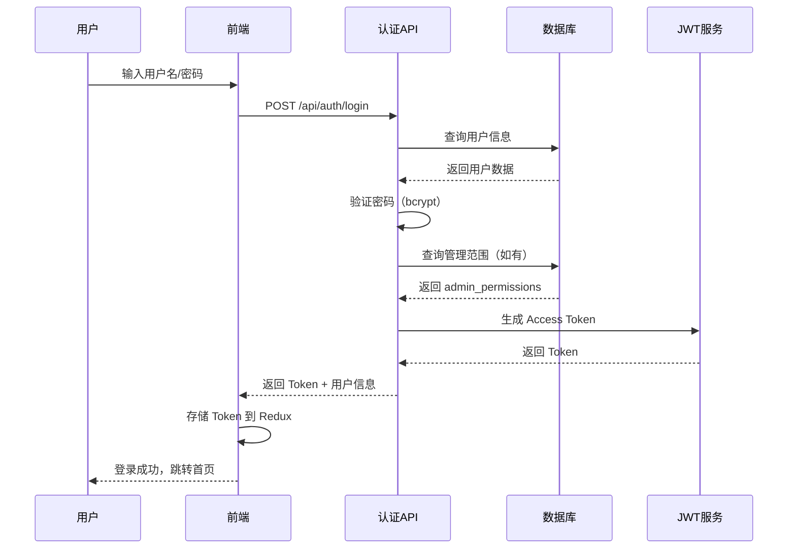
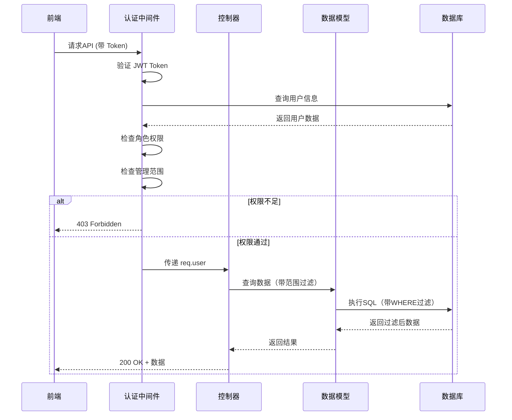
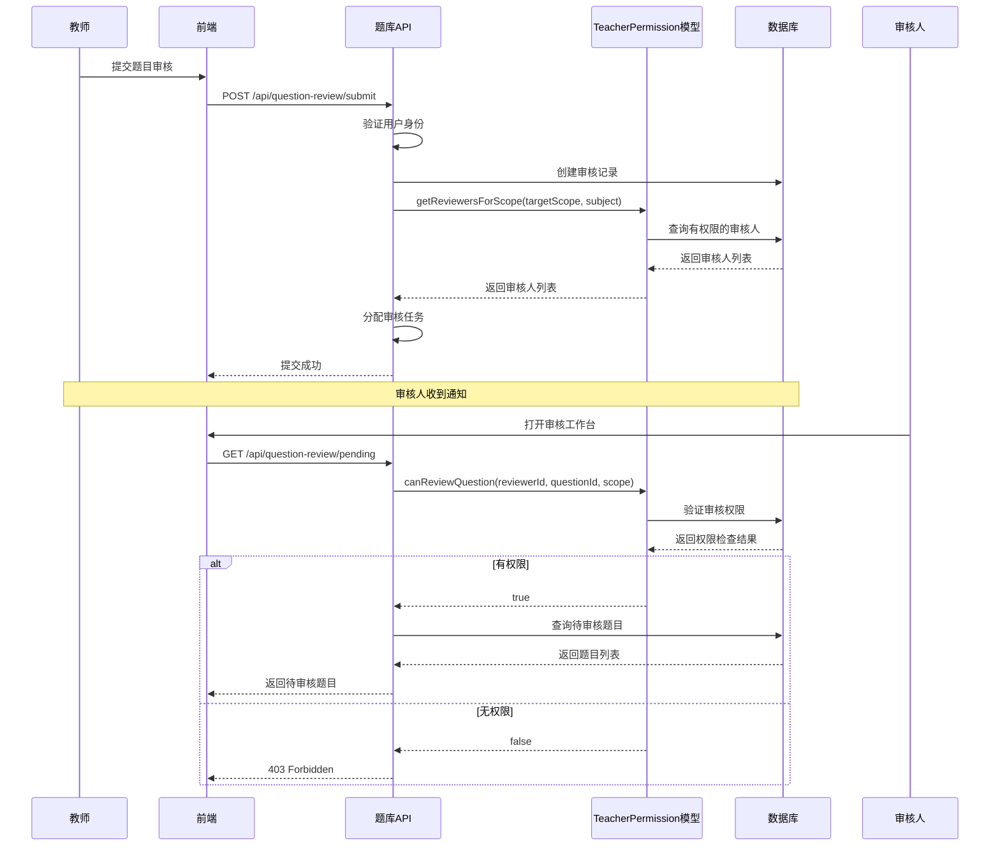
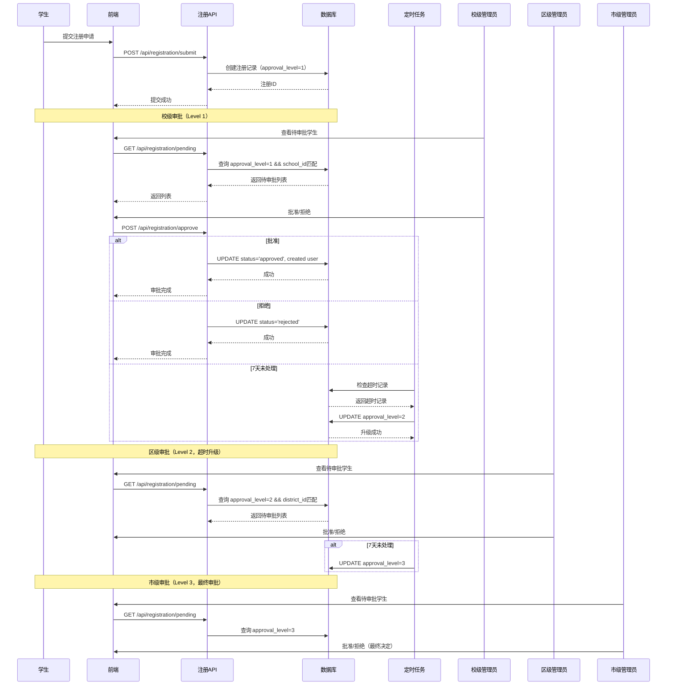

# 贵阳市小学生测评平台 - 权限系统综合指南

**文档版本**: v1.1
**创建日期**: 2025-11-05
**最后更新**: 2025-11-07

---

## 📋 目录

1. [概述](#概述)
2. [用户角色层级](#用户角色层级)
3. [权限类型](#权限类型)
4. [访问控制规则](#访问控制规则)
5. [范围隔离机制](#范围隔离机制)
6. [近期修改记录](#近期修改记录)
7. [技术实现参考](#技术实现参考)
8. [授权流程](#授权流程)
9. [测试覆盖状态](#测试覆盖状态)

---

## 概述

本文档提供贵阳市小学生测评平台权限系统的完整说明，包括角色定义、权限类型、访问控制规则、数据隔离机制以及技术实现细节。本文档结合了2025-11-05的最新功能修改。

### 权限系统核心特性

- **9级用户角色层级** - 从学生到系统管理员的完整层级
- **基于角色的访问控制 (RBAC)** - 角色决定功能访问权限
- **范围隔离** - 基于管理范围的数据可见性控制
- **细粒度题库权限** - 3种题库审核权限类型
- **活动类型限制** - 练习vs测评的创建权限分离
- **分层授权规则** - 管理员只能管理其管辖范围内的用户

---

## 用户角色层级

### 完整角色列表（9级）

| 角色代码 | 中文名称 | 权限等级 | 管理范围 | 关键权限 |
|---------|---------|---------|---------|---------|
| `student` | 学生 | Level 1 | 个人 | 参与练习、查看个人成绩、下载证书 |
| `teacher` | 教师 | Level 2 | 班级 | 创建练习、评卷、查看班级成绩、管理题库草稿 |
| `school_admin` | 校级管理员 | Level 3 | 学校 | 用户管理（本校）、审批学生注册、查看学校数据 |
| `district_admin` | 区县级管理员 | Level 4 | 区县 | 创建测评、用户管理（本区）、题库审核（区级）、数据统计 |
| `base_school_admin` | 基地学校管理员 | Level 4 | 基地学校 | 创建测评、用户管理（本校）、跨校协作 |
| `municipal_school_admin` | 市直属学校管理员 | Level 4 | 市直属学校 | 创建测评、用户管理（本校）、市级协作 |
| `municipal_admin` | 市级管理员 | Level 5 | 全市 | 创建测评、全市用户管理、题库审核（市级）、数据分析 |
| `system_admin` | 系统管理员 | Level 6 | **全局（无限制）** | **最高权限**：查看所有用户/题库/活动/成绩、管理所有数据、系统配置、不受任何范围限制 |

### 权限等级说明

- **Level 1**: 终端用户，仅访问自己的数据
- **Level 2**: 基础管理，班级/小组范围
- **Level 3**: 校级管理，单一学校范围
- **Level 4**: 区级/特殊校级管理，区域或特定学校范围
- **Level 5**: 市级管理，全市范围
- **Level 6**: **系统管理，全局访问，无任何限制**

### 角色层级关系

```
系统管理员 (system_admin, L6)
    ↓
市级管理员 (municipal_admin, L5)
    ↓
┌────────────────┬─────────────────┬──────────────────┐
│                │                 │                  │
区县级管理员     基地学校管理员    市直属学校管理员
(district_admin) (base_school)    (municipal_school)
Level 4          Level 4          Level 4
    ↓                ↓                 ↓
校级管理员 (school_admin, L3)
    ↓
教师 (teacher, L2)
    ↓
学生 (student, L1)
```

---

## 权限类型

### 1. 系统内置角色权限

每个用户角色自动拥有以下内置权限（无需额外授权）：

#### 学生 (student)
- ✅ 登录系统
- ✅ 查看可用的练习和测评活动
- ✅ 参与活动、提交答案
- ✅ 查看个人成绩和历史记录
- ✅ 下载个人证书
- ❌ 无法访问管理功能
- ❌ 无法查看他人成绩

#### 教师 (teacher)
- ✅ 学生的所有权限
- ✅ 创建和管理练习活动
- ✅ 创建题库草稿
- ✅ 查看任教班级的学生成绩
- ✅ 评卷（主观题）
- ✅ 导出班级成绩报告
- ❌ 无法创建测评活动（需要管理员权限）
- ❌ 无法直接发布题目到正式题库（需审核）

#### 校级管理员 (school_admin)
- ✅ 教师的所有权限
- ✅ 管理本校用户账号
- ✅ 审批本校学生注册
- ✅ 查看本校所有数据和统计
- ✅ 管理本校教师权限
- ❌ 无法创建测评活动
- ❌ 无法跨校管理

#### 区县级管理员 (district_admin)
- ✅ 校级管理员的所有权限
- ✅ **创建测评活动**（关键权限）
- ✅ 管理本区所有学校和用户
- ✅ 审批区内学生注册（第二级审批）
- ✅ 授予区内教师题库审核权限
- ✅ 查看区级数据统计
- ❌ 无法跨区管理

#### 基地学校管理员 (base_school_admin)
- ✅ 校级管理员的所有权限
- ✅ **创建测评活动**（关键权限）
- ✅ 跨校协作（基地校间）
- ✅ 管理基地校用户
- ❌ 无法管理非基地校

#### 市直属学校管理员 (municipal_school_admin)
- ✅ 校级管理员的所有权限
- ✅ **创建测评活动**（关键权限）
- ✅ 市级协作
- ✅ 管理市直属校用户
- ❌ 无法管理其他类型学校

#### 市级管理员 (municipal_admin)
- ✅ 所有下级管理员权限
- ✅ **创建测评活动**
- ✅ 管理全市所有用户和学校
- ✅ 审批学生注册（第三级审批，超时自动升级）
- ✅ 授予全市范围的题库审核权限
- ✅ 查看全市数据和生成分析报告
- ✅ 系统配置（部分）

#### 系统管理员 (system_admin)

**最高权限级别 - 不受任何限制**

系统管理员拥有平台的**最高权限**，可以访问和管理所有数据和功能，不受任何范围限制。

**数据访问权限（无限制）**:
- ✅ **查看所有用户数据** - 全市所有学生、教师、管理员的完整信息
- ✅ **查看所有题库** - 测评题库、市级练习题库、所有区级题库、所有校级题库
- ✅ **查看所有活动** - 练习活动、测评活动，无论创建者和范围
- ✅ **查看所有成绩和答卷** - 任意学生的成绩、答案详情、历史记录
- ✅ **查看所有审核记录** - 题库审核流程、学生注册审批记录
- ✅ **查看所有权限配置** - 教师权限、管理员权限、权限授予历史
- ✅ **访问所有统计数据** - 系统级、市级、区级、校级、班级的全部统计报表

**功能操作权限（完全权限）**:
- ✅ **用户管理** - 创建、编辑、删除任意用户，修改用户角色
- ✅ **权限管理** - 授予、撤销任意权限，管理权限配置
- ✅ **题库管理** - 创建、编辑、删除、发布任意范围的题目，无需审核
- ✅ **活动管理** - 创建、编辑、删除、发布任意类型和范围的活动
- ✅ **审核管理** - 批准、拒绝任意题库审核和学生注册申请
- ✅ **成绩管理** - 查看、修改、导出任意成绩数据
- ✅ **系统配置** - 修改系统参数、管理数据字典、配置审核流程
- ✅ **数据库操作** - 执行数据库迁移、数据备份恢复

**特殊权限**:
- ✅ **绕过所有权限检查** - 不受范围隔离、角色限制、状态限制的约束
- ✅ **跨区跨校操作** - 可以管理任意区县、任意学校的数据
- ✅ **历史数据访问** - 可以查看已删除、已禁用的历史记录
- ✅ **系统维护权限** - 系统升级、日志查看、性能监控

**范围说明**:
- **无范围限制** - 不受 `district_id`、`school_id` 等范围字段的约束
- **数据可见性** - 系统中所有数据对系统管理员完全可见
- **功能可用性** - 系统中所有功能对系统管理员完全开放

**使用场景**:
- 系统初始化和配置
- 跨区域数据分析和报表
- 问题排查和技术支持
- 紧急数据修复和恢复
- 权限问题调查和处理

### 2. 题库审核权限（可授予权限）

这些权限需要通过 `teacher_permissions` 表额外授予，不是角色自带的。

| 权限类型 | 权限代码 | 授予对象 | 审核范围 | 授予权限角色 |
|---------|---------|---------|---------|------------|
| 测评题库审核 | `assessment_review` | 教师/管理员 | 市级测评题库 | 市级管理员、系统管理员 |
| 市级练习题库审核 | `practice_municipal_review` | 教师/管理员 | 市级练习题库 | 市级管理员、系统管理员 |
| 区级练习题库审核 | `practice_district_review` | 教师/管理员 | 特定区的练习题库 | 区级管理员、市级管理员、系统管理员 |

#### 权限授予数据结构

```sql
CREATE TABLE teacher_permissions (
  id SERIAL PRIMARY KEY,
  user_id INTEGER NOT NULL,                    -- 被授权用户ID
  permission_type VARCHAR(50) NOT NULL,        -- 权限类型（上表3种之一）
  subjects TEXT[] NOT NULL,                    -- 可审核的科目列表
  scope_level VARCHAR(20),                     -- 权限层级: 'municipal', 'district', 'school'
  district_id INTEGER,                         -- 区级权限关联的区ID
  school_id INTEGER,                           -- 学校权限关联的学校ID
  granted_by INTEGER,                          -- 授权人ID
  granted_at TIMESTAMP DEFAULT CURRENT_TIMESTAMP,
  expires_at TIMESTAMP,                        -- 权限过期时间（可选）
  is_active BOOLEAN DEFAULT true,              -- 权限是否有效
  notes TEXT,
  created_at TIMESTAMP DEFAULT CURRENT_TIMESTAMP,
  updated_at TIMESTAMP DEFAULT CURRENT_TIMESTAMP,
  UNIQUE(user_id, permission_type, scope_level, district_id)
);
```

#### 权限授予规则

1. **市级管理员或系统管理员**可以授予：
   - `assessment_review`（测评题库审核）- 全市范围
   - `practice_municipal_review`（市级练习题库审核）- 全市范围
   - `practice_district_review`（区级练习题库审核）- 任意区

2. **区级管理员**可以授予：
   - `practice_district_review`（区级练习题库审核）- 仅限本区

3. **校级管理员及以下**无权授予题库审核权限

#### 已废弃的权限类型

| 权限代码 | 状态 | 废弃日期 | 替代权限 |
|---------|------|---------|---------|
| `question_bank_review` | ❌ 已废弃 | 2025-11-05 | 上述3种细粒度权限 |

**废弃说明**：旧的 `question_bank_review` 权限不区分题库类型和层级，已通过数据库迁移 `012_cleanup_old_permissions.sql` 软删除（`is_active = false`），受影响用户ID: 1, 9, 10。

---

## 访问控制规则

### 1. 活动管理权限

#### 练习活动 (practice)

**创建权限**:
- ✅ 教师 (teacher)
- ✅ 校级管理员 (school_admin)
- ✅ 区县级管理员 (district_admin)
- ✅ 基地学校管理员 (base_school_admin)
- ✅ 市直属学校管理员 (municipal_school_admin)
- ✅ 市级管理员 (municipal_admin)
- ❌ 学生 (student) - 无权限

**编辑权限**:
- ✅ 活动创建者本人
- ✅ 高级管理员（district_admin及以上）

**删除权限**:
- ✅ 活动创建者（仅限草稿状态）
- ✅ 高级管理员（仅限草稿状态）
- ❌ 已发布/进行中的活动无法删除

**组卷权限**:
- ✅ 活动创建者
- ✅ 高级管理员

#### 测评活动 (assessment)

**创建权限**（受限）:
- ❌ 学生 (student)
- ❌ 教师 (teacher) - **无权限**
- ❌ 校级管理员 (school_admin) - **无权限**
- ✅ 区县级管理员 (district_admin)
- ✅ 基地学校管理员 (base_school_admin)
- ✅ 市直属学校管理员 (municipal_school_admin)
- ✅ 市级管理员 (municipal_admin)
- ✅ 系统管理员 (system_admin)

**编辑权限**:
- ✅ 活动创建者本人
- ✅ 高级管理员（district_admin及以上）

**删除权限**:
- ✅ 活动创建者（仅限草稿状态）
- ✅ 高级管理员（仅限草稿状态）
- ❌ 已发布/进行中的测评无法删除

**发布权限**:
- ✅ 活动创建者
- ✅ 高级管理员
- ❌ 已进行中/已结束的活动无法再次发布

### 2. 题库管理权限

#### 题库创建

| 角色 | 可创建草稿 | 可直接发布 | 需要审核 |
|------|-----------|-----------|---------|
| 学生 | ❌ | ❌ | - |
| 教师 | ✅ | ❌ | ✅ |
| 校级管理员 | ✅ | ❌ | ✅ |
| 区县级管理员 | ✅ | ✅（区级练习） | ✅（市级/测评） |
| 市级管理员 | ✅ | ✅（市级练习、测评） | ❌ |
| 系统管理员 | ✅ | ✅（全部） | ❌ |

#### 题库审核流程

**审核权限来源**：通过 `teacher_permissions` 表授予

**审核层级匹配**：
```
题目提交范围 (target_scope)          需要的审核权限
───────────────────────────────── → ──────────────────────────
assessment                         → assessment_review
practice_municipal                 → practice_municipal_review
practice_district_BY (白云区)       → practice_district_review (district_id 匹配白云区)
practice_district_YY (云岩区)       → practice_district_review (district_id 匹配云岩区)
practice_school_XXX                → 无需审核（校级题库）
```

**审核流程**:
1. 教师创建题目草稿
2. 教师提交审核，选择目标范围（target_scope）
3. 系统根据 target_scope 查询有权限的审核人
4. 审核人审核题目，批准或拒绝
5. 批准后题目发布到对应题库

**审核权限验证逻辑** (TeacherPermission.canReviewQuestion):
```javascript
// 1. 获取题目信息（科目、创建者）
const question = await QuestionBank.findById(questionId);

// 2. 根据 target_scope 确定需要的权限类型
let requiredPermission;
if (targetScope === 'assessment') {
  requiredPermission = 'assessment_review';
} else if (targetScope === 'practice_municipal') {
  requiredPermission = 'practice_municipal_review';
} else if (targetScope.startsWith('practice_district_')) {
  requiredPermission = 'practice_district_review';
  // 同时需要匹配 district_id
}

// 3. 查询审核人列表
const reviewers = await TeacherPermission.getReviewersForScope(targetScope, question.subject);

// 4. 验证当前用户是否在审核人列表中
return reviewers.some(r => r.id === reviewerId);
```

### 3. 用户管理权限

#### 用户查看权限

| 管理员角色 | 可查看用户范围 | 实现方式 |
|-----------|--------------|---------|
| 校级管理员 (school_admin) | 本校所有用户 | 通过 school_id 过滤 |
| 区县级管理员 (district_admin) | 本区所有学校的用户 | 通过 district_id 过滤 |
| 基地学校管理员 (base_school_admin) | 本基地学校用户 | 通过 school_id 过滤 |
| 市直属学校管理员 (municipal_school_admin) | 本市直属学校用户 | 通过 school_id 过滤 |
| 市级管理员 (municipal_admin) | 全市所有用户 | 无过滤 |
| 系统管理员 (system_admin) | 所有用户 | 无过滤 |

#### 用户创建权限

| 管理员角色 | 可创建用户类型 |
|-----------|--------------|
| 校级管理员 | 本校教师、本校学生（需审批） |
| 区县级管理员 | 本区所有学校的教师、学生（需审批） |
| 市级管理员 | 全市所有角色（除系统管理员） |
| 系统管理员 | 所有角色 |

#### 用户角色统计显示（2025-11-05修改）

**修改内容**：前端用户管理页面的角色统计卡片，根据当前管理员的权限范围动态显示。

**修改文件**：`frontend/src/pages/admin/UserManagement.tsx`

**修改逻辑**：
```typescript
// 只统计当前管理员有权限查看的角色
const canViewRoleStats = (role: string): boolean => {
  const viewableRoles = getViewableRoles(currentUser?.role as UserRole);
  return viewableRoles.some(r => r.value === role);
};

// 条件渲染统计卡片
{canViewRoleStats('student') && (
  <Col xs={24} sm={12} lg={6}>
    <Card><Statistic title="学生" value={statistics.students} /></Card>
  </Col>
)}
```

**效果**：
- 校级管理员：只显示学生、教师统计
- 区级管理员：显示学生、教师、校级管理员统计
- 市级管理员：显示所有角色统计（除系统管理员）
- 系统管理员：显示全部角色统计

### 4. 学生注册审批权限

#### 三级审批机制

```
学生提交注册
    ↓
校级管理员审批（Level 1）
    ↓ (7天内未处理自动升级)
区级管理员审批（Level 2）
    ↓ (7天内未处理自动升级)
市级管理员审批（Level 3）
    ↓
注册完成
```

#### 审批权限规则

| 审批级别 | 负责角色 | 超时升级时间 | 可执行操作 |
|---------|---------|------------|----------|
| Level 1 | 校级管理员 (school_admin) | 7天 | 批准、拒绝、退回 |
| Level 2 | 区县级管理员 (district_admin) | 7天 | 批准、拒绝、退回、降级 |
| Level 3 | 市级管理员 (municipal_admin) | 无 | 批准、拒绝、退回、降级 |

#### 自动升级逻辑

```sql
-- 自动升级查询（每日定时任务）
SELECT * FROM registration_requests
WHERE status = 'pending'
  AND approval_level < 3
  AND created_at < NOW() - INTERVAL '7 days'
  AND last_updated_at < NOW() - INTERVAL '7 days';

-- 升级操作
UPDATE registration_requests
SET approval_level = approval_level + 1,
    last_updated_at = NOW(),
    escalation_reason = '超时自动升级'
WHERE id IN (...);
```

---

## 范围隔离机制

### 1. 数据可见性隔离

#### 按管理范围过滤数据

**实现方式**：通过 `admin_permissions` 表关联用户的管理范围

```sql
-- admin_permissions 表结构
CREATE TABLE admin_permissions (
  id SERIAL PRIMARY KEY,
  user_id INTEGER REFERENCES users(id),
  district_id INTEGER REFERENCES districts(id),  -- 区级管理员关联区ID
  school_id INTEGER REFERENCES schools(id),      -- 校级管理员关联学校ID
  base_school_id INTEGER,                       -- 基地学校ID
  municipal_school_id INTEGER,                  -- 市直属学校ID
  created_at TIMESTAMP DEFAULT CURRENT_TIMESTAMP
);
```

#### 用户查询过滤示例

```javascript
// backend/src/models/User.js - getUsers() 方法

// 校级管理员：只看本校
if (filters.managementScope && filters.managementScope.schoolId) {
  sql += ` AND u.id IN (
    SELECT user_id FROM teachers WHERE school_id = $${paramCount}
    UNION
    SELECT user_id FROM students WHERE school_id = $${paramCount}
  )`;
  params.push(filters.managementScope.schoolId);
}

// 区级管理员：只看本区所有学校
if (filters.managementScope && filters.managementScope.districtId) {
  sql += ` AND u.id IN (
    SELECT DISTINCT user_id FROM teachers t
    JOIN schools s ON t.school_id = s.id
    WHERE s.district_id = $${paramCount}
    UNION
    SELECT DISTINCT user_id FROM students st
    JOIN schools s ON st.school_id = s.id
    WHERE s.district_id = $${paramCount}
  )`;
  params.push(filters.managementScope.districtId);
}
```

### 2. 活动范围隔离

#### 活动范围 (scope) 定义

| Scope值 | 中文名称 | 创建权限 | 可见范围 |
|---------|---------|---------|---------|
| `system` | 系统级 | 系统管理员 | 全部用户 |
| `municipal` | 市级 | 市级管理员、系统管理员 | 全市用户 |
| `district` | 区县级 | 区级管理员及以上 | 本区用户 |
| `base_school` | 基地学校 | 基地学校管理员及以上 | 基地学校用户 |
| `municipal_school` | 市直属学校 | 市直属学校管理员及以上 | 市直属学校用户 |
| `school` | 学校级 | 校级管理员及以上 | 本校用户 |
| `class` | 班级 | 教师及以上 | 本班级用户 |

#### Scope自动确定逻辑

```javascript
// backend/src/middleware/activityPermission.js - getScopeForUser()

function getScopeForUser(user) {
  const scopeMap = {
    'system_admin': 'system',
    'municipal_admin': 'municipal',
    'district_admin': 'district',
    'base_school_admin': 'base_school',
    'municipal_school_admin': 'municipal_school',
    'school_admin': 'school',
    'teacher': 'class'
  };
  return scopeMap[user.role] || 'class';
}
```

### 3. 题库范围隔离

#### 题库层级

```
assessment (测评题库) - 市级统一
    ↓
practice_municipal (市级练习题库)
    ↓
practice_district_BY (白云区练习题库)
practice_district_YY (云岩区练习题库)
    ↓
practice_school_001 (学校001题库)
practice_school_002 (学校002题库)
```

#### 题库可见性规则

| 用户角色 | 可见题库范围 |
|---------|------------|
| 学生 | 本人参与活动的题库 |
| 教师 | 全部练习题库（选题用）、本人创建的草稿 |
| 校级管理员 | 全部练习题库、本校题库 |
| 区级管理员 | 全部题库（含测评）、本区题库 |
| 市级管理员 | 全部题库 |
| 系统管理员 | 全部题库 |

---

## 近期修改记录

### 2025-11-05 修改汇总

#### 1. 数据库迁移：清理旧权限类型

**迁移文件**：`database/migrations/012_cleanup_old_permissions.sql`

**修改内容**：
- 软删除所有 `question_bank_review` 权限（设置 `is_active = false`）
- 受影响用户：user_id = 1, 9, 10 (共3条权限记录)
- 添加废弃说明备注

**SQL操作**：
```sql
UPDATE teacher_permissions
SET is_active = false,
    updated_at = CURRENT_TIMESTAMP,
    notes = COALESCE(notes || ' | ', '') ||
            'Deprecated on 2025-11-05: question_bank_review permission has been replaced with granular permissions (assessment_review, practice_municipal_review, practice_district_review)'
WHERE permission_type = 'question_bank_review' AND is_active = true;
```

**背景说明**：
- 旧权限类型不区分题库层级和类型，粒度不够
- 新权限体系提供3种细粒度权限，更符合实际需求
- 保留历史记录（软删除）用于审计

#### 2. 前端修改：用户管理角色统计过滤

**修改文件**：`frontend/src/pages/admin/UserManagement.tsx`

**修改内容**：
- 用户管理页面的角色统计卡片，根据当前管理员权限动态显示
- 只显示当前管理员有权查看的角色统计

**关键代码**：
```typescript
// 判断当前管理员是否有权限查看该角色统计
const canViewRoleStats = (role: string): boolean => {
  const viewableRoles = getViewableRoles(currentUser?.role as UserRole);
  return viewableRoles.some(r => r.value === role);
};

// 条件渲染统计卡片
{canViewRoleStats('student') && (
  <Col xs={24} sm={12} lg={6}>
    <Card>
      <Statistic
        title="学生"
        value={statistics.students}
        prefix={<UserOutlined />}
      />
    </Card>
  </Col>
)}
```

**效果示例**：
- 校级管理员：只显示"学生"和"教师"统计
- 区级管理员：显示"学生"、"教师"、"校级管理员"统计
- 市级管理员：显示除"系统管理员"外的所有统计

#### 3. 前端修改：导航菜单统一命名（任务列表 2025-11-05-03）

**修改文件**：
- `frontend/src/components/layout/MainLayout.tsx`
- `frontend/src/pages/teacher/ActivityListPage.tsx`
- `frontend/src/pages/admin/AssessmentManagementPage.tsx`

**修改内容**：
- 教师导航菜单："活动管理" → "练习管理"
- 管理员导航菜单："测评管理" → "活动管理"
- 页面标题统一调整

**背景说明**：
- 明确区分教师和管理员的职责
- 教师专注于练习管理，管理员负责测评和全部活动管理
- 提升用户界面清晰度

### 2025-11-07 权限系统修复

本次修复解决了5个权限管理相关问题，涉及用户隐私保护、权限可见性控制、数据显示准确性和字段可编辑性。

#### 1. 移除用户管理中的身份证字段

**修改文件**: `frontend/src/pages/admin/UserManagement.tsx`

**修改内容**:
- 从 `User` 接口移除 `id_card` 字段
- 从 `UserFormData` 接口移除 `idCard` 字段
- 移除新建/编辑用户表单中的身份证号输入框
- 移除 `createUser` API调用中的 `idCard` 参数
- 移除编辑用户时的身份证字段赋值

**背景说明**:
- 系统不存放任何身份证信息，遵循个人信息保护原则
- 降低数据安全风险
- 用户身份验证通过手机号和用户名完成

#### 2. 移除教师个人信息页面中的注册时间字段

**修改文件**: `frontend/src/pages/ProfilePage.tsx`

**修改内容**:
- 从"Common fields"部分移除"注册时间"字段（第242-244行）

**背景说明**:
- 注册时间对终端用户（教师、学生）意义不大
- 简化个人信息页面
- 管理员仍可在用户管理页面查看用户创建时间

#### 3. 修复区级管理员不应该看到市级测评题库审核权限

**修改文件**: `backend/src/models/TeacherPermission.js`

**修改内容**:
- 在 `getAll()` 方法的区级管理员分支中添加权限类型过滤（第174-175行）
- 只允许区级管理员查看 `practice_district_review` 类型的权限

**关键代码**:
```javascript
// 区级管理员只能看到区级练习审核权限，不能看到测评和市级练习审核权限
whereClauses.push(`tp.permission_type = 'practice_district_review'`);
```

**背景说明**:
- 区级管理员只能管理本区的区级练习题库审核权限
- 测评题库（`assessment_review`）和市级练习题库（`practice_municipal_review`）由市级/系统管理员管理
- 防止区级管理员越权查看或管理市级权限

**影响**:
- 权限管理页面 - 区级管理员只能看到本区的 `practice_district_review` 权限
- 区级管理员无法看到其他类型的权限记录

#### 4. 修复权限管理中区域显示和授权人显示错误

**修改文件**: `backend/src/models/TeacherPermission.js`

**修改内容**:
- 在 `getAll()` 方法的SELECT语句中添加 `districts` 和 `schools` 表关联（第137-148行）

**修改前**:
```javascript
SELECT tp.*, u.username, u.real_name, u.role, g.real_name as granted_by_name
FROM teacher_permissions tp
JOIN users u ON tp.user_id = u.id
LEFT JOIN users g ON tp.granted_by = g.id
```

**修改后**:
```javascript
SELECT tp.*, u.username, u.real_name, u.role, g.real_name as granted_by_name,
  d.name as district_name, s.name as school_name
FROM teacher_permissions tp
JOIN users u ON tp.user_id = u.id
LEFT JOIN users g ON tp.granted_by = g.id
LEFT JOIN districts d ON tp.district_id = d.id
LEFT JOIN schools s ON tp.school_id = s.id
```

**背景说明**:
- 之前缺少 `district_name` 和 `school_name` 的关联，导致前端显示区域时为空或错误显示"全市"
- 区级练习审核权限应该显示对应的区县名称（如"白云区"、"云岩区"）
- 授权人通过 `granted_by` 字段关联 `users` 表，正确显示授权管理员姓名

**影响**:
- 权限管理页面"区域"列 - 正确显示区县名称
- 权限管理页面"授权人"列 - 正确显示授权管理员姓名

#### 5. 修复备注字段无法编辑的问题

**修改文件**:
- `backend/src/models/TeacherPermission.js` - `grantDistrictPermission()` 方法（第208-219行）
- `backend/src/routes/permissions.js` - grant API 调用（第170-177行）

**修改内容**:

**a) 扩展 grantDistrictPermission() 方法参数**:
```javascript
// 修改前：硬编码 notes，不接收 expiresAt 参数
static async grantDistrictPermission(userId, subjects, grantedBy, districtId) {
  return await this.create({
    // ...
    notes: '区级练习题库审核权限'  // ❌ 硬编码
  });
}

// 修改后：接收 expiresAt 和 notes 参数
static async grantDistrictPermission(userId, subjects, grantedBy, districtId, expiresAt = null, notes = null) {
  return await this.create({
    // ...
    expires_at: expiresAt,
    notes: notes || '区级练习题库审核权限'  // ✅ 可自定义
  });
}
```

**b) 修改 grant API 调用**:
```javascript
const permission = await TeacherPermission.grantDistrictPermission(
  user_id,
  subjects,
  req.user.id,
  managementScope.district_id,
  expires_at || null,  // ✅ 传递有效期
  notes || null        // ✅ 传递自定义备注
);
```

**背景说明**:
- 之前区级权限的备注字段硬编码为"区级练习题库审核权限"
- 创建和编辑权限时，前端传递的 `notes` 和 `expires_at` 参数被忽略
- 修复后，管理员可以在授予/编辑权限时自定义备注和有效期

**影响**:
- 权限管理页面 - 授予权限时可自定义备注
- 权限管理页面 - 编辑权限时可修改备注
- 备注字段 - 可编辑
- 有效期字段 - 可编辑

---

## 技术实现参考

### 1. 认证中间件 (auth.js)

#### 核心中间件函数

**authMiddleware** - JWT令牌验证
```javascript
const authMiddleware = async (req, res, next) => {
  try {
    const token = req.header('Authorization')?.replace('Bearer ', '');
    if (!token) {
      return res.status(401).json({ message: 'Access denied. No token provided.' });
    }

    const decoded = jwt.verify(token, process.env.JWT_SECRET);
    const user = await User.findById(decoded.userId);

    if (!user) {
      return res.status(401).json({ message: 'Invalid token. User not found.' });
    }

    req.user = {
      id: user.id,
      username: user.username,
      role: user.role,
      realName: user.real_name
    };

    next();
  } catch (error) {
    res.status(401).json({ message: 'Invalid token.' });
  }
};
```

**requireRole** - 角色验证
```javascript
const requireRole = (roles) => {
  return (req, res, next) => {
    if (!req.user) {
      return res.status(401).json({ message: 'Authentication required' });
    }

    if (!roles.includes(req.user.role)) {
      return res.status(403).json({
        message: 'Insufficient permissions',
        required: roles,
        current: req.user.role
      });
    }

    next();
  };
};
```

**requireMinLevel** - 最低权限等级验证
```javascript
const requireMinLevel = (minLevel) => {
  return (req, res, next) => {
    const userLevel = User.getRoleLevel(req.user.role);

    if (userLevel < minLevel) {
      return res.status(403).json({
        message: `Minimum permission level ${minLevel} required`,
        currentLevel: userLevel
      });
    }

    next();
  };
};
```

**requireManagementScope** - 管理范围验证
```javascript
const requireManagementScope = (scopeType) => {
  return async (req, res, next) => {
    // 系统管理员和市级管理员：全部权限
    if (req.user.role === 'system_admin' || req.user.role === 'municipal_admin') {
      return next();
    }

    // 获取管理员权限信息
    const permissions = await User.getAdminPermissions(req.user.id);

    if (!permissions) {
      return res.status(403).json({ message: 'No management scope found' });
    }

    // 根据 scopeType 验证权限
    if (scopeType === 'school' && !permissions.school_id) {
      return res.status(403).json({ message: 'School management permission required' });
    }

    if (scopeType === 'district' && !permissions.district_id) {
      return res.status(403).json({ message: 'District management permission required' });
    }

    // 将管理范围信息附加到请求
    req.managementScope = {
      districtId: permissions.district_id,
      schoolId: permissions.school_id,
      role: req.user.role
    };

    next();
  };
};
```

#### 中间件使用示例

```javascript
// 示例1：需要教师或管理员角色
router.get('/activities',
  authMiddleware,
  requireRole(['teacher', 'school_admin', 'district_admin', 'municipal_admin']),
  activityController.getActivities
);

// 示例2：需要最低Level 3（校级管理员）权限
router.post('/users',
  authMiddleware,
  requireMinLevel(3),
  userController.createUser
);

// 示例3：需要区级管理范围
router.get('/district/statistics',
  authMiddleware,
  requireManagementScope('district'),
  statisticsController.getDistrictStats
);
```

### 2. 活动权限中间件 (activityPermission.js)

#### 关键常量定义

```javascript
// 可以创建练习活动的角色
const PRACTICE_ALLOWED_ROLES = [
  'teacher',
  'school_admin',
  'district_admin',
  'base_school_admin',
  'municipal_school_admin',
  'municipal_admin'
];

// 可以创建测评活动的角色（受限）
const ASSESSMENT_ALLOWED_ROLES = [
  'system_admin',
  'district_admin',
  'base_school_admin',
  'municipal_school_admin',
  'municipal_admin'
];
```

#### 权限检查函数

**canCreateActivity** - 创建活动权限
```javascript
function canCreateActivity(user, activityType) {
  if (activityType === 'assessment') {
    return ASSESSMENT_ALLOWED_ROLES.includes(user.role);
  }

  if (activityType === 'practice') {
    return PRACTICE_ALLOWED_ROLES.includes(user.role);
  }

  return false;
}
```

**canEditActivity** - 编辑活动权限
```javascript
function canEditActivity(user, activity) {
  // 创建者可以编辑
  if (activity.created_by === user.id) {
    return true;
  }

  // 高级管理员可以编辑任何活动
  const adminRoles = [
    'system_admin',
    'district_admin',
    'base_school_admin',
    'municipal_school_admin',
    'municipal_admin'
  ];

  return adminRoles.includes(user.role);
}
```

**canDeleteActivity** - 删除活动权限
```javascript
function canDeleteActivity(user, activity) {
  // 已发布或进行中的活动不能删除
  if (['published', 'ongoing'].includes(activity.status)) {
    return false;
  }

  // 创建者可以删除草稿
  if (activity.created_by === user.id && activity.status === 'draft') {
    return true;
  }

  // 高级管理员可以删除草稿活动
  const adminRoles = [
    'system_admin',
    'district_admin',
    'base_school_admin',
    'municipal_school_admin',
    'municipal_admin'
  ];

  return adminRoles.includes(user.role) && activity.status === 'draft';
}
```

### 3. 教师权限模型 (TeacherPermission.js)

#### 关键方法

**create** - 创建权限
```javascript
static async create(permissionData) {
  const {
    user_id,
    permission_type,
    subjects,
    scope_level,
    district_id,
    school_id,
    granted_by,
    expires_at,
    notes
  } = permissionData;

  const sql = `
    INSERT INTO teacher_permissions
    (user_id, permission_type, subjects, scope_level, district_id, school_id, granted_by, expires_at, notes)
    VALUES ($1, $2, $3, $4, $5, $6, $7, $8, $9)
    ON CONFLICT (user_id, permission_type, scope_level, district_id)
    DO UPDATE SET
      subjects = $3,
      school_id = $6,
      granted_by = $7,
      expires_at = $8,
      notes = $9,
      is_active = true,
      updated_at = CURRENT_TIMESTAMP
    RETURNING *
  `;

  const result = await query(sql, [
    user_id,
    permission_type,
    subjects,
    scope_level || 'municipal',
    district_id || null,
    school_id || null,
    granted_by,
    expires_at,
    notes
  ]);

  return result.rows[0];
}
```

**getReviewersForScope** - 获取审核人列表
```javascript
static async getReviewersForScope(targetScope, subject) {
  let permissionType;
  let districtCode = null;

  // 根据 targetScope 确定权限类型
  if (targetScope === 'assessment') {
    permissionType = 'assessment_review';
  } else if (targetScope === 'practice_municipal') {
    permissionType = 'practice_municipal_review';
  } else if (targetScope.startsWith('practice_district_')) {
    permissionType = 'practice_district_review';
    districtCode = targetScope.replace('practice_district_', '');
  } else {
    return []; // 校级题库不需要审核
  }

  let sql = `
    SELECT DISTINCT
      u.id, u.username, u.real_name, u.role,
      tp.subjects, tp.scope_level, tp.district_id,
      d.name as district_name
    FROM teacher_permissions tp
    JOIN users u ON tp.user_id = u.id
    LEFT JOIN districts d ON tp.district_id = d.id
    WHERE tp.permission_type = $1
      AND tp.is_active = true
      AND (tp.expires_at IS NULL OR tp.expires_at > CURRENT_TIMESTAMP)
      AND $2 = ANY(tp.subjects)
  `;

  const params = [permissionType, subject];

  // 如果是区级权限，需要匹配区域
  if (districtCode) {
    sql += ` AND d.code = $3`;
    params.push(districtCode);
  }

  sql += ` ORDER BY u.real_name`;

  const result = await query(sql, params);
  return result.rows;
}
```

**getAll with scope filtering** - 获取权限列表（带范围过滤）
```javascript
static async getAll(filters = {}) {
  let sql = `
    SELECT tp.*,
      u.username, u.real_name, u.role,
      g.real_name as granted_by_name
    FROM teacher_permissions tp
    JOIN users u ON tp.user_id = u.id
    LEFT JOIN users g ON tp.granted_by = g.id
  `;

  const params = [];
  let paramCount = 0;
  const whereClauses = ['1=1'];

  // ... 其他过滤条件 ...

  // 区级管理员只能看到该区域内的教师权限
  if (filters.managementScope && filters.managementScope.role === 'district_admin') {
    const districtId = filters.managementScope.districtId;
    if (districtId) {
      paramCount++;
      whereClauses.push(`u.id IN (
        SELECT DISTINCT t.user_id
        FROM teachers t
        WHERE t.school_id IN (SELECT id FROM schools WHERE district_id = $${paramCount})
      )`);
      params.push(districtId);
    }
  }

  // 校级管理员只能看到该校的教师权限
  if (filters.managementScope &&
      (filters.managementScope.role === 'school_admin' ||
       filters.managementScope.role === 'base_school_admin' ||
       filters.managementScope.role === 'municipal_school_admin')) {
    const schoolId = filters.managementScope.schoolId;
    if (schoolId) {
      paramCount++;
      whereClauses.push(`u.id IN (
        SELECT user_id FROM teachers WHERE school_id = $${paramCount}
      )`);
      params.push(schoolId);
    }
  }

  sql += ` WHERE ${whereClauses.join(' AND ')}`;
  sql += ` ORDER BY tp.created_at DESC`;

  const result = await query(sql, params);
  return result.rows;
}
```

---

## 授权流程

### 1. 用户登录授权流程



### 2. API请求授权流程



### 3. 题库审核授权流程



### 4. 学生注册三级审批流程



---

## 测试覆盖状态

### 当前测试概况

根据 `docs/FEATURE_REQUIREMENTS.md` 中记录的测试状态：

- **API测试**: 15+ 测试文件
- **E2E回归测试**: 41个测试用例，100%通过率
- **冒烟测试**: 7个核心功能测试

### 已有权限相关测试

#### API测试
- `tests/api/hierarchical-permission-api-test.js` - 分层权限管理API测试（新增）
- `tests/api/profile-api-test.js` - 用户资料权限测试（新增）
- `tests/api/activity-permissions.test.js` - 活动权限测试

#### E2E测试
- `tests/e2e/regression/hierarchical-permissions.spec.ts` - 分层权限管理E2E测试（新增）
- `tests/e2e/regression/activity-permissions.spec.ts` - 活动权限E2E测试
- Authentication测试（AUT101-AUT107）- 基本登录权限测试

### ⚠️ 需要补充的测试（待Task 3详细分析）

初步识别需要补充的测试领域：

1. **题库审核权限测试**
   - [ ] 测评题库审核权限验证
   - [ ] 市级练习题库审核权限验证
   - [ ] 区级练习题库审核权限验证（带district_id匹配）
   - [ ] 跨区审核权限隔离测试
   - [ ] 科目匹配验证测试

2. **活动创建权限测试**
   - [ ] 教师创建练习活动（应成功）
   - [ ] 教师创建测评活动（应拒绝）
   - [ ] 校级管理员创建测评（应拒绝）
   - [ ] 区级管理员创建测评（应成功）
   - [ ] 各角色创建活动的scope验证

3. **用户管理范围隔离测试**
   - [ ] 校级管理员查看用户（仅本校）
   - [ ] 区级管理员查看用户（仅本区）
   - [ ] 跨校/跨区数据访问拒绝测试
   - [ ] 用户统计显示过滤测试（2025-11-05新功能）

4. **学生注册审批流程测试**
   - [ ] 三级审批流程完整测试
   - [ ] 超时自动升级机制测试
   - [ ] 跨级审批拒绝测试

5. **废弃权限迁移测试**
   - [ ] 验证旧权限已禁用
   - [ ] 验证新权限正常工作
   - [ ] 回滚脚本测试

**详细的测试覆盖分析和缺失任务将在Task 3中完成**。

---

## 附录

### A. 相关数据库表结构

#### users 表
```sql
CREATE TABLE users (
  id SERIAL PRIMARY KEY,
  username VARCHAR(50) UNIQUE NOT NULL,
  password_hash VARCHAR(255) NOT NULL,
  real_name VARCHAR(100),
  role VARCHAR(50) NOT NULL, -- 9种角色之一
  status VARCHAR(20) DEFAULT 'active',
  created_at TIMESTAMP DEFAULT CURRENT_TIMESTAMP,
  updated_at TIMESTAMP DEFAULT CURRENT_TIMESTAMP
);
```

#### admin_permissions 表
```sql
CREATE TABLE admin_permissions (
  id SERIAL PRIMARY KEY,
  user_id INTEGER NOT NULL REFERENCES users(id),
  district_id INTEGER REFERENCES districts(id),
  school_id INTEGER REFERENCES schools(id),
  base_school_id INTEGER,
  municipal_school_id INTEGER,
  created_at TIMESTAMP DEFAULT CURRENT_TIMESTAMP
);
```

#### teacher_permissions 表
```sql
CREATE TABLE teacher_permissions (
  id SERIAL PRIMARY KEY,
  user_id INTEGER NOT NULL REFERENCES users(id) ON DELETE CASCADE,
  permission_type VARCHAR(50) NOT NULL, -- 'assessment_review', 'practice_municipal_review', 'practice_district_review'
  subjects TEXT[] NOT NULL,
  scope_level VARCHAR(20), -- 'municipal', 'district', 'school'
  district_id INTEGER REFERENCES districts(id),
  school_id INTEGER REFERENCES schools(id),
  granted_by INTEGER REFERENCES users(id),
  granted_at TIMESTAMP DEFAULT CURRENT_TIMESTAMP,
  expires_at TIMESTAMP,
  is_active BOOLEAN DEFAULT true,
  notes TEXT,
  created_at TIMESTAMP DEFAULT CURRENT_TIMESTAMP,
  updated_at TIMESTAMP DEFAULT CURRENT_TIMESTAMP,
  UNIQUE(user_id, permission_type, scope_level, district_id)
);
```

### B. 环境变量配置

```bash
# JWT配置
JWT_SECRET=your_secret_key_here
JWT_EXPIRES_IN=24h
JWT_REFRESH_EXPIRES_IN=7d

# 数据库配置
DB_HOST=localhost
DB_PORT=5432
DB_NAME=guiyang_oj
DB_USER=postgres
DB_PASSWORD=your_password

# CORS配置
CORS_ORIGIN=http://localhost:3000
```

### C. 参考文档索引

| 文档名称 | 路径 | 说明 |
|---------|------|------|
| 题库权限管理规范 | `docs/QUESTION_BANK_PERMISSION_MANAGEMENT.md` | 题库权限系统详细规范 |
| 用户管理指南 | `docs/USER_MANAGEMENT_GUIDE.md` | 用户创建、审批流程指南 |
| 功能需求文档 | `docs/FEATURE_REQUIREMENTS.md` | 完整功能需求和实现状态 |
| 系统设计文档 | `docs/updated_system_design_0707_v2.md` | 系统架构和设计说明 |
| API文档 | `docs/API_Document.md` | 后端API接口文档 |
| 测试指南 | `tests/docs/测试指南.md` | 测试编写和执行指南 |
| CLAUDE开发指南 | `CLAUDE.md` | 开发流程和最佳实践 |

---

**文档维护**: 本文档需要在权限系统发生重大变更时及时更新。

**反馈渠道**: 如有疑问或发现文档错误，请联系开发团队或提交Issue。
