# 贵阳市小学生测评服务平台 — 功能演示文档

> 统一密码：`password123` | 访问地址：`http://localhost:3100` 或 `http://localhost:8080`
>
> 📸 本文档所有截图由 Playwright 自动生成，存放在 `docs/screenshots/` 目录

---

## 演示账号

| 角色 | 用户名 | 姓名 | 用途 |
|------|--------|------|------|
| 市级管理员 | `admin` | 系统管理员 | 全局管理功能 |
| 区级管理员 | `yunyan_admin` | 云岩区管理员 | 区级数据隔离 |
| 校级管理员 | `school_admin_01` | 第一小学管理员 | 校级管理 |
| 市直属学校 | `municipal_school_admin` | 市直属学校管理员 | 市直属视角 |
| 基地校管理员 | `base_school_admin` | 信息技术基地校管理员 | 基地校视角 |
| 教师（数学） | `teacher_yy_ps_math` | 蒋磊-云岩一小 | 题库/活动/评卷 |
| 教师（信息科技） | `teacher_yy_ps_it` | 韩雪-云岩一小 | 信息科技教学 |
| 学生 | `13800138003` | 张小明 | 学生端全流程 |

补充教师账号（按区/校/科目分布）：

| 区 | 小学-数学 | 小学-信息科技 | 中学-数学 | 中学-信息科技 |
|----|-----------|-------------|-----------|-------------|
| 白云区 | `teacher_by_ps_math` | `teacher_by_ps_it` | `teacher_by_ms_math` | `teacher_by_ms_it` |
| 南明区 | `teacher_nm_ps_math` | `teacher_nm_ps_it` | `teacher_nm_ms_math` | `teacher_nm_ms_it` |
| 云岩区 | `teacher_yy_ps_math` | `teacher_yy_ps_it` | `teacher_yy_ms_math` | `teacher_yy_ms_it` |

---

## 演示数据概览

系统已预填充丰富的演示数据，确保每个功能页面都有实际内容展示：

| 数据类型 | 数量 | 说明 |
|----------|------|------|
| 用户账号 | 35+ | 6区管理员 + 18教师 + 10+学生 |
| 题库题目 | 39 | 覆盖7种题型（单选/多选/判断/填空/编程/匹配/问答），数学+信息科技 |
| 测评活动 | 14 | 3已完成 + 4进行中 + 2已发布 + 1草稿 + 3练习（含三年级专项） |
| 活动题目关联 | 63 | 活动↔题库的多对多关联 |
| 学生答题记录 | 19 | 多学生、多活动的完整答题数据 |
| 答案详情 | 24 | 含自动判题和待人工批改记录 |
| 教学班 | 3 | 2已批准 + 1待审批（含成员和教师） |
| 日常任务 | 6 | 每日/每周/每月任务定义 |
| 积分交易 | 33 | 多学生的积分获得和消费记录 |
| 学生成就 | 11 | 多学生已解锁的成就 |
| 学生统计 | 38 | 能力维度 + 知识点掌握统计 |
| 证书 | 3 | 数学和信息科技测评证书 |
| 注册申请 | 3 | 待审核和已通过的申请 |

> **重新加载演示数据**：
> ```bash
> # 先重置数据库（如需要）
> docker exec -i guiyang_oj_postgres psql -U postgres -d guiyang_oj < database/schema.sql
> docker exec -i guiyang_oj_postgres psql -U postgres -d guiyang_oj < database/seed.sql
>
> # 加载演示数据
> docker exec -i guiyang_oj_postgres psql -U postgres -d guiyang_oj < database/demo_data.sql
> ```

---

## 功能模块总览

```
┌─────────────────────────────────────────────────────┐
│                   贵阳市小学生测评服务平台              │
├──────────┬──────────────┬───────────────┬───────────┤
│  管理员端  │   教师端      │   学生端       │  公共服务  │
├──────────┼──────────────┼───────────────┼───────────┤
│ 管理总览  │ 题库管理      │ 测评中心      │ 登录认证   │
│ 用户管理  │ 草稿箱        │ 练习中心      │ 学生注册   │
│ 权限管理  │ 审核工作台    │ 在线答题      │ 证书验证   │
│ 审批中心  │ 活动管理      │ 成绩查看      │           │
│ 题库管理  │ 组卷功能      │ 成就系统      │           │
│ 成就管理  │ 评卷系统      │ 积分系统      │           │
│ 测评管理  │ 数据分析      │ 个人统计      │           │
│          │ 教学班管理    │ 成长中心      │           │
└──────────┴──────────────┴───────────────┴───────────┘
```

---

## 一、管理员端功能

> 登录账号：`admin` / `password123`

### 1.1 管理总览仪表盘

**路径**：`/admin/home` → `/admin/overview`


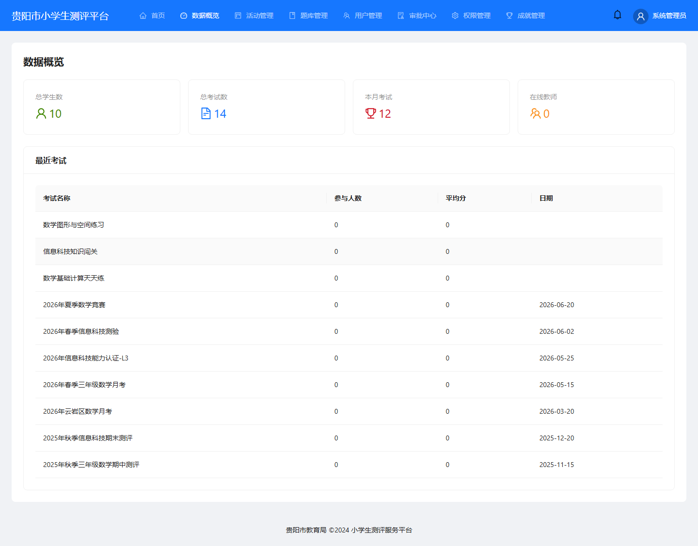

| 功能 | 说明 |
|------|------|
| 统计卡片 | 学生总数、考试总数、本月考试数、在线教师数 |
| 近期考试 | 展示最近考试列表，含参与人数、平均分、日期 |
| 快捷入口 | 跳转题库管理、用户管理、活动管理 |

### 1.2 用户管理

**路径**：`/admin/users`

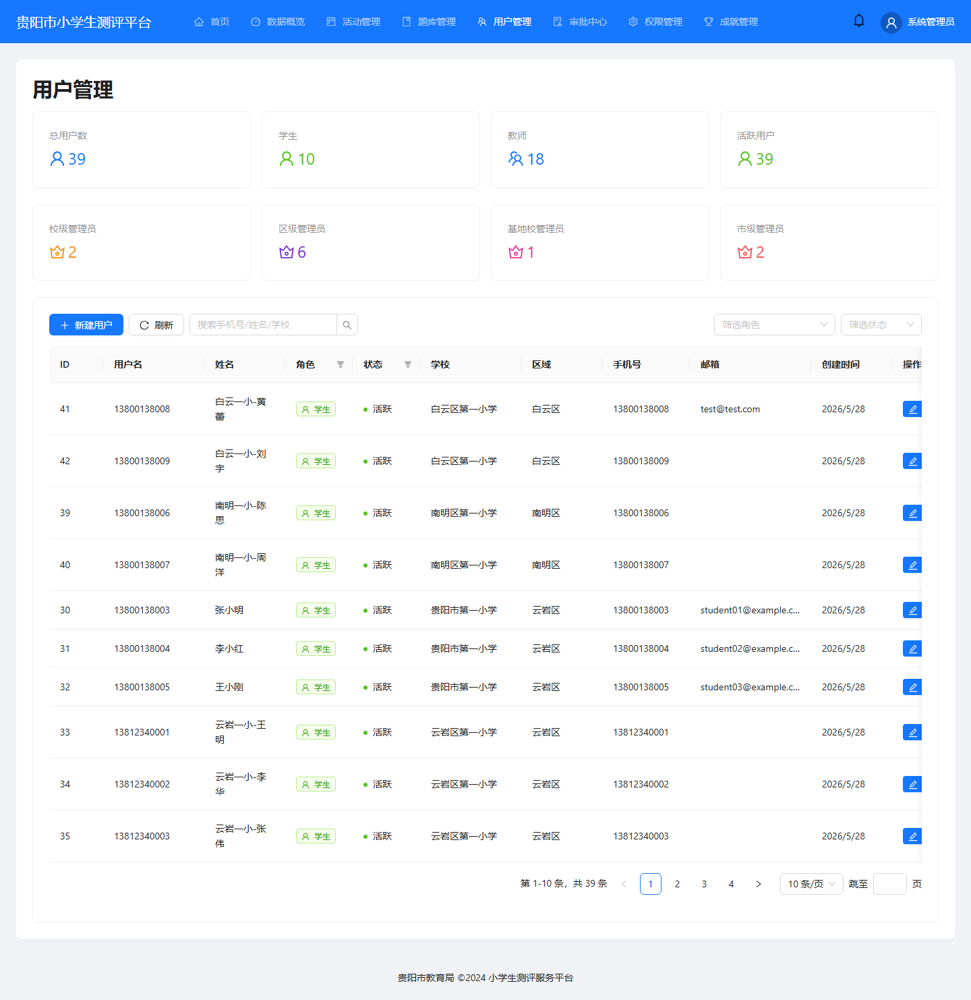

| 功能 | 操作 |
|------|------|
| 用户列表 | 分页展示，支持按角色（管理员/教师/学生）筛选 |
| 新增用户 | 填写用户名、密码、角色、真实姓名、手机号、邮箱 |
| 编辑用户 | 修改角色、个人信息 |
| 删除用户 | 二次确认后删除 |
| 重置密码 | 一键重置为默认密码 |

### 1.3 权限管理

**路径**：`/admin/permissions`

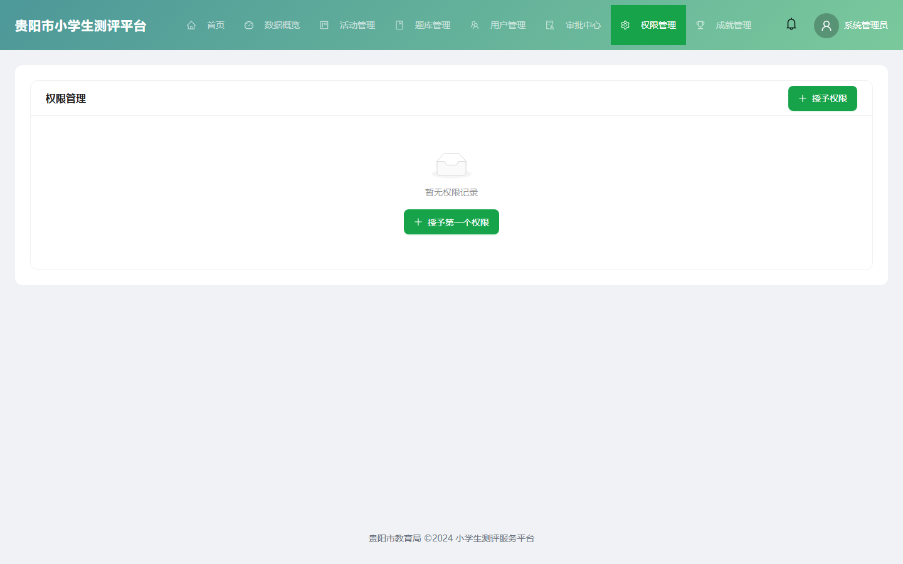

**角色层级**：

| 层级 | 角色 | 权限范围 |
|------|------|---------|
| 7 | 市级管理员 (municipal_admin) | 全部权限 |
| 6 | 市直属学校管理员 (municipal_school_admin) | 市直属学校 |
| 5 | 基地校管理员 (base_school_admin) | 基地学校 |
| 4 | 区级管理员 (district_admin) | 本区范围 |
| 3 | 校级管理员 (school_admin) | 本校范围 |
| 2 | 教师 (teacher) | 教学相关 |
| 1 | 学生 (student) | 答题查看 |

**权限类别**：

| 类别 | 权限项 | 说明 |
|------|--------|------|
| 管理权限 | `assessment_manage` | 测评题库管理（含审核、撤回） |
| 管理权限 | `practice_municipal_manage` | 市级练习题库管理 |
| 管理权限 | `practice_district_manage` | 区级练习题库管理 |
| 管理权限 | `competition_manage` | 竞赛管理 |
| 发布权限 | `practice_publish_municipal` | 市级练习发布 |
| 发布权限 | `practice_publish_district` | 区级练习发布 |
| 发布权限 | `practice_publish_school` | 校级练习发布 |
| 发布权限 | `practice_publish_base_school` | 基地学校练习发布 |
| 发布权限 | `practice_publish_municipal_school` | 市直学校练习发布 |

### 1.4 审批中心

**路径**：`/admin/approval-center`

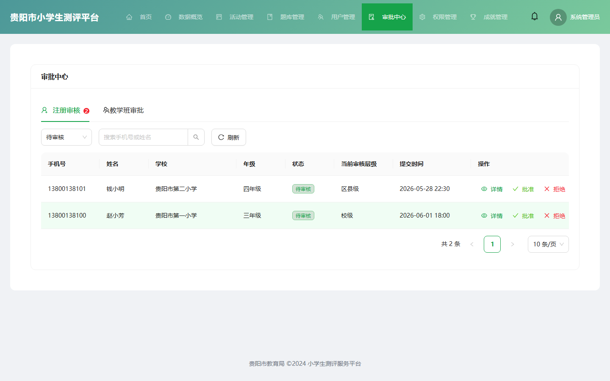

| 功能 | 说明 |
|------|------|
| 注册审批 | 审核学生自助注册申请，批准/拒绝 |
| 题目审核 | 审核教师提交的题目，通过/驳回 |
| 教学班审批 | 审核教学班创建申请 |

### 1.5 题库管理（管理员+教师共用）

**路径**：`/admin/question-bank` 或 `/teacher/question-bank`

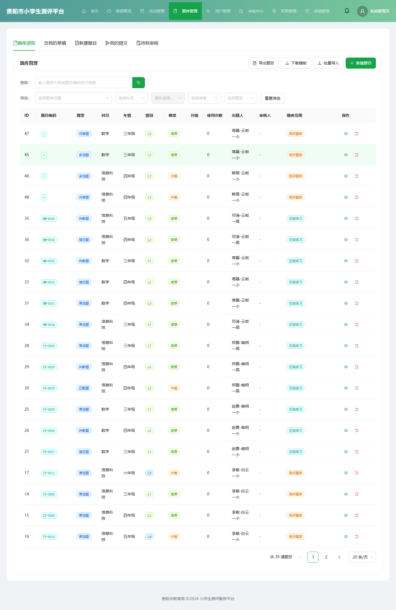

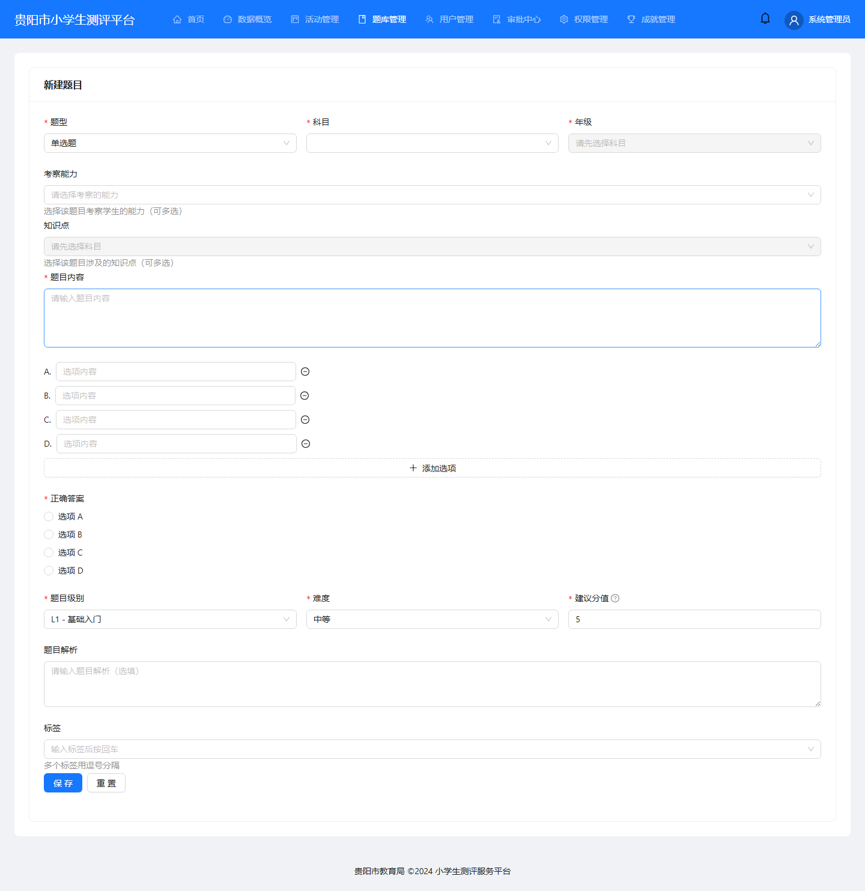

**支持的 7 种题型**：

| 题型 | 标识 | 答题交互 | 判题方式 |
|------|------|---------|---------|
| 单选题 | `single` | Radio 单选 | 自动判题 |
| 多选题 | `multiple` | Checkbox 多选 | 自动判题 |
| 判断题 | `true_false` | 对/错选择 | 自动判题 |
| 填空题 | `blank` | 文本输入 | 自动判题 |
| 编程题 | `code` | 代码编辑器 | 判题服务自动评判 |
| 匹配题 | `matching` | 左右配对 | 自动判题 |
| 问答题 | `essay` | 文本域 | 教师手动评分 |

**题目属性**：

- 难度等级：简单 (easy) / 中等 (medium) / 困难 (hard)
- 适用科目：数学、信息科技
- 适用年级：一年级 ~ 高三（按科目不同有所限制）
- 题库范围：测评题库、市级练习题库、区级练习题库、校级练习题库

**题目生命周期**：

```
创建草稿 → 提交审核 → 审核通过/驳回 → 发布入库 → 停用
```

**题库范围说明**：

| 范围 | 说明 | 可见性 |
|------|------|--------|
| 测评题库 (assessment) | 区级测评专用 | 区级管理员管理 |
| 市级练习题库 (practice_municipal) | 全市练习 | 市级管理员管理 |
| 区级练习题库 (practice_district_XX) | 本区练习 | 区级管理员管理 |
| 校级练习题库 (practice_school_N) | 本校练习 | 校级管理员管理 |

### 1.6 成就管理

**路径**：`/admin/achievements`

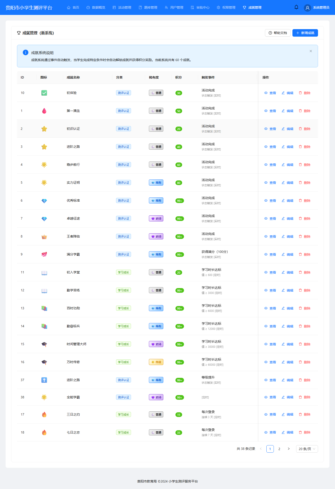

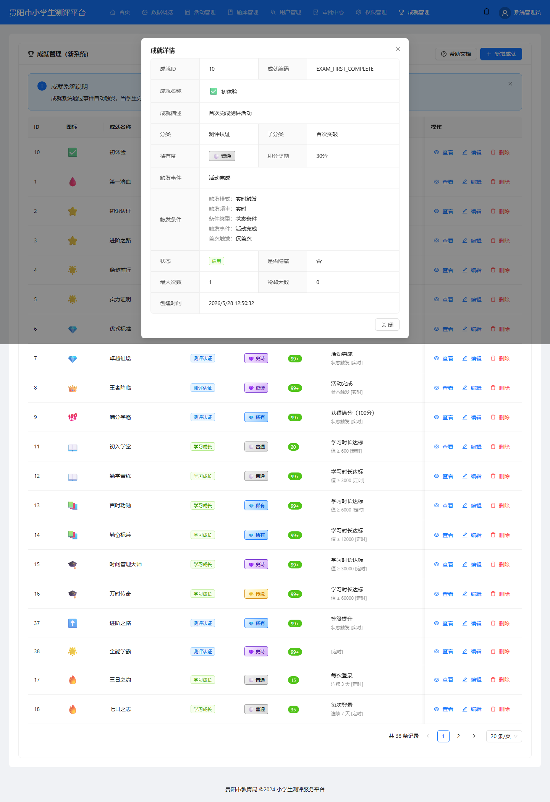

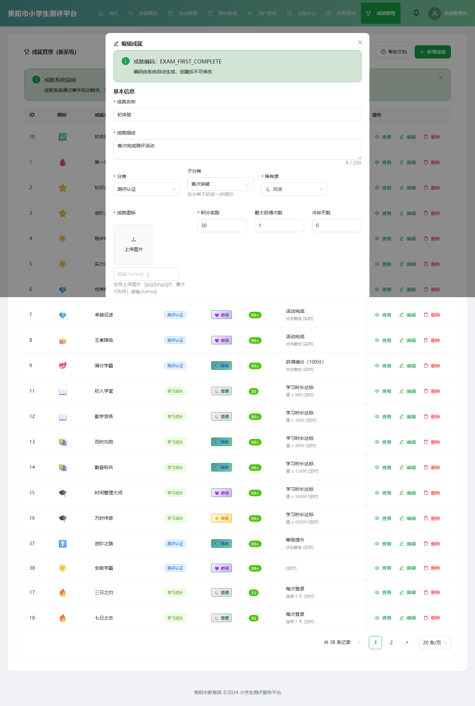

**成就分类体系**：

| 大类 | 子分类 | 说明 |
|------|--------|------|
| 考试认证 | 首次突破、等级进阶、跨学科 | 考试成绩相关 |
| 学习成长 | 首次突破、学习时长、学习频率、连续成功、能力提升、学习习惯 | 学习行为相关 |
| 社交协作 | 互动交流、帮助他人、获得认可、知识分享 | 社交互动相关 |
| 特殊活动 | 节日活动、季节活动 | 时限活动相关 |

**稀有度等级**：

| 稀有度 | 图标 | 标签颜色 | 含义 |
|--------|------|---------|------|
| 普通 | ⚪ | 灰色渐变 | 基础成就 |
| 稀有 | 💎 | 蓝色渐变 | 较难获得 |
| 史诗 | 💜 | 紫色渐变 | 高难度 |
| 传说 | 🌟 | 金色渐变 | 极稀有 |
| 神话 | 🔥 | 红色渐变 | 最高稀有度 |

**触发条件**：

- 触发模式：自动触发 / 手动授予
- 触发频率：一次性 / 每日 / 每周 / 每月
- 条件类型：分数达标 / 次数累计 / 时长累计 / 排名达成
- 时间窗口：支持固定日期和模板变量（如 `${LUNAR_NEW_YEAR}` → 农历新年初一）

**管理功能**：列表查看、详情查看（中文展示）、新增、编辑（分类联动子分类下拉）

### 1.7 测评活动管理

**路径**：`/admin/assessments`

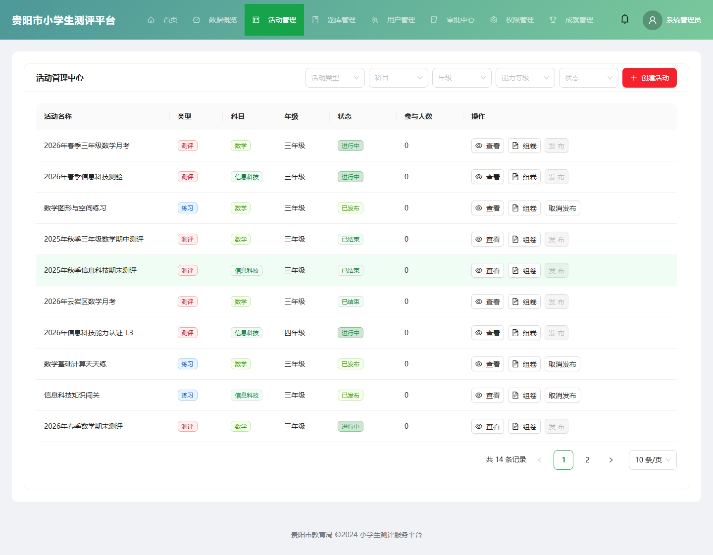

**活动类型**：

| 类型 | 标识 | 说明 |
|------|------|------|
| 测评 | `assessment` | 正式考试，有严格时间限制 |
| 练习 | `practice` | 自主练习，可配置重做 |

**创建活动流程**：

1. 选择类型（测评/练习）和科目
2. 选择年级（一年级 ~ 高三）和能力等级（L1 ~ L7）
3. 设定时间范围和时长限制（限时/不限时）
4. 设置及格分数和总分
5. 选择发布范围（市级/区级/校级）
6. 配置是否允许重做及最大尝试次数
7. 提交后进入组卷环节

**活动状态流转**：

```
草稿 → 已发布 → 进行中 → 已结束
```

**组卷功能**（`/admin/assessments/:id/paper`）：

- 从题库按条件筛选题目（题型、难度、科目）
- 添加到试卷并设置分值
- 支持手动选题和自动抽题
- 预览试卷总分和时间配置

---

## 二、教师端功能

> 登录账号：`teacher_yy_ps_math` / `password123`

### 2.1 教师题库管理

**路径**：`/teacher/question-bank`

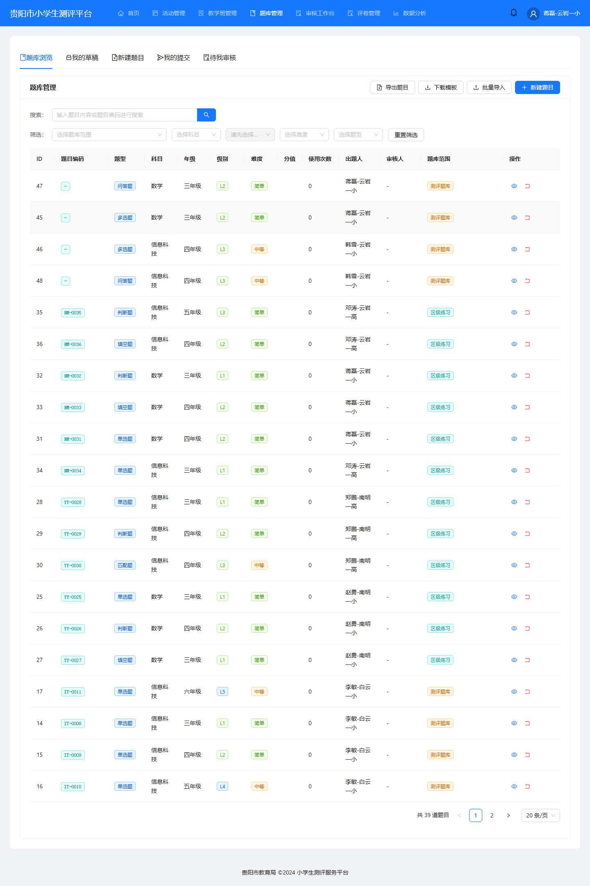

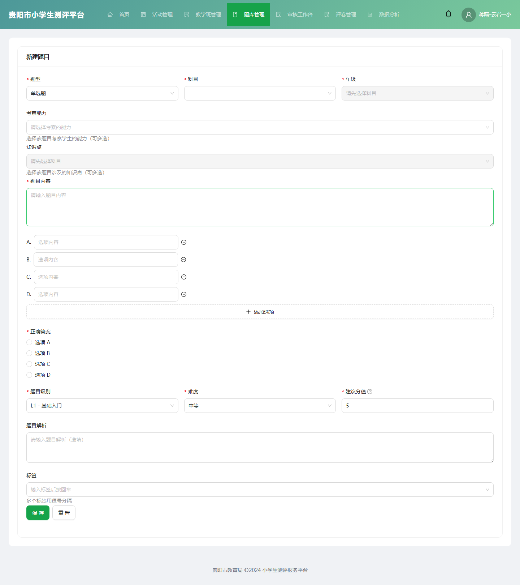

**路径**：`/teacher` (首页仪表盘)

| 功能 | 说明 |
|------|------|
| 教学概览 | 班级数、学生数、近期活动 |
| 题目统计 | 按题型统计已创建题目数 |
| 快捷操作 | 创建题目、创建活动、查看待评卷 |

### 2.2 题库工作流

**路径**：`/teacher/question-bank`

**草稿箱** (`/teacher/question-bank` → 草稿标签)：

- 题目暂存为草稿，支持反复编辑
- 显示草稿状态、创建时间
- 支持按题型、难度筛选

**我的提交** (`/teacher/question-bank` → 提交标签)：

- 查看已提交的题目及审核状态
- 状态：待审核 / 已通过 / 已驳回
- 驳回后可修改重新提交

**审核工作台** (`/teacher/review-workbench`)：

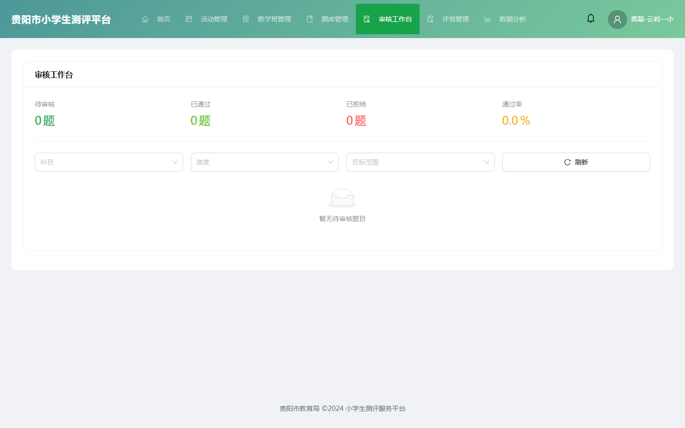

- 展示待审核题目队列
- 审核操作：通过 / 驳回（填写驳回原因）
- 按题库范围筛选审核列表

**创建/编辑题目** (`/teacher/question-bank/create`)：

- 选择题型 → 动态展示对应表单
- 单选题：题干 + 4个选项 + 正确答案
- 多选题：题干 + 多个选项 + 多个正确答案
- 判断题：题干 + 正确/错误
- 填空题：题干 + 答案（支持多个空）
- 编程题：题干 + 代码模板 + 测试用例（输入/输出对）
- 匹配题：左侧项 + 右侧项 + 正确配对
- 问答题：题干 + 参考答案
- 设置难度、解析、分值
- 选择题库范围（根据账号自动匹配所属区域及审核人）

### 2.3 活动管理

**路径**：`/teacher/activities`

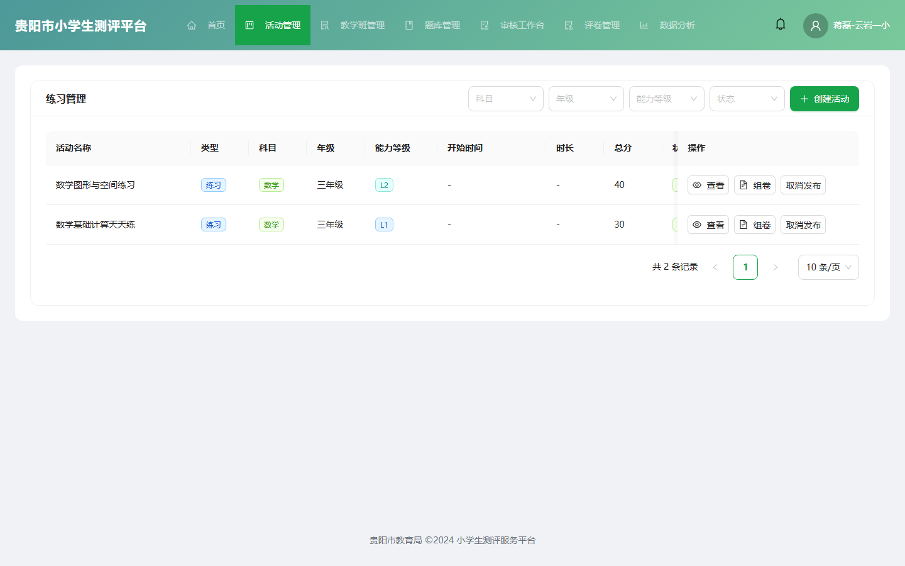

| 操作 | 说明 |
|------|------|
| 活动列表 | 查看已创建的活动，按类型/状态筛选 |
| 创建活动 | 选择类型（测评/练习），配置参数 |
| 编辑活动 | 修改活动信息（草稿/未发布状态） |
| 活动详情 | 查看参与情况、答题统计 |
| 组卷 | 从题库选题组卷，配置分值 |

### 2.4 评卷系统

**路径**：`/teacher/grading`

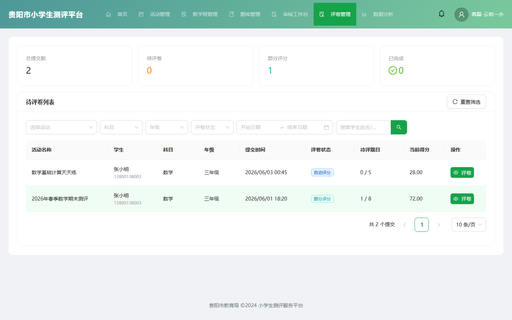

**评卷列表**：

- 展示待评卷/已评卷活动
- 显示学生姓名、提交时间、状态
- 按活动筛选

**评卷详情** (`/teacher/grading/:id`)：

- **按题型分组展示**学生作答内容
- 自动判题题型（单选/多选/判断/填空/编程/匹配）：显示判题结果和对错标记
- 手动评卷题型（问答题）：展示学生答案，教师可输入评分和评语
- 评分进度条实时更新
- 自动保存评分
- 支持上/下一位学生快速切换

### 2.5 数据分析

**路径**：`/teacher/data-analytics`

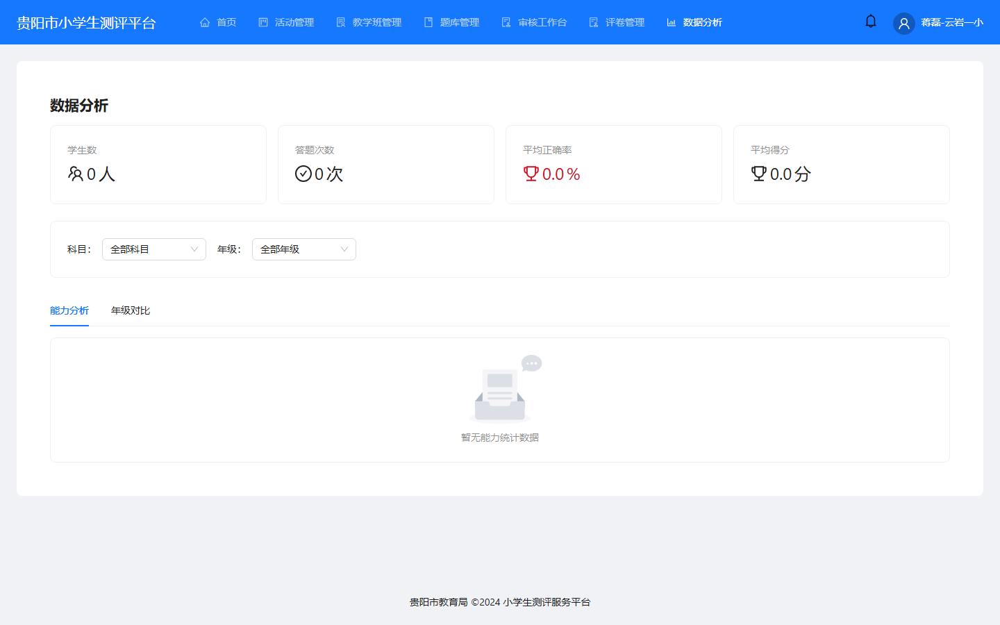

| 图表类型 | 说明 |
|---------|------|
| 柱状图 | 各班级/学校成绩分布对比 |
| 雷达图 | 学科能力维度分析（按能力等级 L1~L7） |
| 统计数据 | 参与率、平均分、优秀率、及格率 |
| 筛选条件 | 按学校、年级、科目筛选 |

### 2.6 教学班管理

**路径**：`/teacher/teaching-classes`

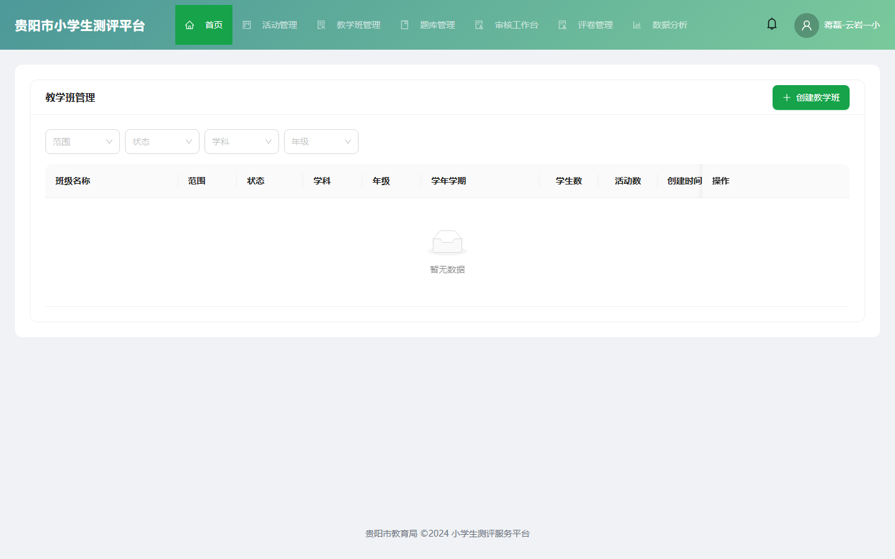

| 功能 | 说明 |
|------|------|
| 班级列表 | 展示管理的教学班 |
| 创建班级 | 填写班级名称、科目、学年学期 |
| 班级详情 | 查看班级信息、任课教师 |
| 学员管理 | 添加/移除班级学员 |

---

## 三、学生端功能

> 登录账号：`13800138003` / `password123`

### 3.1 学生首页

**路径**：`/` (登录后首页)

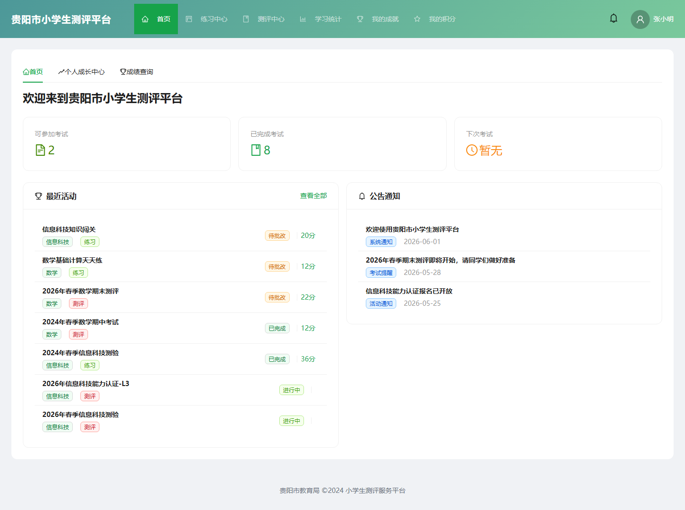

| 功能 | 说明 |
|------|------|
| 学习概览 | 参与活动数、完成数、学习时长（动态统计） |
| 最近活动 | 显示可参加的测评和练习列表，点击直接进入 |
| 公告通知 | 展示系统公告和考试提醒 |

### 3.2 测评中心

**路径**：`/student/assessments`

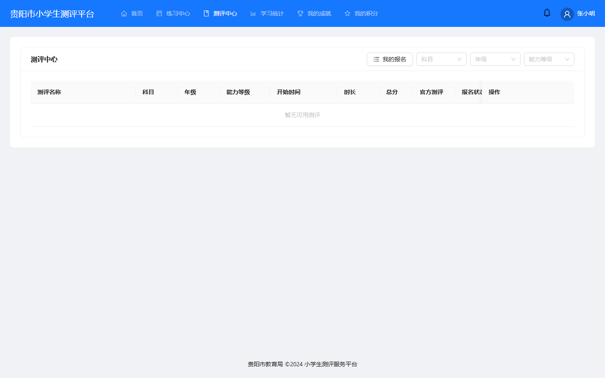

| 功能 | 说明 |
|------|------|
| 可参加测评 | 展示已发布的测评列表（标题、科目、时间、时长） |
| 报名功能 | 如启用报名，先报名再参加 |
| 状态标识 | 未开始 / 进行中 / 已结束 / 已完成 |
| 进入答题 | 点击进入测评答题页面 |

### 3.3 练习中心

**路径**：`/student/practice`

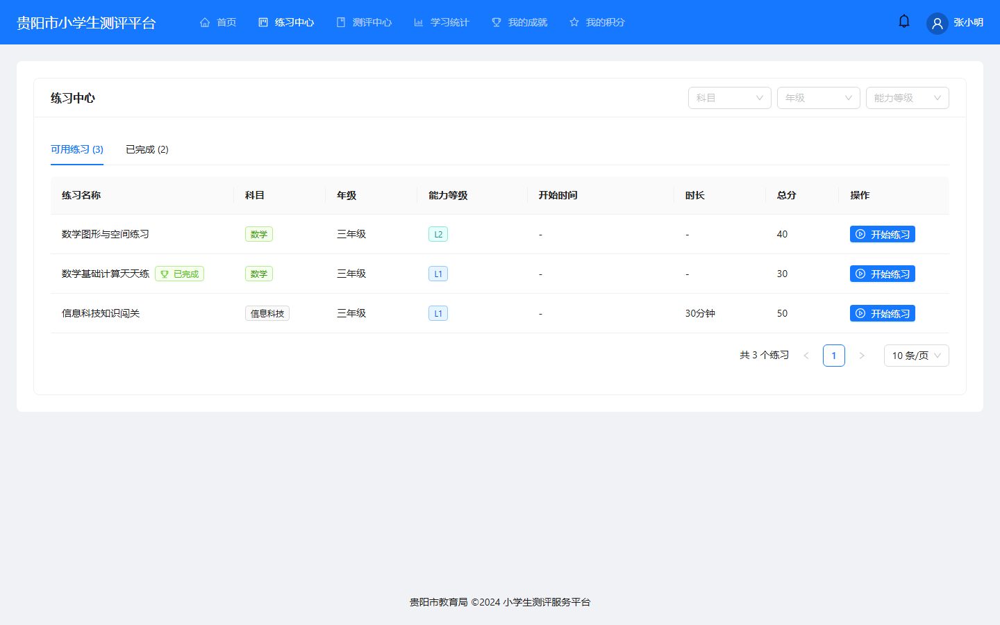

| 功能 | 说明 |
|------|------|
| 可用练习 | 展示可参加的练习活动 |
| 已完成练习 | 展示历史练习记录及得分 |
| 重复练习 | 如允许重做，可再次参加 |

### 3.4 在线答题 ⭐

**路径**：`/student/activity/:id`


**答题界面功能**：

| 功能 | 说明 |
|------|------|
| 倒计时 | 顶部实时倒计时，时间到自动交卷 |
| 答题卡 | 侧栏展示所有题目序号，点击跳转 |
| 进度指示 | 已答/未答题目数量统计 |
| 自动保存 | 答案实时保存到服务器 + 本地 localStorage 备份 |
| 题型渲染 | 根据题型动态渲染对应交互组件 |

**各题型交互**：

| 题型 | 交互方式 |
|------|---------|
| 单选题 | Radio 圆形单选按钮 |
| 多选题 | Checkbox 方形复选框 |
| 判断题 | 对/错 按钮组 |
| 填空题 | Input 文本输入框 |
| 编程题 | 代码编辑器 + 运行测试 + 提交判题 |
| 匹配题 | 选择匹配/拖拽连线 |
| 问答题 | TextArea 文本域 |

**编程题特色**：
- 在线代码编辑器
- 支持运行测试用例查看输出
- 提交后由独立判题服务（judge-service）沙箱执行
- 展示测试用例通过情况

### 3.5 成绩查看

**路径**：`/student/results/:id`

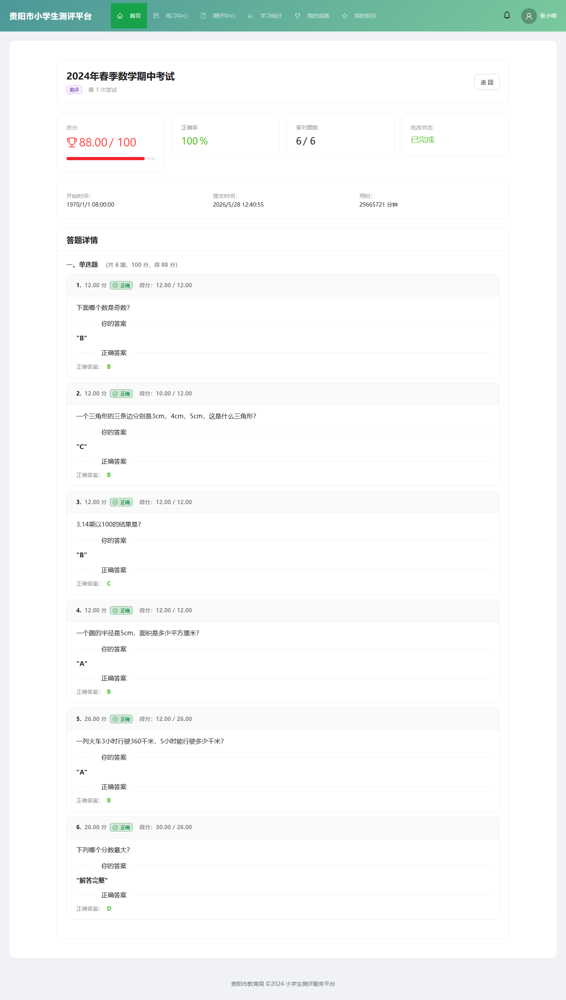

| 功能 | 说明 |
|------|------|
| 成绩总分 | 总得分 / 满分 |
| 逐题回顾 | 每题的作答、正确答案、得分 |
| 对错标记 | ✓ / ✗ 标识每题对错 |

### 3.6 成就系统

**路径**：`/student/achievements`

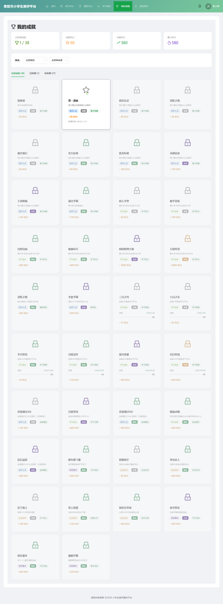

| 功能 | 说明 |
|------|------|
| 成就卡片墙 | 按类别分组展示所有成就 |
| 已解锁/未解锁 | 已获得成就高亮展示，未获得灰色锁定 |
| 成就详情 | 查看名称、描述、获得条件、获得时间 |
| 分类筛选 | 按考试认证/学习成长/社交协作/特殊活动筛选 |
| 稀有度展示 | 5 级稀有度（⚪💎💜🌟🔥）对应渐变颜色 |

### 3.7 积分系统

**路径**：`/student/points`

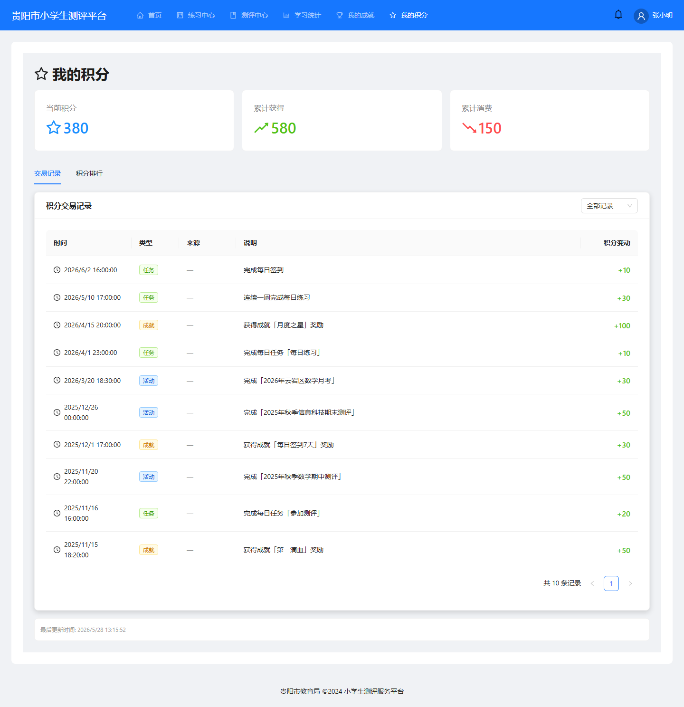

| 功能 | 说明 |
|------|------|
| 积分账户 | 当前积分 / 累计积分 / 已消费积分 |
| 积分流水 | 获得记录（来源、时间、数额），按时间排序 |
| 来源分类 | 成就奖励、每日任务、活动完成、兑换消费等 |

### 3.8 个人统计

**路径**：`/student/statistics`

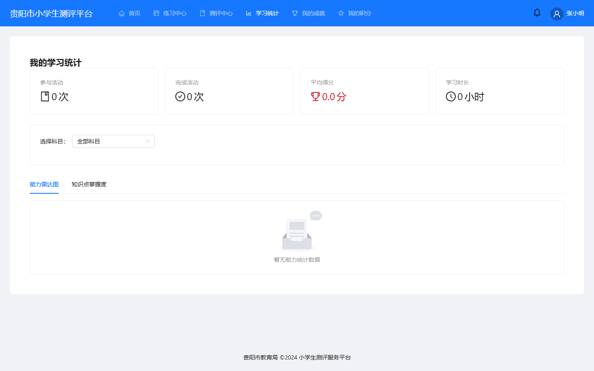

| 功能 | 说明 |
|------|------|
| 学习数据 | 参与活动数、完成率、学习时长 |
| 成绩趋势 | 历次考试成绩变化 |
| 科目分布 | 各科目参与情况和表现 |

### 3.9 我的报名

**路径**：`/student/registrations`

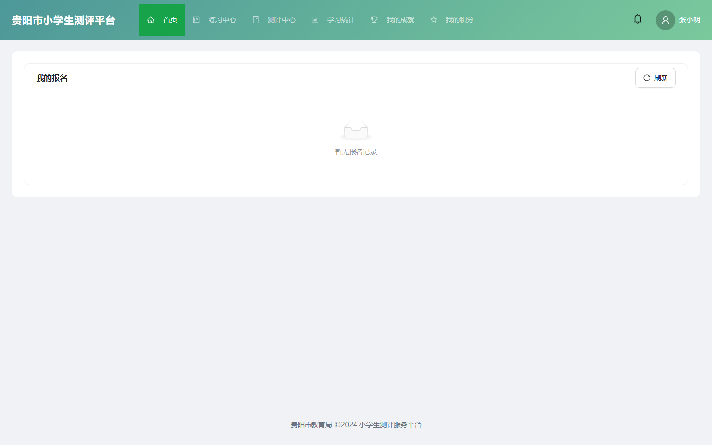

| 功能 | 说明 |
|------|------|
| 报名列表 | 展示已报名的测评 |
| 报名状态 | 待审核 / 已通过 / 已拒绝 |

### 3.10 个人成长中心

**路径**：`/student` → 成长中心

| 功能 | 说明 |
|------|------|
| 学习进度 | 完成活动数、学习时长 |
| 学习轨迹 | Timeline 时间线展示学习历程 |
| 成就进度 | 已解锁成就数/总成就数 |

---

## 四、公共服务（无需登录）

### 4.1 登录认证

**路径**：`/login`

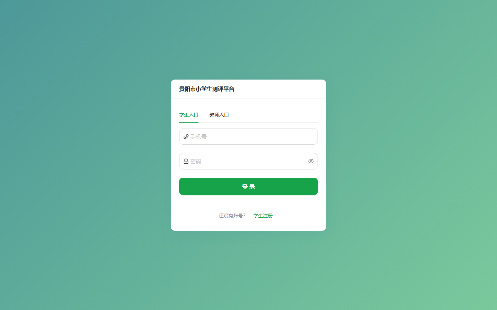

| 功能 | 说明 |
|------|------|
| 账号登录 | 用户名 + 密码 |
| JWT 认证 | Access Token + Refresh Token 双 Token 机制 |
| 角色路由 | 登录后按角色自动跳转对应首页 |

### 4.2 学生自助注册

**路径**：`/register`

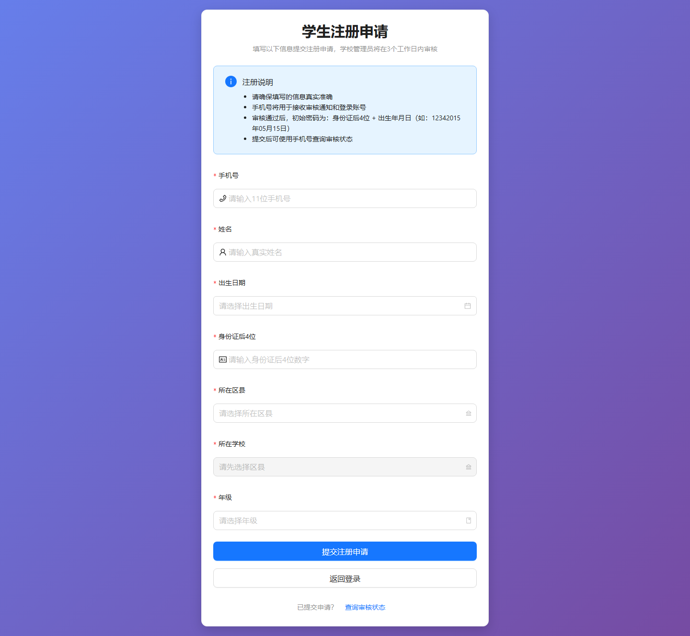

| 功能 | 说明 |
|------|------|
| 注册申请 | 填写姓名、身份证号、学校等信息 |
| 审核状态 | `/register-status/:phone` 查看审核进度 |
| 管理员审批 | 在 `/admin/approval-center` 或 `RegistrationApprovalPage` 审批 |

### 4.3 证书验证

**路径**：`/verify` 或 `/verify/:certNumber`

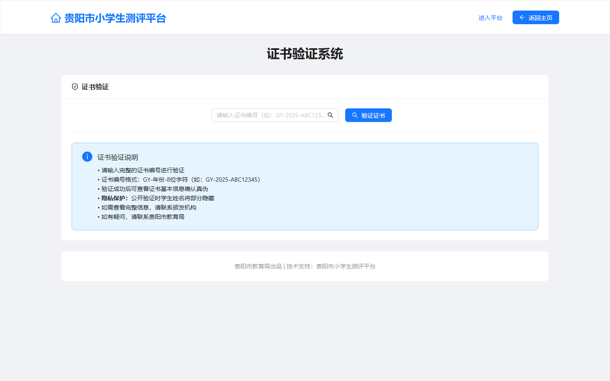

| 功能 | 说明 |
|------|------|
| 输入验证 | 输入证书编号验证真伪 |
| 链接验证 | 通过 URL 直接携带编号验证 |
| 证书下载 | 验证通过后可下载证书文件 |

### 4.4 通知系统

**路径**：`/notifications`（需登录）

| 功能 | 说明 |
|------|------|
| 通知列表 | 展示系统通知和个人通知 |
| 已读/未读 | 未读通知标记 |
| 类型分类 | 系统公告、活动提醒、成绩通知 |

---

## 五、多级权限数据隔离对比

> 区级管理员登录：`yunyan_admin` / `password123`

对比管理员 `admin`（全市数据）和区级管理员 `yunyan_admin`（仅云岩区数据）的视角差异：

**市级管理员视角 — 用户管理**：


**区级管理员视角 — 用户管理**：

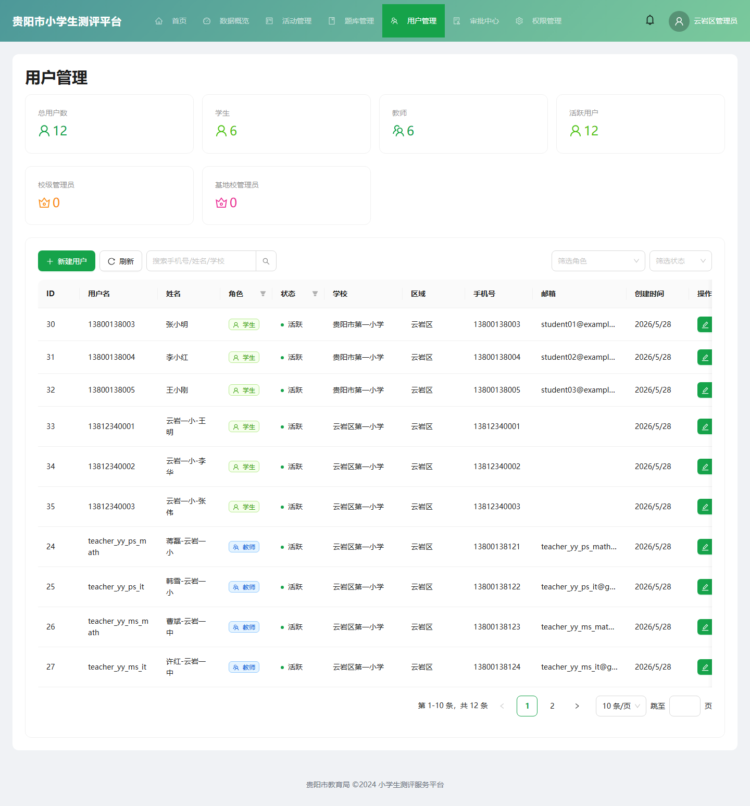

**区级管理员首页**：

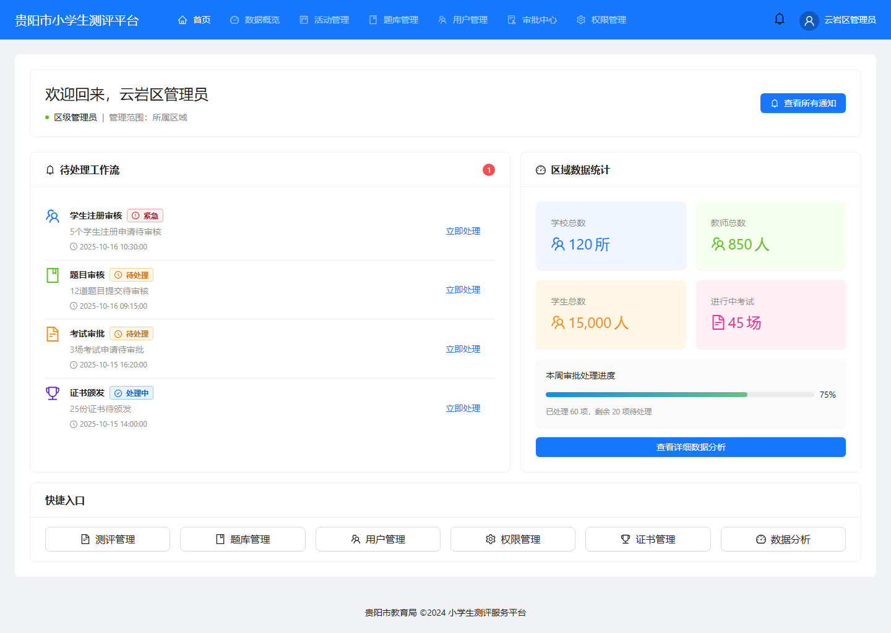

> 💡 可见区级管理员只能看到本区的用户和数据，实现了严格的数据隔离。

---

## 六、系统架构与技术亮点

### 技术栈

| 层级 | 技术 |
|------|------|
| 前端 | React 18 + TypeScript + Ant Design 5 + Redux Toolkit + Vite |
| 后端 | Node.js + Express.js + PostgreSQL 15 + Redis |
| 判题 | 独立 judge-service 服务，沙箱执行代码 |
| 部署 | Docker Compose + Nginx 反向代理 |
| 图表 | Recharts（柱状图、雷达图） |
| 测试 | Playwright (E2E) + Jest (单元/API) |

### 服务架构

```
浏览器 → Nginx(:8080) → Frontend(:3100)
                        → Backend(:3003) → PostgreSQL(:5432)
                                          → Redis(:6379)
                        → Judge Service(:3002)
```

### 核心亮点

| 亮点 | 说明 |
|------|------|
| 多级权限体系 | 5 层角色 × 6 个行政区，数据严格隔离 |
| 7 种题型全覆盖 | 单选/多选/判断/填空/编程/匹配/问答 |
| 编程题自动判题 | 独立判题服务，沙箱执行，多测试用例 |
| 题库质量管控 | 草稿→提交→审核→发布，完整工作流 |
| 成就积分体系 | 5 级稀有度、4 大类别、积分激励、游戏化学习 |
| 能力等级评估 | 数学和信息技术各 7 个等级（L1~L7），雷达图可视化 |
| 数据可视化 | 柱状图、雷达图、进度条、统计卡片 |
| 答题安全 | 倒计时、双保存（服务端+localStorage）、自动交卷 |
| 证书系统 | 自动生成 + 在线验证真伪 |
| 一键部署 | Docker Compose 编排全部服务 |

---

## 七、演示流程建议

### 推荐路线（约 40 分钟）

| 步骤 | 角色 | 账号 | 内容 | 时长 |
|------|------|------|------|------|
| 1 | 管理员 | `admin` | 登录 → 管理总览 → 用户管理 → 权限管理 | 5 min |
| 2 | 管理员 | `admin` | 题库管理 → 创建题目（展示 7 种题型） | 5 min |
| 3 | 管理员 | `admin` | 成就管理 → 查看详情（稀有度+触发条件） | 3 min |
| 4 | 管理员 | `admin` | 测评管理 → 创建测评 → 组卷 | 5 min |
| 5 | 教师 | `teacher_yy_ps_math` | 题库草稿/审核流程 → 评卷系统 → 数据分析 | 7 min |
| 6 | 学生 | `13800138003` | 测评中心 → 在线答题（各题型） → 交卷 | 5 min |
| 7 | 学生 | `13800138003` | 成就系统 → 积分系统 → 个人统计 | 3 min |
| 8 | 区级 | `yunyan_admin` | 切换账号 → 展示数据隔离效果 | 2 min |
| 9 | 公共 | — | 学生注册 → 证书验证（退出登录后） | 3 min |
| 10 | 编程题 | 教师创建 → 学生答题 | 编程题全流程：创建 → 添加用例 → 答题 → 自动判题 | 2 min |

### 最短演示路线（约 15 分钟）

| 步骤 | 内容 |
|------|------|
| 1 | 管理员登录 → 权限管理（讲解多级体系）→ 题库（7 种题型） |
| 2 | 切换学生 → 在线答题（展示各题型交互）→ 交卷查看成绩 |
| 3 | 学生成就 → 积分 → 切换区级账号展示数据隔离 |
