# 贵阳市小学生测评服务平台 — 功能演示文档

> 统一密码：`password123` | 访问地址：`http://localhost:8080`（Nginx）或 `http://localhost:3100`（前端直连）
>
> 开发调试地址：`http://localhost:3000`（Vite 热更新，改完源码即时生效；:3100 需 `docker compose build frontend` 重建）
>
> 🎨 界面已应用薄荷编程品牌设计规范：品牌主色 `#0ea5e9`（天空蓝）、导航渐变 `#0ea5e9 → #38bdf8`
> 📐 全站视觉规范：导航到页面首块统一 40px、卡片纵向堆叠缝隙统一 6px、紧凑表格
>
> 📸 本文档所有截图由 `scripts/take_screenshots.js`（Playwright）自动生成，存放在 `docs/screenshots/` 目录。
> 重照方式：先重置演示数据，再运行 `node scripts/take_screenshots.js`

---

## 演示账号

| 角色 | 用户名 | 姓名 | 用途 |
|------|--------|------|------|
| 市级管理员 | `admin` | 系统管理员 | 全局管理功能 |
| 区级管理员 | `yunyan_admin` | 云岩区管理员 | 区级数据隔离 |
| 校级管理员 | `school_admin_01` | 第一小学管理员 | 校级管理 |
| 市直属学校 | `municipal_school_admin` | 市直属学校管理员 | 市直属视角 |
| 基地校管理员 | `base_school_admin` | 信息技术基地校管理员 | 基地校视角 |
| 教师（数学） | `teacher_yy_ps_math` | 蒋磊-云岩一小 | 题库/活动/评卷/数据分析 |
| 教师（信息科技） | `teacher_yy_ps_it` | 韩雪-云岩一小 | 信息科技教学 |
| 学生 | `13800138003` | 张小明 | 学生端全流程 |

补充教师账号（按区/校/科目分布，详见 `docs/DEMO_GUIDE.md`）：

| 区 | 小学-数学 | 小学-信息科技 | 中学-数学 | 中学-信息科技 |
|----|-----------|-------------|-----------|-------------|
| 白云区 | `teacher_by_ps_math` | `teacher_by_ps_it` | `teacher_by_ms_math` | `teacher_by_ms_it` |
| 南明区 | `teacher_nm_ps_math` | `teacher_nm_ps_it` | `teacher_nm_ms_math` | `teacher_nm_ms_it` |
| 云岩区 | `teacher_yy_ps_math` | `teacher_yy_ps_it` | `teacher_yy_ms_math` | `teacher_yy_ms_it` |

---

## 演示数据概览

系统由 `backend/scripts/seed-demo-data.js` 一键重建演示数据，确保每个功能页面开箱即有内容：

```bash
# 一键重建（在 backend 容器内执行，自动清理并重建全部业务演示数据）
docker exec guiyang_oj_backend node scripts/seed-demo-data.js
```

| 数据类型 | 数量 | 说明 |
|----------|------|------|
| 用户账号 | 47 | 6 区管理员 + 18 教师 + 学生等 |
| 题库题目 | 78 | 75 已发布 + 3 待审核，覆盖 7 种题型（单选/多选/判断/填空/编程/匹配/问答），数学 + 信息科技 |
| 测评/练习活动 | 9 | 全部为完整卷子（每份 ≥5 题，含编程题与主观题） |
| 活动↔题目关联 | 85 | 多对多组卷关联 |
| 学生答卷 | 3 | 张小明已完成卷（出成绩）+ 王明/李华待评卷（供评卷演示） |
| 答案详情 | 30 | 含自动判题与待人工批改记录 |
| 错题 | 5 | 张小明的数学错题（含错误次数与知识点） |
| 教学班 | 2 | 数学/信息科技各 1 个（含任课教师、学生与关联活动） |
| 日常任务 | 6 | 每日/每周/每月任务定义 |
| 积分流水 | 23 | 张小明 16 笔（当前 200 分，连胜 7）+ 王明 4 笔 + 李华 3 笔 |
| 每日积分统计 | 42 | 3 名学生近 7 天按难度分布 |
| 积分排行榜 | 9 | 总榜/周榜/月榜各 3 条（服务每小时自动刷新，张小明 305 分居首） |
| 成就解锁 | 13 | 张小明 8 / 王明 3 / 李华 2 |
| 证书 | 2 | 张小明数学/信息科技证书（编号可在证书验证页查验） |
| 注册申请 | 30+ | 供注册审批演示 |

> ⚠️ 注意：积分/连胜/成就/证书按 `students.id` 读写，答卷按 `users.id` 读写——种子脚本已分别处理，勿混用。

---

## 功能模块总览

```
┌──────────────────────────────────────────────────────────────┐
│                    贵阳市小学生测评服务平台                      │
├──────────────┬──────────────────┬───────────────┬─────────────┤
│   管理员端    │     教师端        │    学生端      │   公共服务   │
├──────────────┼──────────────────┼───────────────┼─────────────┤
│ 管理总览      │ 题库管理（富文本） │ 智能练习 ⭐    │ 登录认证     │
│ 用户管理      │ 草稿箱/我的提交   │ 练习中心       │ 学生注册     │
│ 权限管理      │ 审核工作台        │ 测评中心       │ 证书验证     │
│ 审批中心      │ 活动管理/组卷     │ 在线答题       │             │
│ 题库管理      │ 评卷系统（多维筛选）│ 成绩查看      │             │
│ 成就管理      │ 数据分析仪表盘    │ 错题巩固站     │             │
│ 测评管理      │ 教学班管理        │ 成就/积分/商店 │             │
│              │                  │ 学习统计/成长   │             │
└──────────────┴──────────────────┴───────────────┴─────────────┘
```

学生端导航顺序：首页 → **智能练习** → 练习中心 → 测评中心 → 错题集 → 学习统计 → 我的成就 → 我的积分 → 积分商店

---

## 一、管理员端功能

> 登录账号：`admin` / `password123`

### 1.1 管理总览仪表盘

**路径**：`/admin/home` → `/admin/overview`

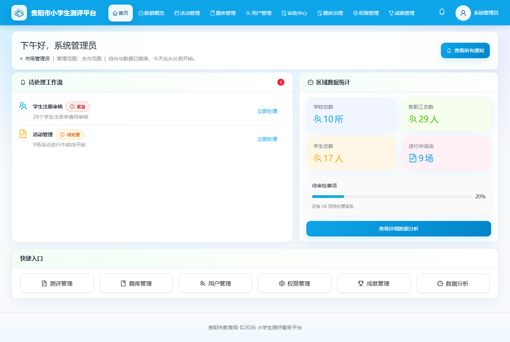

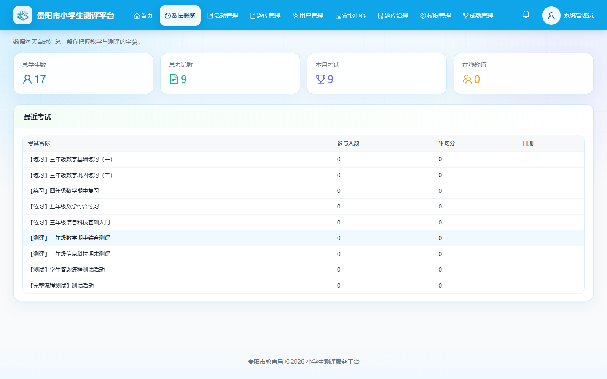

| 功能 | 说明 |
|------|------|
| 问候横幅 | 品牌蓝渐变横幅 + 时段问候语，聚合关键统计 |
| 统计卡片 | 学生总数、考试总数、本月考试数、在线教师数 |
| 近期考试 | 最近考试列表，含参与人数、平均分、日期 |
| 快捷入口 | 跳转题库管理、用户管理、活动管理 |

### 1.2 用户管理

**路径**：`/admin/users`

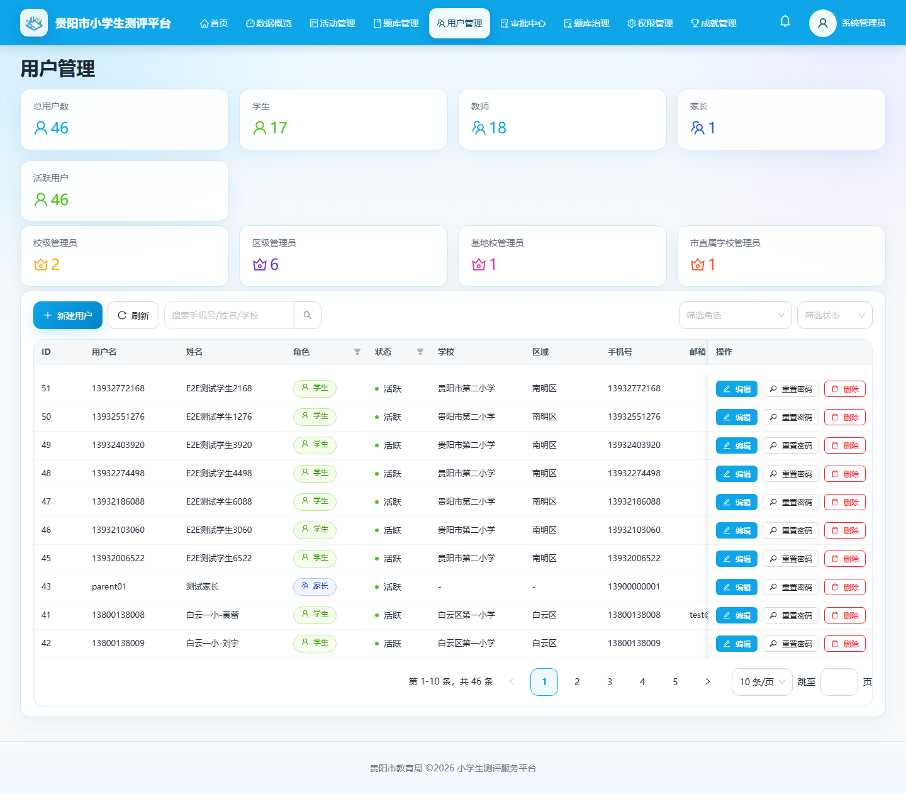

| 功能 | 操作 |
|------|------|
| 用户列表 | 分页展示，支持按角色（管理员/教师/学生）筛选 |
| 新增用户 | 填写用户名、密码、角色、真实姓名、手机号、邮箱 |
| 编辑用户 | 修改角色、个人信息 |
| 删除用户 | 二次确认后删除 |
| 重置密码 | 一键重置为默认密码 |

### 1.3 权限管理

**路径**：`/admin/permissions`

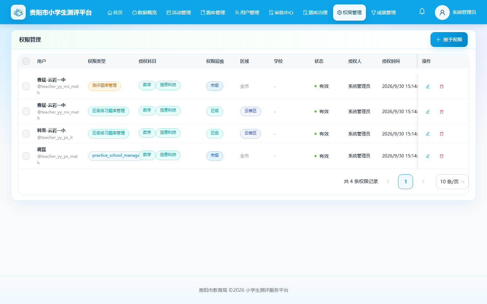

**角色层级**：

| 层级 | 角色 | 权限范围 |
|------|------|---------|
| 7 | 市级管理员 (municipal_admin) | 全部权限 |
| 6 | 市直属学校管理员 (municipal_school_admin) | 市直属学校 |
| 5 | 基地校管理员 (base_school_admin) | 基地学校 |
| 4 | 区级管理员 (district_admin) | 本区范围 |
| 3 | 校级管理员 (school_admin) | 本校范围 |
| 2 | 教师 (teacher) | 教学相关 |
| 1 | 学生 (student) | 答题查看 |

**权限类别**：

| 类别 | 权限项 | 说明 |
|------|--------|------|
| 管理权限 | `assessment_manage` | 测评题库管理（含审核、撤回） |
| 管理权限 | `practice_municipal_manage` | 市级练习题库管理 |
| 管理权限 | `practice_district_manage` | 区级练习题库管理 |
| 管理权限 | `competition_manage` | 竞赛管理 |
| 发布权限 | `practice_publish_municipal` | 市级练习发布 |
| 发布权限 | `practice_publish_district` | 区级练习发布 |
| 发布权限 | `practice_publish_school` | 校级练习发布 |
| 发布权限 | `practice_publish_base_school` | 基地学校练习发布 |
| 发布权限 | `practice_publish_municipal_school` | 市直学校练习发布 |

### 1.4 审批中心

**路径**：`/admin/approval-center`

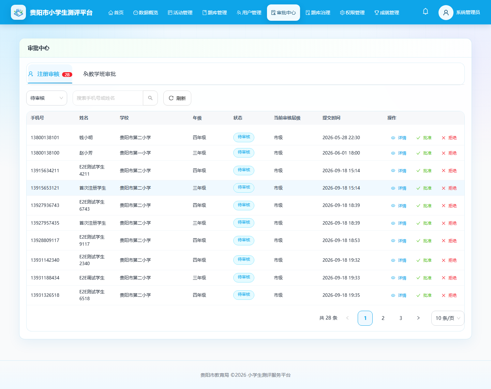

| 功能 | 说明 |
|------|------|
| 注册审批 | 审核学生自助注册申请（演示数据含 30+ 条），批准/拒绝 |
| 题目审核 | 审核教师提交的题目（当前有 3 道待审核），通过/驳回 |
| 教学班审批 | 审核教学班创建申请 |

### 1.5 题库管理（管理员+教师共用）

**路径**：`/admin/question-bank` 或 `/teacher/question-bank`

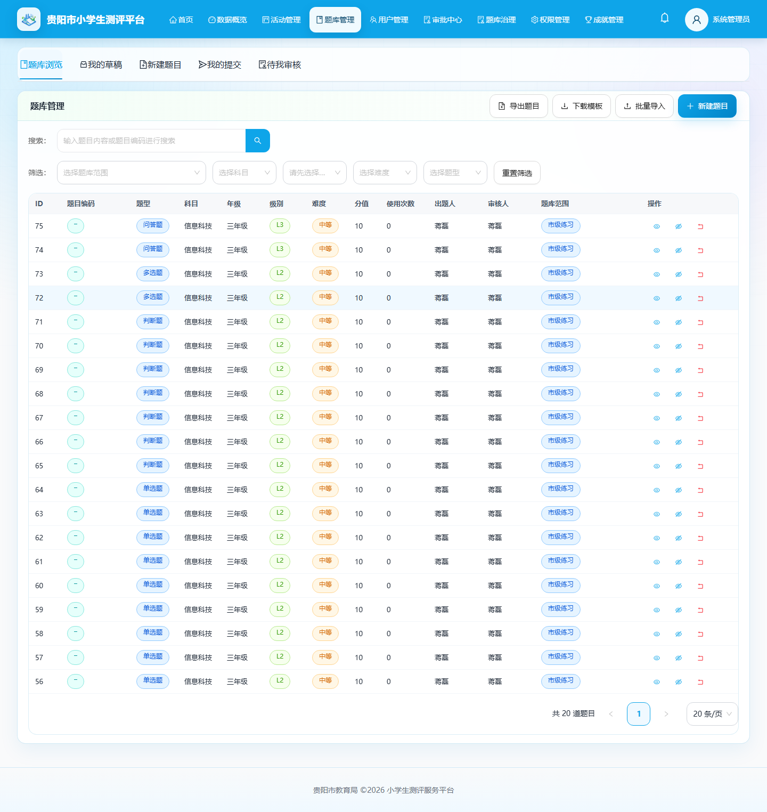

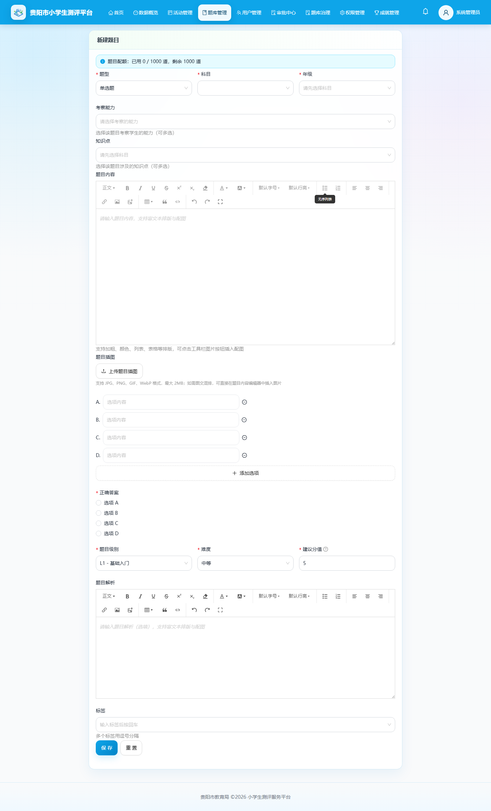

**支持的 7 种题型**：

| 题型 | 标识 | 答题交互 | 判题方式 |
|------|------|---------|---------|
| 单选题 | `single` | Radio 单选 | 自动判题 |
| 多选题 | `multiple` | Checkbox 多选 | 自动判题 |
| 判断题 | `true_false` | 对/错选择 | 自动判题 |
| 填空题 | `blank` | 文本输入 | 自动判题 |
| 编程题 | `code` | 代码编辑器 | 判题服务沙箱评判 |
| 匹配题 | `matching` | 左右配对 | 自动判题 |
| 问答题 | `essay` | 文本域 | 教师手动评分 |

**题目属性**：

- 难度等级：简单 (easy) / 中等 (medium) / 困难 (hard)
- 适用科目：数学、信息科技
- 适用年级：一年级 ~ 高三（按科目不同有所限制）
- 题库范围：测评题库、市级练习题库、区级练习题库、校级练习题库

**富文本题干**：题干编辑采用 wangEditor 富文本编辑器（前后端 DOMPurify/sanitize-html 全链路消毒），支持加粗、列表、图片等排版，学生端按同样式渲染。

**题目生命周期**：

```
创建草稿 → 提交审核 → 审核通过/驳回 → 发布入库 → 停用
```

**题库范围说明**：

| 范围 | 说明 | 可见性 |
|------|------|--------|
| 测评题库 (assessment) | 区级测评专用 | 区级管理员管理 |
| 市级练习题库 (practice_municipal) | 全市练习 | 市级管理员管理 |
| 区级练习题库 (practice_district_XX) | 本区练习 | 区级管理员管理 |
| 校级练习题库 (practice_school_N) | 本校练习 | 校级管理员管理 |

### 1.6 成就管理

**路径**：`/admin/achievements`

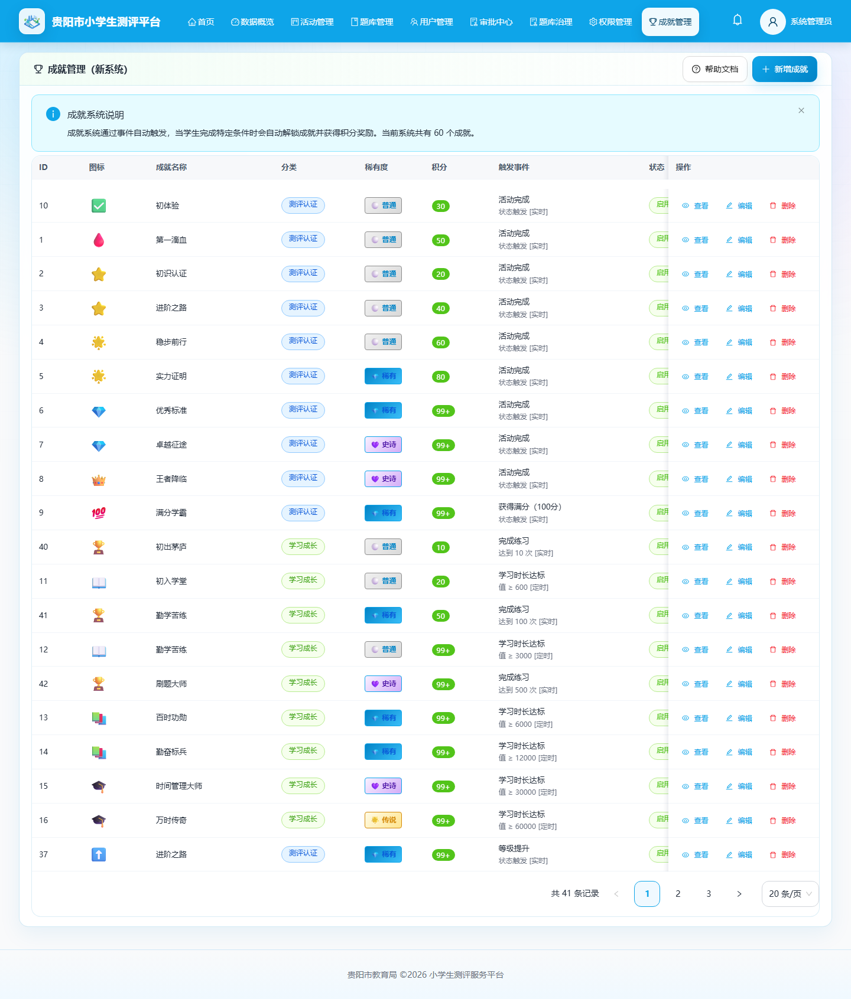

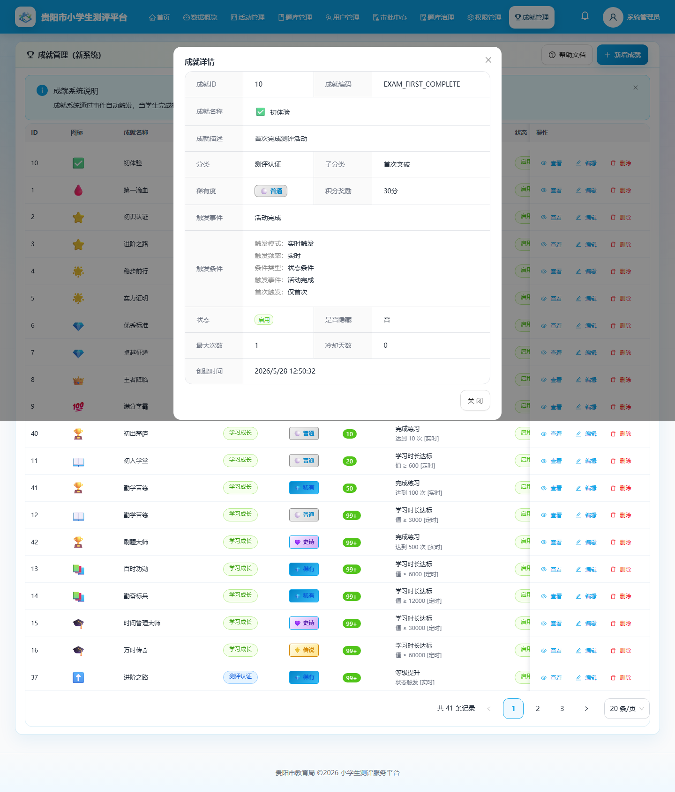

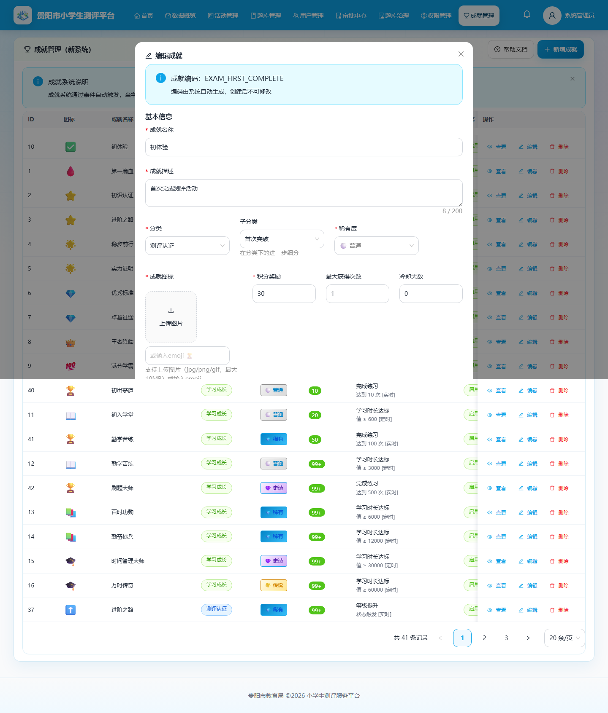

**成就分类体系**：

| 大类 | 子分类 | 说明 |
|------|--------|------|
| 考试认证 | 首次突破、等级进阶、跨学科 | 考试成绩相关 |
| 学习成长 | 首次突破、学习时长、学习频率、连续成功、能力提升、学习习惯 | 学习行为相关 |
| 社交协作 | 互动交流、帮助他人、获得认可、知识分享 | 社交互动相关 |
| 特殊活动 | 节日活动、季节活动 | 时限活动相关 |

**稀有度等级**：

| 稀有度 | 图标 | 标签颜色 | 含义 |
|--------|------|---------|------|
| 普通 | ⚪ | 灰色渐变 | 基础成就 |
| 稀有 | 💎 | 蓝色渐变 | 较难获得 |
| 史诗 | 💜 | 紫色渐变 | 高难度 |
| 传说 | 🌟 | 金色渐变 | 极稀有 |
| 神话 | 🔥 | 红色渐变 | 最高稀有度 |

**触发条件**：

- 触发模式：自动触发 / 手动授予
- 触发频率：一次性 / 每日 / 每周 / 每月
- 条件类型：分数达标 / 次数累计 / 时长累计 / 排名达成
- 时间窗口：支持固定日期和模板变量（如 `${LUNAR_NEW_YEAR}` → 农历新年初一）

**管理功能**：列表查看、详情查看（中文展示）、新增、编辑（分类联动子分类下拉）

### 1.7 测评活动管理

**路径**：`/admin/assessments`

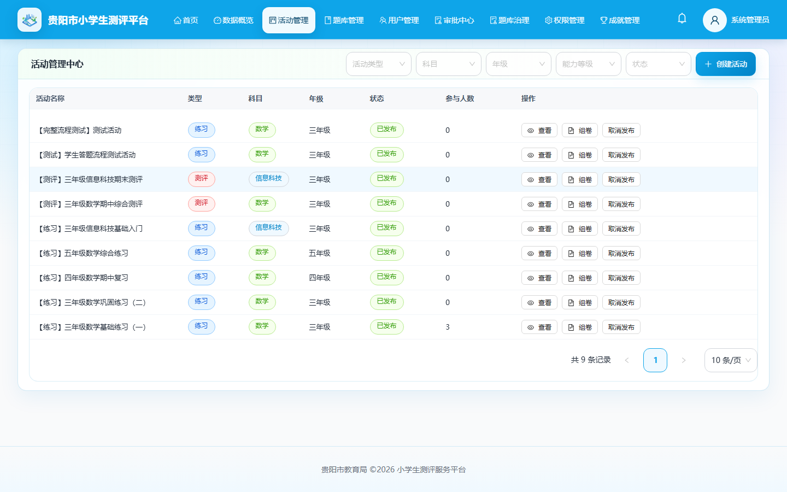

**活动类型**：

| 类型 | 标识 | 说明 |
|------|------|------|
| 测评 | `assessment` | 正式考试，有严格时间限制 |
| 练习 | `practice` | 自主练习，可配置重做 |

**创建活动流程**：

1. 选择类型（测评/练习）和科目
2. 选择年级（一年级 ~ 高三）和能力等级（L1 ~ L7）
3. 设定时间范围和时长限制（限时/不限时）
4. 设置及格分数和总分
5. 选择发布范围（市级/区级/校级）
6. 配置是否允许重做及最大尝试次数
7. 提交后进入组卷环节

**活动状态流转**：

```
草稿 → 已发布 → 进行中 → 已结束
```

**组卷功能**（`/admin/assessments/:id/paper`）：

- 从题库按条件筛选题目（题型、难度、科目）
- 添加到试卷并设置分值
- 支持手动选题和自动抽题
- 预览试卷总分和时间配置

---

## 二、教师端功能

> 登录账号：`teacher_yy_ps_math` / `password123`

### 2.1 教师题库管理

**路径**：`/teacher/question-bank`（首页仪表盘 `/teacher`）


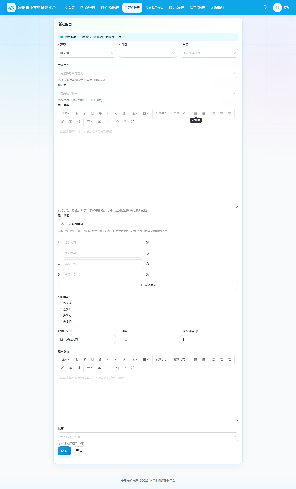

| 功能 | 说明 |
|------|------|
| 教学概览 | 班级数、学生数、近期活动 |
| 题目统计 | 按题型统计已创建题目数 |
| 快捷操作 | 创建题目、创建活动、查看待评卷 |
| 富文本题干 | wangEditor 编辑器，支持排版与图片 |

### 2.2 题库工作流

**路径**：`/teacher/question-bank`

**草稿箱**（题库 → 草稿标签）：

- 题目暂存为草稿，支持反复编辑
- 显示草稿状态、创建时间
- 支持按题型、难度筛选

**我的提交**（题库 → 提交标签）：

- 查看已提交的题目及审核状态
- 状态：待审核 / 已通过 / 已驳回
- 驳回后可修改重新提交

**审核工作台** (`/teacher/review-workbench`)：

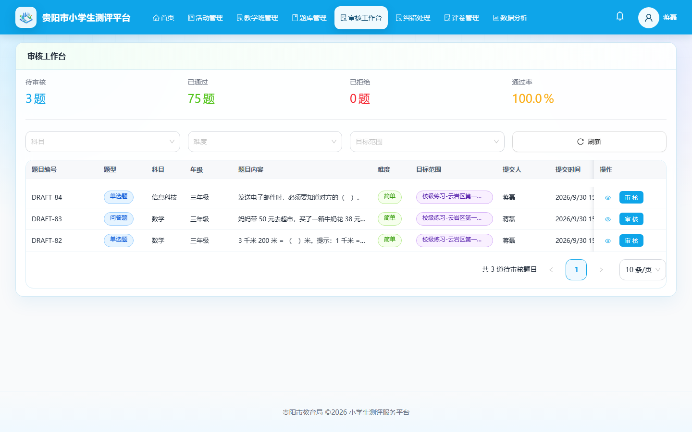

- 展示待审核题目队列（题目内容列按富文本摘要展示）
- 审核操作：通过 / 驳回（填写驳回原因）
- 按题库范围筛选审核列表

**创建/编辑题目** (`/teacher/question-bank/create`)：

- 选择题型 → 动态展示对应表单；保存时未通过校验会提示并滚动到首个错误项
- 单选题：题干 + 4个选项 + 正确答案
- 多选题：题干 + 多个选项 + 多个正确答案
- 判断题：题干 + 正确/错误
- 填空题：题干 + 答案（支持多个空）
- 编程题：题干 + 代码模板 + 测试用例（输入/输出对）
- 匹配题：左侧项 + 右侧项 + 正确配对
- 问答题：题干 + 参考答案
- 设置难度、解析、分值
- 选择题库范围（根据账号自动匹配所属区域及审核人）

### 2.3 活动管理

**路径**：`/teacher/activities`

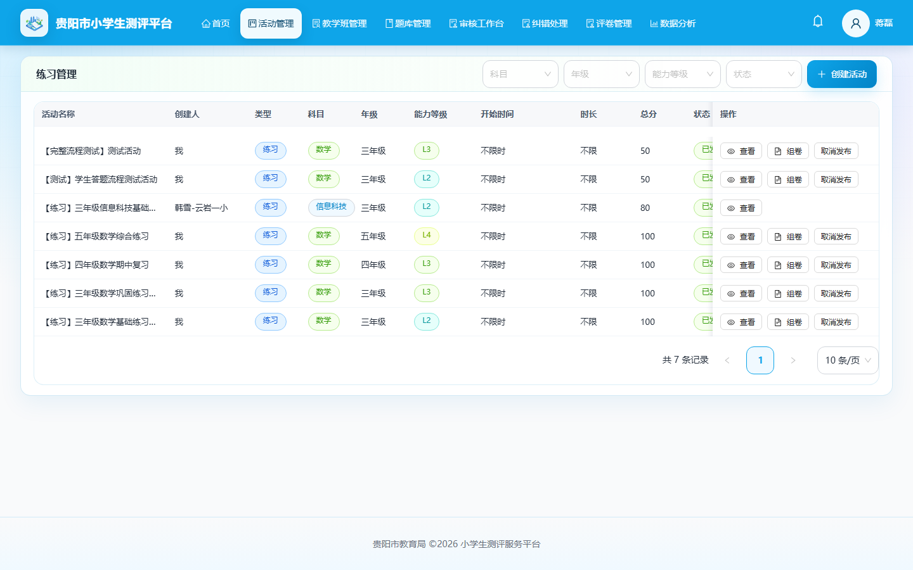

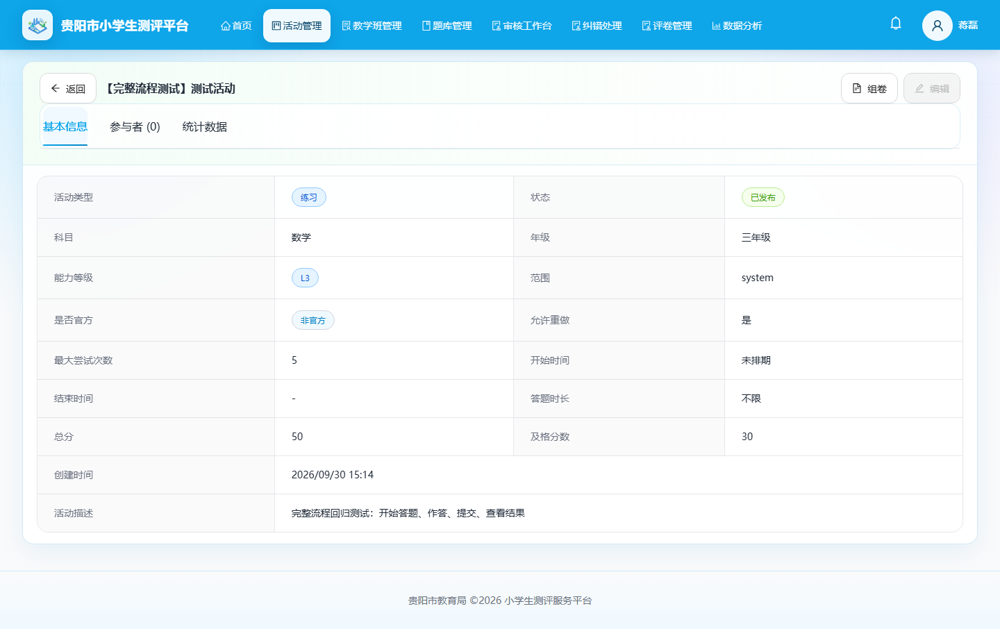

| 操作 | 说明 |
|------|------|
| 活动列表 | 查看已创建的活动，按类型/状态筛选 |
| 创建活动 | 选择类型（测评/练习），配置参数 |
| 编辑活动 | 修改活动信息（草稿/未发布状态） |
| 活动详情 | 查看参与情况、答题统计 |
| 组卷 | 从题库选题组卷，配置分值 |

### 2.4 评卷系统

**路径**：`/teacher/grading`

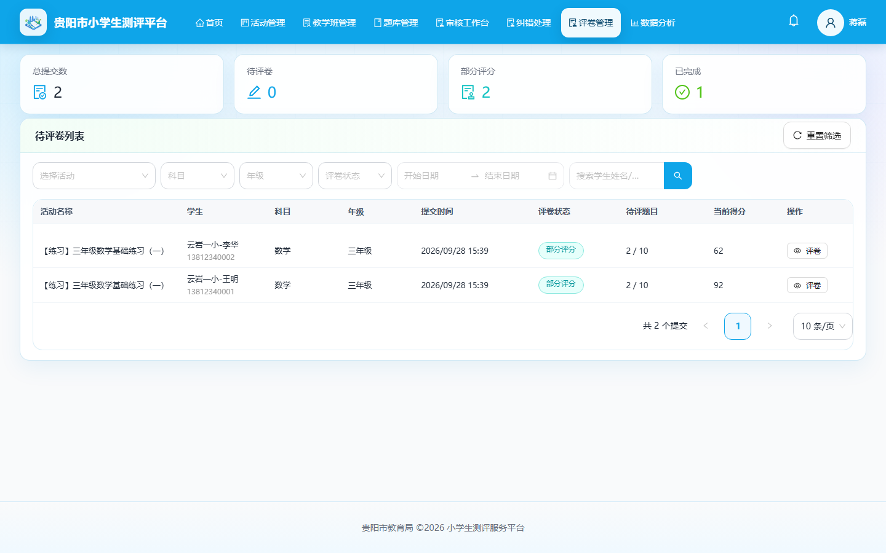

**评卷列表（多维筛选）**：

- 筛选器：活动 / 科目 / 年级 / 评卷状态 / **提交日期区间** / 学生姓名或学号搜索
- 日期选择为受控组件，选中即生效、重置即清空；筛选期间页面保持挂载（遮罩加载，不丢选择）
- 筛选条件同步到 URL 参数，可直接分享带筛选的链接
- 结束日期含当天全部提交（`submit_time < 次日零点`）
- 顶部统计卡：总提交数 / 待评卷 / 部分评分 / 已完成

**评卷详情** (`/teacher/grading/:id`)：

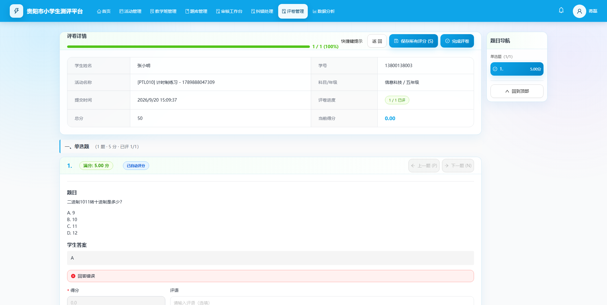

- **按题型分组展示**学生作答内容
- 自动判题题型（单选/多选/判断/填空/编程/匹配）：显示判题结果和对错标记
- 手动评卷题型（问答题）：展示学生答案，教师可输入评分和评语
- 评分进度条实时更新
- 自动保存评分
- 支持上/下一位学生快速切换

### 2.5 数据分析（仪表盘布局）

**路径**：`/teacher/data-analytics`

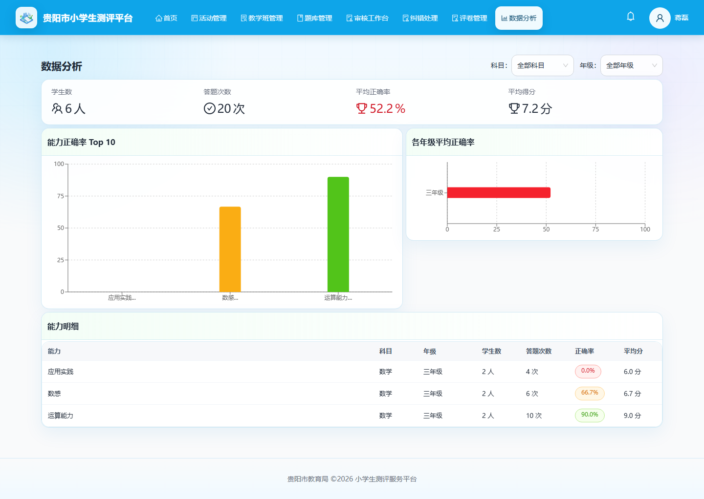

单屏仪表盘布局，一页看全：

| 区块 | 说明 |
|------|------|
| 工具行 | 标题 + 视图级别（校级/区域级，按权限显示）+ 科目/年级筛选，不再单独占卡 |
| 概览单卡 | 学生数、答题次数、平均正确率（红绿着色）、平均得分 |
| 能力正确率 Top 10 | 柱状图，按正确率红/黄/绿着色，悬浮显示完整能力名、年级、学生数 |
| 各年级平均正确率 | 横向条形图，只展示有数据的年级，任意数量可读 |
| 能力明细 | 紧凑表格（能力/科目/年级/学生数/答题次数/正确率标签/平均分），区域级多一列学校数 |

> 区域级视图：有权限的账号可切换查看区域内所有学校的聚合数据，页面顶部出现提示条。

### 2.6 教学班管理

**路径**：`/teacher/teaching-classes`

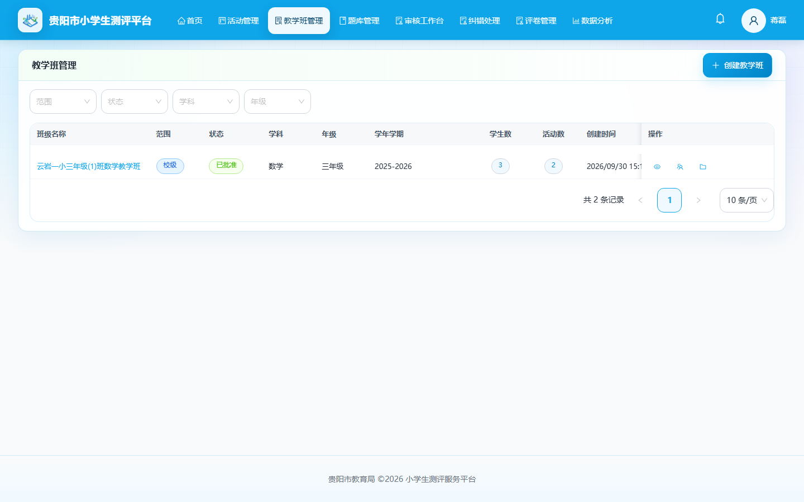

| 功能 | 说明 |
|------|------|
| 班级列表 | 展示管理的教学班 |
| 创建班级 | 填写班级名称、科目、学年学期（提交需管理员审批） |
| 班级详情 | 查看班级信息、任课教师、关联活动 |
| 学员管理 | 添加/移除班级学员 |

---

## 三、学生端功能

> 登录账号：`13800138003`（张小明）/ `password123`

### 3.1 学生首页

**路径**：`/`（登录后首页）

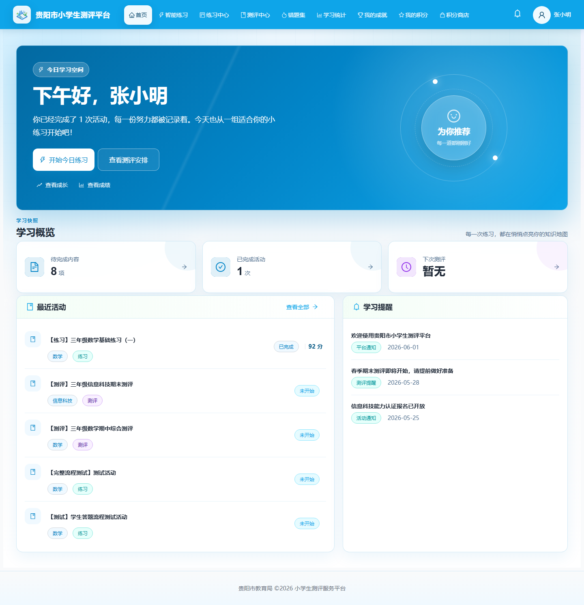

| 功能 | 说明 |
|------|------|
| 问候横幅 | 时段问候（早上好/下午好/晚上好）+ 鼓励文案，蓝天渐变视觉 |
| 学习快照 | 参与活动数、完成数、下次测评倒计时，点击卡片直达 |
| 最近活动 | 可参加的测评和练习列表，一键进入 |
| 快捷入口 | 开始今日练习 / 查看测评安排 / 查看成长 / 查看成绩 |

### 3.2 智能练习 ⭐（个性化推荐）

**路径**：`/student/smart-practice`（学生端导航第一位）

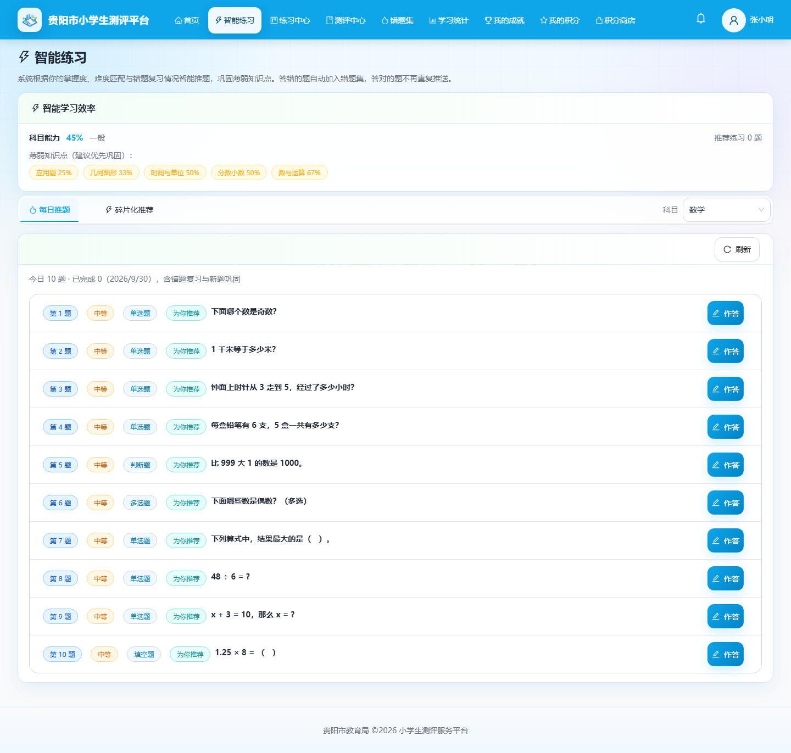

| 功能 | 说明 |
|------|------|
| 智能学习效率卡 | 科目能力百分比 + 薄弱知识点标签（建议优先巩固），数据来自知识点掌握度统计 |
| 每日推题 | 每日 10 题：错题复习 + 新题巩固，已完成的题不再重复推送 |
| 碎片化推荐 | 按薄弱知识点生成的补充练习集 |
| 学科切换 | 右上角按科目切换推荐（数学/信息科技） |
| 答题闭环 | 答对得积分+连胜，答错自动进入错题集；知识点掌握度实时更新 |

### 3.3 练习中心

**路径**：`/student/practice`

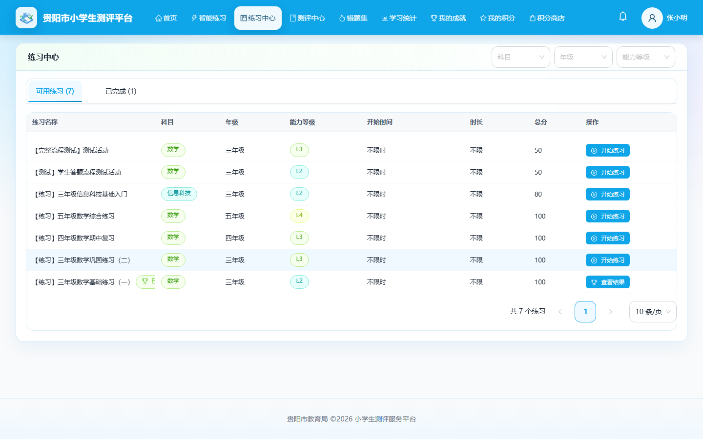

| 功能 | 说明 |
|------|------|
| 可用练习 | 展示可参加的练习活动（科目、题数、时间一目了然） |
| 已完成练习 | 历史练习记录及得分 |
| 重复练习 | 如允许重做，可再次参加 |

### 3.4 测评中心

**路径**：`/student/assessments`

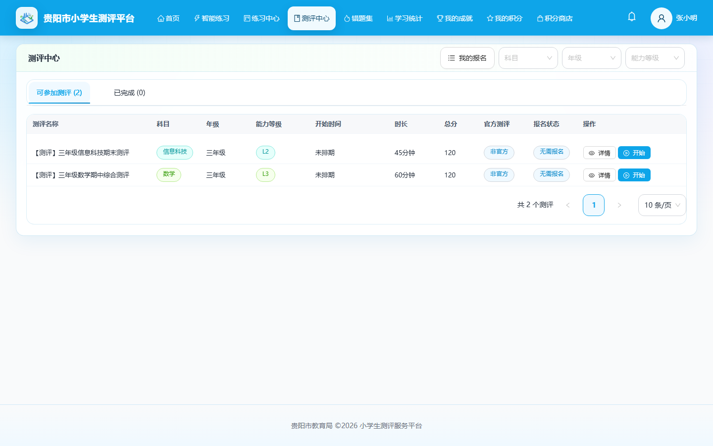

| 功能 | 说明 |
|------|------|
| 可参加测评 | 已发布测评列表（标题、科目、开始时间、时长——未排期/不限时均有明确标识） |
| 报名功能 | 如启用报名，先报名再参加 |
| 状态标识 | 未开始 / 进行中 / 已结束 / 已完成 |
| 进入答题 | 点击进入测评答题页面 |

### 3.5 在线答题 ⭐

**路径**：`/student/activity/:id`


**答题界面功能**：

| 功能 | 说明 |
|------|------|
| 倒计时 | 顶部实时倒计时，时间到自动交卷 |
| 答题卡 | 左侧固定（sticky 跟随滚动），题号按钮与卷面滚动双向联动；已答题目深色高亮 |
| 进度指示 | 已答/未答题目数量统计 |
| 自动保存 | 答案实时保存到服务器 + 本地 localStorage 备份 |
| 题型渲染 | 根据题型动态渲染对应交互组件 |

**各题型交互**：

| 题型 | 交互方式 |
|------|---------|
| 单选题 | Radio 圆形单选按钮 |
| 多选题 | Checkbox 方形复选框 |
| 判断题 | 对/错 按钮组 |
| 填空题 | Input 文本输入框 |
| 编程题 | 代码编辑器 + 运行测试 + 提交判题 |
| 匹配题 | 选择匹配/拖拽连线 |
| 问答题 | TextArea 文本域 |

**编程题特色**：
- 在线代码编辑器
- 支持运行测试用例查看输出
- 提交后由独立判题服务（judge-service）沙箱执行
- 展示测试用例通过情况

### 3.6 成绩查看

**路径**：`/student/results`（列表）→ `/student/results/:id`（详情）

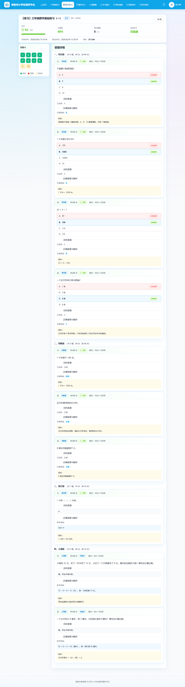

| 功能 | 说明 |
|------|------|
| 整合信息卡 | 标题 + 总分/正确率/答对题数/批改状态 + 开始/提交时间与用时，一张卡呈现 |
| 结果答题卡 | 左侧固定答题卡按**对错着色**（绿=答对、红=答错、黄=待批改），点击跳转对应题目 |
| 逐题回顾 | 每题的作答、正确答案、解析与得分；按题型分组统计得 分 |
| 未公布处理 | 教师未公布结果时显示等待提示与刷新按钮 |

### 3.7 错题巩固站

**路径**：`/student/wrong-questions`

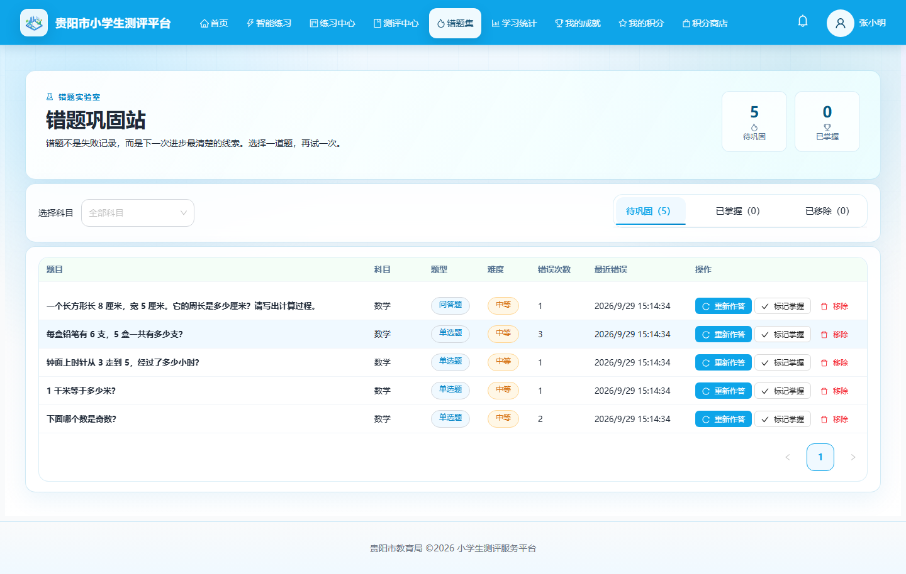

| 功能 | 说明 |
|------|------|
| 问候横幅 | 「错题不是失败记录，而是下一次进步最清楚的线索」 |
| 科目筛选 | 按科目过滤错题 |
| 分类页签 | 待巩固 / 已掌握 / 已移除 |
| 巩固操作 | 重新作答 / 标记掌握 / 移除，含错误次数与最近错误时间 |
| 数据闭环 | 智能练习答错的题自动进入错题集 |

### 3.8 成就系统

**路径**：`/student/achievements`

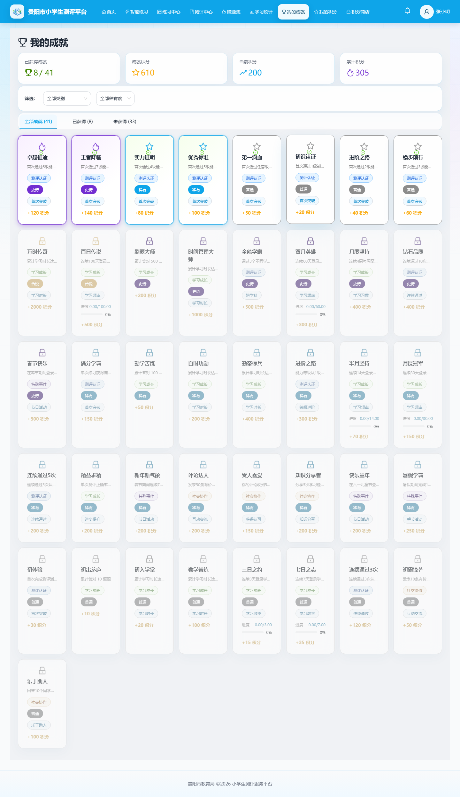

| 功能 | 说明 |
|------|------|
| 成就卡片墙 | 按类别分组展示所有成就 |
| 已解锁/未解锁 | 已获得成就高亮展示，未获得灰色锁定 |
| 成就详情 | 查看名称、描述、获得条件、获得时间 |
| 分类筛选 | 按考试认证/学习成长/社交协作/特殊活动筛选 |
| 稀有度展示 | 5 级稀有度（⚪💎💜🌟🔥）对应渐变颜色 |

### 3.9 积分系统

**路径**：`/student/points`

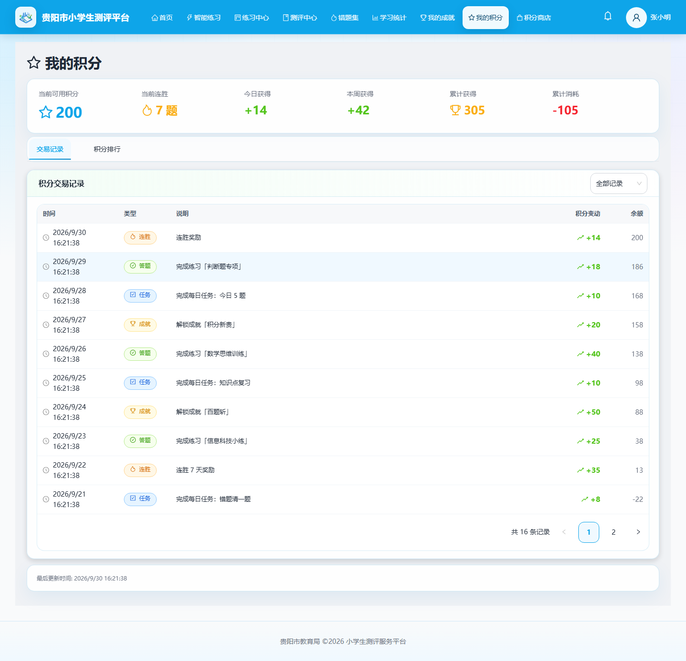

| 功能 | 说明 |
|------|------|
| 整合概览卡 | 当前可用积分、当前连胜、今日/本周获得、累计获得、累计消耗，一卡呈现 |
| 积分流水 | 获得与消费记录（成就奖励/每日任务/答题/连胜/兑换），按时间排序，余额可追溯 |
| 积分排行 | 与全校学生对比的积分排行 |

### 3.10 积分商店

**路径**：`/student/shop`

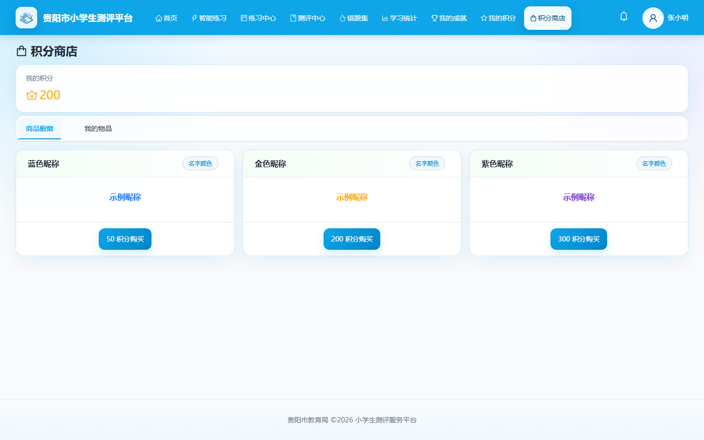

| 功能 | 说明 |
|------|------|
| 商品兑换 | 用积分兑换学习奖励道具 |
| 兑换记录 | 消费流水同步进入积分明细 |

### 3.11 学习统计

**路径**：`/student/statistics`

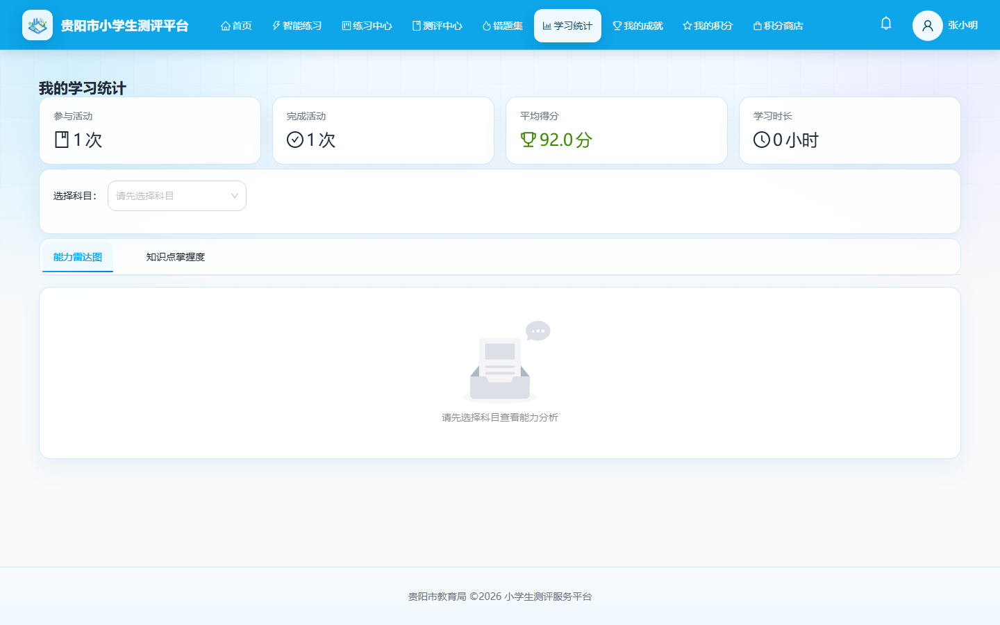

| 功能 | 说明 |
|------|------|
| 学习概览 | 参与活动数、完成数等统计卡 |
| 科目切换 | 按科目查看能力雷达图与知识点掌握 |
| 图表分析 | 成绩趋势与分布可视化 |

### 3.12 个人成长中心

**路径**：`/student/growth`

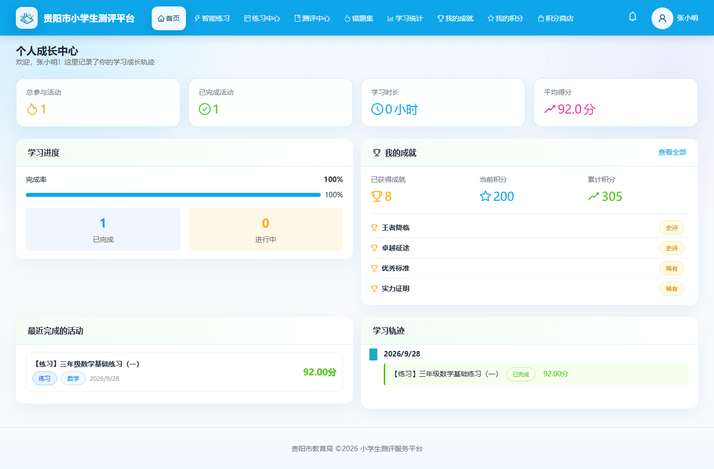

| 功能 | 说明 |
|------|------|
| 学习进度 | 完成活动数、学习时长 |
| 学习轨迹 | Timeline 时间线展示学习历程 |
| 成就进度 | 已解锁成就数/总成就数 |

### 3.13 我的报名

**路径**：`/student/registrations`

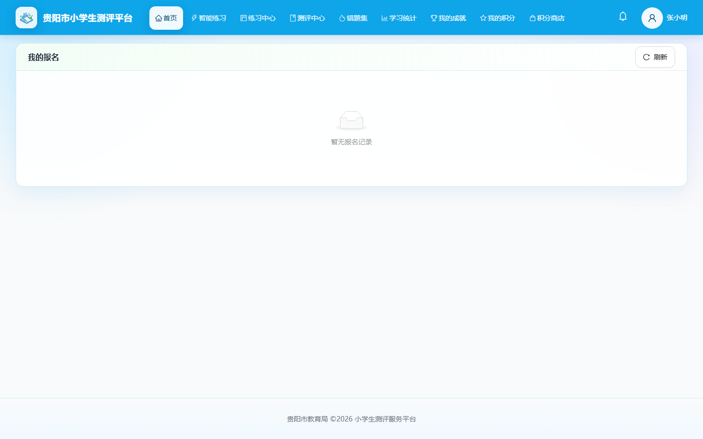

| 功能 | 说明 |
|------|------|
| 报名列表 | 展示已报名的测评 |
| 报名状态 | 待审核 / 已通过 / 已拒绝 |

---

## 四、公共服务

### 4.1 登录认证

**路径**：`/login`

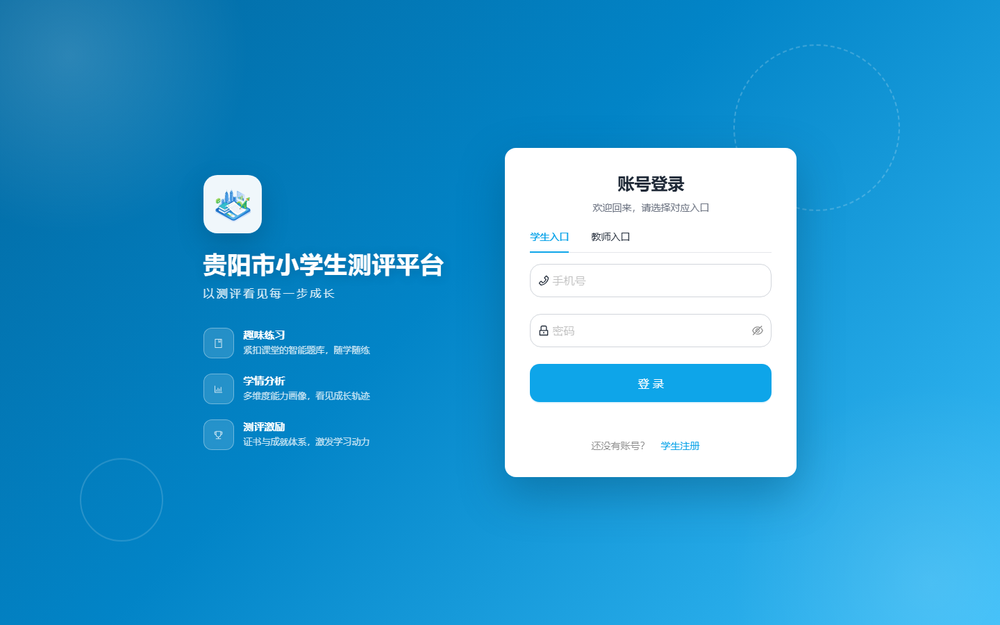

| 功能 | 说明 |
|------|------|
| 品牌视觉 | 全屏蓝天渐变 + 左侧品牌介绍 + 右侧登录卡片 |
| 多角色入口 | 学生（手机号）/ 教师 / 家长分页签登录 |
| JWT 认证 | Access Token + Refresh Token 双 Token 机制 |
| 角色路由 | 登录后按角色自动跳转对应首页 |

### 4.2 学生自助注册

**路径**：`/register`

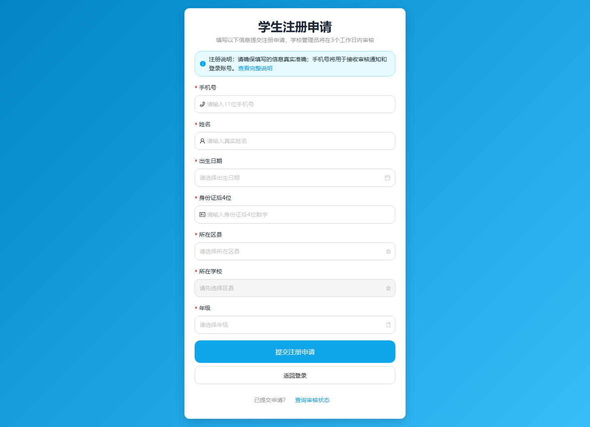

| 功能 | 说明 |
|------|------|
| 注册申请 | 填写姓名、身份证号、学校等信息（紧凑布局，注册说明为折叠提示） |
| 审核状态 | `/register-status/:phone` 查看审核进度 |
| 管理员审批 | 在 `/admin/approval-center` 审批 |

### 4.3 证书验证

**路径**：`/verify` 或 `/verify/:certNumber`

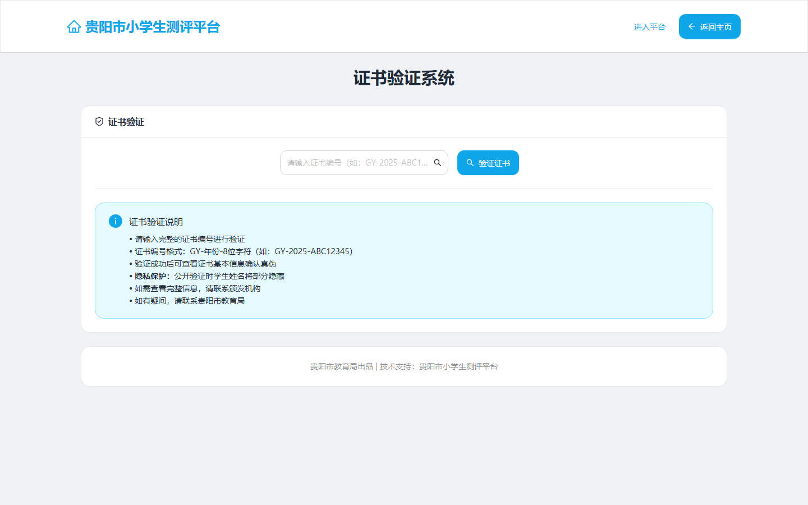

| 功能 | 说明 |
|------|------|
| 输入验证 | 输入证书编号验证真伪（演示编号：`GY-2026-MATH0001`、`GY-2026-IT000002`） |
| 链接验证 | 通过 URL 直接携带编号验证 |
| 证书下载 | 验证通过后可下载证书文件 |

### 4.4 通知系统

**路径**：`/notifications`（需登录）

| 功能 | 说明 |
|------|------|
| 通知列表 | 展示系统通知和个人通知 |
| 已读/未读 | 未读通知标记 |
| 类型分类 | 系统公告、活动提醒、成绩通知 |

---

## 五、多级权限数据隔离对比

> 区级管理员登录：`yunyan_admin` / `password123`

对比管理员 `admin`（全市数据）和区级管理员 `yunyan_admin`（仅云岩区数据）的视角差异：

**市级管理员视角 — 用户管理**：


**区级管理员视角 — 用户管理**：

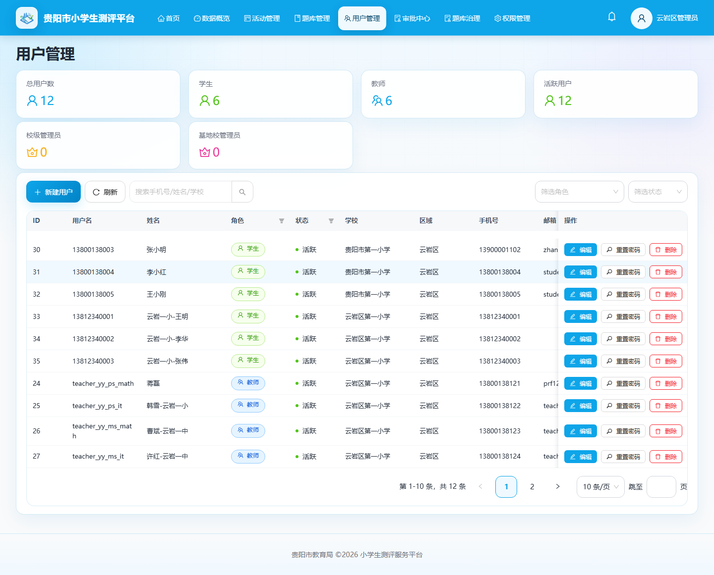

**区级管理员首页**：

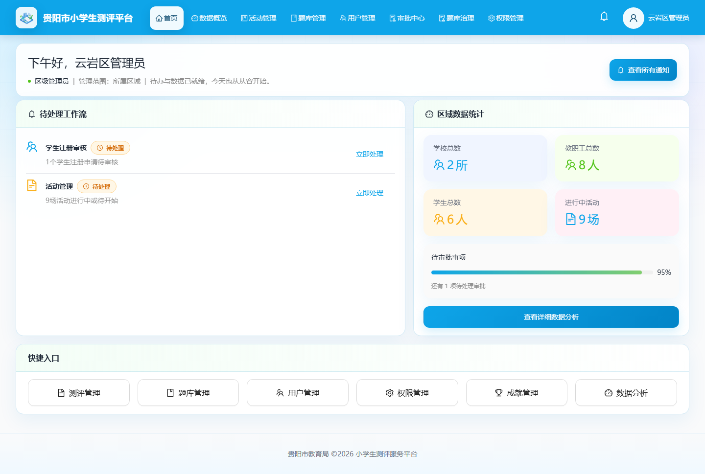

> 💡 可见区级管理员只能看到本区的用户和数据，实现了严格的数据隔离。

---

## 六、系统架构与技术亮点

### 技术栈

| 层级 | 技术 |
|------|------|
| 前端 | React 18 + TypeScript + Ant Design 5 + Redux Toolkit + Vite |
| 富文本 | wangEditor + DOMPurify（前端）+ sanitize-html（后端）全链路消毒 |
| 设计系统 | 薄荷品牌设计规范：品牌色 #0ea5e9、导航渐变、40px 页面顶距、6px 卡片缝隙、紧凑表格 |
| 后端 | Node.js + Express.js + PostgreSQL 15 + Redis |
| 判题 | 独立 judge-service 服务，沙箱执行代码 |
| 部署 | Docker Compose + Nginx 反向代理 |
| 图表 | Recharts（柱状图、条形图） |
| 测试 | Playwright (E2E) + Jest (单元/API) |

### 服务架构

```
浏览器 ──→ Nginx(:8080) ──→ Frontend(:3100, 容器内 :80)
                        ──→ Backend(:3003) ──→ PostgreSQL(:5433)
                                             ──→ Redis(:6380)
         Judge Service(:3002，沙箱执行)
开发调试：Vite Dev Server(:3000) → 代理后端
```

### 核心亮点

| 亮点 | 说明 |
|------|------|
| 薄荷品牌设计 | 统一设计系统：天空蓝主色、渐变导航、全站统一间距（40px 顶距 / 6px 卡片缝）、紧凑表格 |
| 智能练习 | 知识点掌握度驱动的个性化推题：错题复习 + 新题巩固，答错自动进错题集 |
| 多级权限体系 | 5 层角色 × 6 个行政区，数据严格隔离 |
| 7 种题型全覆盖 | 单选/多选/判断/填空/编程/匹配/问答 |
| 编程题自动判题 | 独立判题服务，沙箱执行，多测试用例 |
| 富文本题干 | wangEditor 全链路消毒，题目排版所见即所得 |
| 题库质量管控 | 草稿→提交→审核→发布，完整工作流 |
| 成就积分体系 | 5 级稀有度、4 大类别、连胜激励、积分商店 |
| 数据分析仪表盘 | 能力 Top10 柱图 + 年级对比条形图 + 明细表，单屏看全 |
| 评卷多维筛选 | 活动/科目/年级/状态/日期区间/学生搜索，URL 可分享 |
| 答题安全 | 倒计时、双保存（服务端+localStorage）、自动交卷、答题卡滚动联动 |
| 证书系统 | 自动生成 + 在线验证真伪 |
| 一键部署 | Docker Compose 编排全部服务 |
| 演示数据一键重建 | `seed-demo-data.js` 覆盖题库/活动/答卷/错题/积分/成就/证书全业务面 |

---

## 七、演示流程建议

### 推荐路线（约 45 分钟）

| 步骤 | 角色 | 账号 | 内容 | 时长 |
|------|------|------|------|------|
| 1 | 管理员 | `admin` | 登录 → 管理总览 → 用户管理 → 权限管理 | 5 min |
| 2 | 管理员 | `admin` | 题库管理 → 创建题目（富文本 + 7 种题型） | 5 min |
| 3 | 管理员 | `admin` | 成就管理 → 查看详情（稀有度+触发条件） | 3 min |
| 4 | 管理员 | `admin` | 测评管理 → 创建测评 → 组卷 | 5 min |
| 5 | 教师 | `teacher_yy_ps_math` | 审核工作台 → 评卷系统（多维筛选 + 批改问答题） | 6 min |
| 6 | 教师 | `teacher_yy_ps_math` | 数据分析仪表盘（概览 + 双图 + 明细表） | 3 min |
| 7 | 学生 | `13800138003` | 智能练习（推荐答题 → 得积分连胜 → 错题入集） | 6 min |
| 8 | 学生 | `13800138003` | 在线答题（各题型 + 编程题判题）→ 成绩查看（答题卡跳转） | 6 min |
| 9 | 学生 | `13800138003` | 错题巩固站 → 成就 → 积分（流水/连胜）→ 积分商店 | 3 min |
| 10 | 区级 | `yunyan_admin` | 切换账号 → 展示数据隔离效果 | 2 min |
| 11 | 公共 | — | 学生注册 → 证书验证（`GY-2026-MATH0001`） | 3 min |

### 最短演示路线（约 15 分钟）

| 步骤 | 内容 |
|------|------|
| 1 | 管理员登录 → 权限管理（多级体系）→ 题库（7 种题型 + 富文本） |
| 2 | 切换学生 → 智能练习答题 → 在线答题（各题型）→ 成绩查看答题卡 |
| 3 | 学生成就 → 积分 → 切换区级账号展示数据隔离 |
