# 贵阳市学科能力测评认证系统设计方案

## 一、系统总体设计

### 1.1 建设背景与目标

在数字化时代背景下，学科能力素养已成为学生核心素养的重要组成部分。本系统旨在构建全市统一的学科能力测评认证平台，实现：

- **标准化测评**：建立全市统一的学科能力测评标准体系
- **个性化学习**：提供丰富的学习资源和模拟测评平台
- **权威性认证**：颁发具有公信力的能力等级证书
- **数据化分析**：实现多维度数据统计与精准分析
- **智能化管理**：提升测评效率与管理水平

### 1.2 系统总体架构

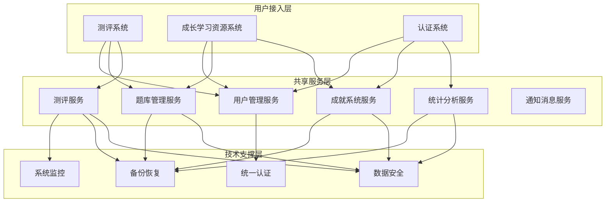

### 1.3 系统间交互关系

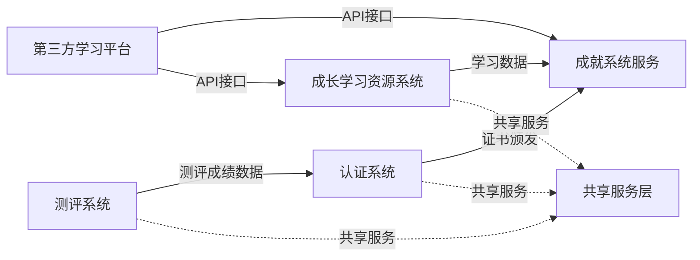

### 1.4 用户角色体系

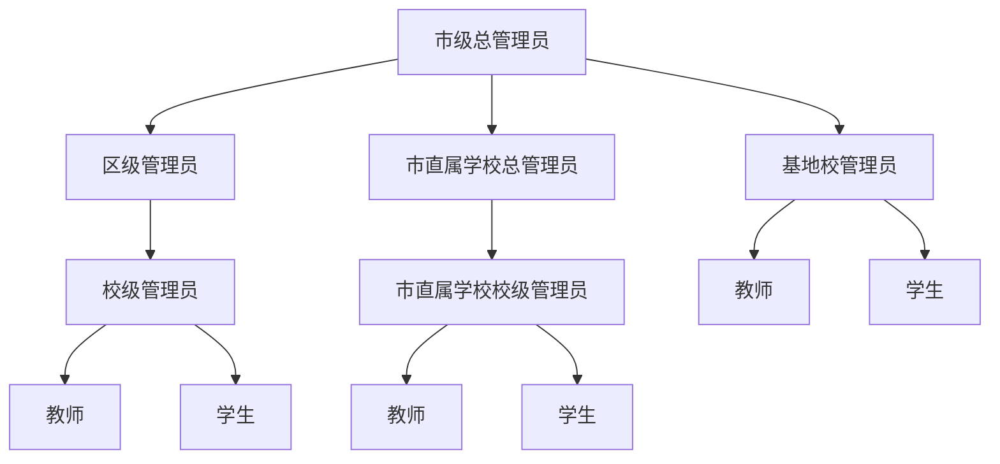

## 二、三大子系统设计

### 2.1 测评系统

#### 2.1.1 系统定位
测评系统是官方正式测评平台，负责贵阳市中小学生学科能力等级测评的组织、实施和成绩管理。

#### 2.1.2 系统架构

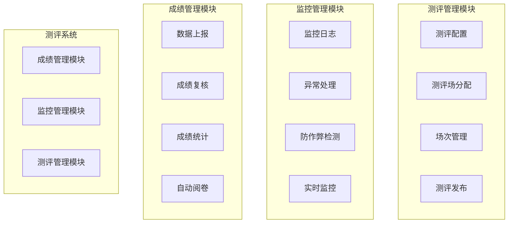

#### 2.1.3 测评流程设计

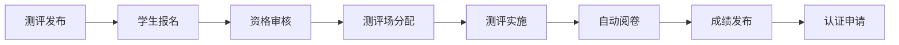

### 2.2 成长学习资源系统

#### 2.2.1 系统定位
成长学习资源系统是学习支持平台，为学生提供自主学习资源、模拟测评和能力提升服务，同时记录详细的学习过程数据。

#### 2.2.2 系统架构

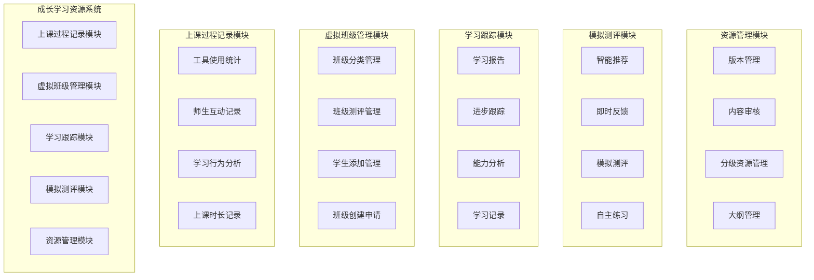

#### 2.2.3 分级学习资源体系

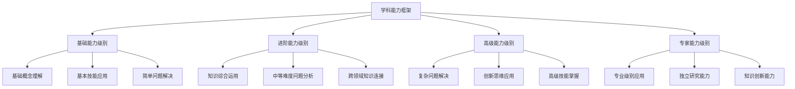

#### 2.2.4 虚拟班级分类与管理机制

##### 2.2.4.1 班级分类体系

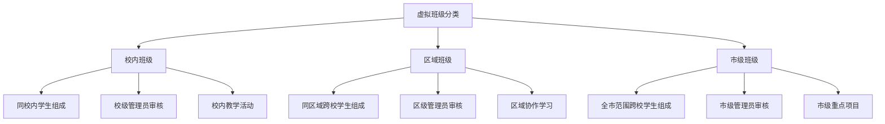

##### 2.2.4.2 班级创建审批流程

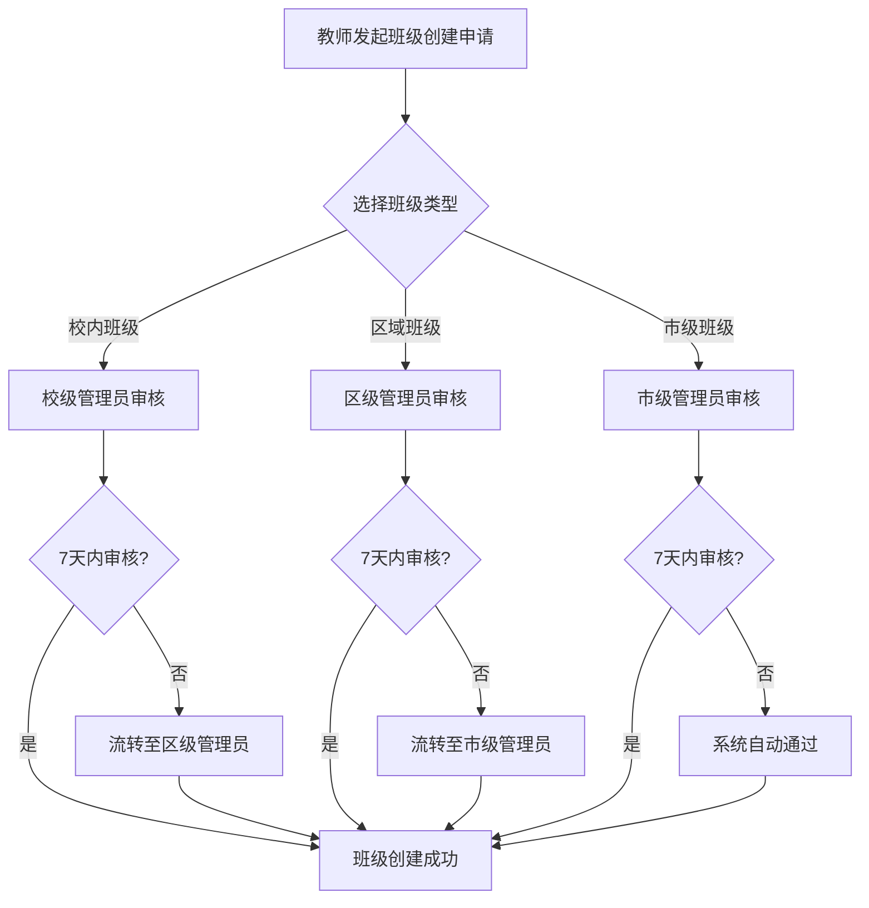

##### 2.2.4.3 班级审批权限矩阵

| 班级类型 | 发起人 | 一级审核人 | 超时流转对象 | 最终流转对象 | 班级特点 |
|----------|--------|------------|-------------|-------------|----------|
| 校内班级 | 教师 | 校级管理员 | 区级管理员 | 市级管理员 | 本校学生，校内活动 |
| 区域班级 | 教师 | 区级管理员 | 市级管理员 | 系统自动通过 | 同区域跨校学生，区域协作 |
| 市级班级 | 教师 | 市级管理员 | 系统自动通过 | - | 全市学生，重点项目 |

##### 2.2.4.4 班级管理功能

**班级创建管理**：
- 班级基本信息设置（名称、描述、学科、学习目标等）
- 学生邀请和添加机制
- 班级权限和规则设定
- 班级有效期和状态管理

**班级教学活动**：
- 在线课程组织和管理
- 班级作业布置和批改
- 班级讨论区和互动
- 班级测评和成绩管理

**班级数据统计**：
- 班级整体学习情况统计
- 学生个体表现分析
- 教学效果评估报告
- 班级活跃度监控

#### 2.2.5 上课过程记录系统

##### 2.2.5.1 记录数据类型

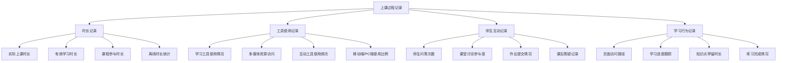

##### 2.2.5.2 数据记录架构

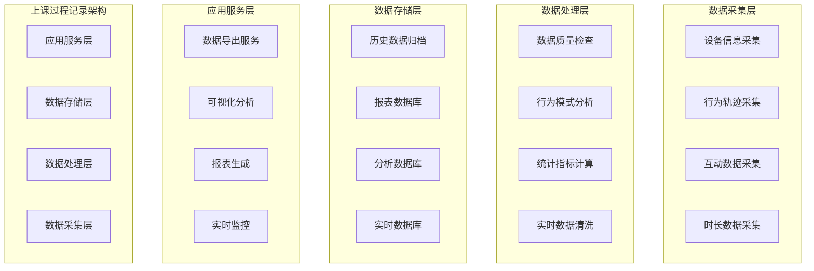

##### 2.2.5.3 关键指标定义

| 指标类别 | 具体指标 | 计算方式 | 用途 |
|----------|----------|----------|------|
| 时长指标 | 有效学习时长 | 实际操作时长-暂停离开时长 | 评估学习投入度 |
| 时长指标 | 课程完成率 | 已学习内容/总课程内容 | 衡量学习进度 |
| 工具指标 | 工具使用多样性 | 使用工具种类数/可用工具总数 | 评估学习方式 |
| 工具指标 | 移动学习占比 | 移动端学习时长/总学习时长 | 分析学习习惯 |
| 互动指标 | 师生互动频次 | 单位时间内互动次数 | 评估课堂活跃度 |
| 互动指标 | 问题解答率 | 学生问题解答数/提问数 | 衡量学习效果 |
| 行为指标 | 学习专注度 | 连续学习时长/总学习时长 | 评估学习质量 |
| 行为指标 | 知识点掌握度 | 练习正确率+停留时长权重 | 分析学习效果 |

##### 2.2.5.4 数据应用场景

**为教师提供的数据支撑**：
- 学生真实上课时长统计，准确评估学习投入
- 课堂互动数据分析，优化教学方式
- 学习工具使用情况，指导教学工具选择
- 学生学习行为模式分析，个性化教学指导

**为管理者提供的数据支撑**：
- 教师教学质量评估数据
- 平台使用效果统计分析
- 资源配置优化建议
- 教学模式改进依据

**为家长提供的数据支撑**：
- 孩子真实学习时长报告
- 学习习惯和行为分析
- 学习进度跟踪报告
- 与同龄人对比分析

##### 2.2.5.5 隐私保护措施

**数据脱敏处理**：
- 敏感个人信息脱敏存储
- 数据聚合后统计分析
- 匿名化处理用户行为数据
- 分级权限访问控制

**合规性保障**：
- 数据收集前明确告知用户
- 提供数据使用设置选项
- 定期数据清理和归档
- 严格的数据访问审计

### 2.3 认证系统

#### 2.3.1 系统定位
认证系统是权威认证平台，负责根据测评成绩为学生颁发具有公信力的学科能力等级证书。

#### 2.3.2 系统架构

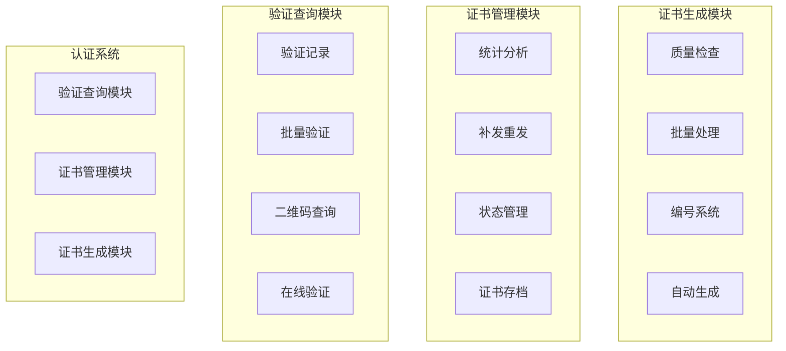

#### 2.3.3 证书认证流程

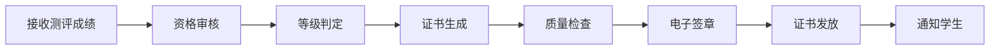

## 三、共享服务层设计

### 3.1 用户管理服务

#### 3.1.1 角色权限矩阵

| 角色 | 测评系统权限 | 成长学习资源系统权限 | 认证系统权限 | 成就系统权限 | 用户管理权限 |
|------|-------------|-------------------|-------------|-------------|-------------|
| 市级总管理员 | 全部权限 | 全部权限 | 全部权限 | 成就规则设定、全部管理 | 全部权限 |
| 基地校管理员 | 5-6级测评发布管理 | 基地教学资源管理、校内模拟测评、虚拟班级管理 | 基地校认证管理 | 查看权限 | 基地校内部管理 |
| 区级管理员 | 区域测评管理 | 区域学习资源管理、区域模拟测评、区域班级审核 | 区域认证管理 | 区域成就统计查看 | 校级管理员生成、学生账号审核 |
| 市直属学校总管理员 | 市直属学校测评管理 | 市直属学校学习资源管理、市直属学校模拟测评、市级班级审核 | 市直属学校认证管理 | 市直属学校成就统计查看 | 市直属学校校级管理员生成、市直属学校学生账号审核 |
| 校级管理员 | 学校测评管理 | 学校学习资源管理、校内模拟测评、校内班级审核 | 学校认证查询 | 学校成就统计查看 | 教师账号生成、学生账号审核 |
| 市直属学校校级管理员 | 市直属学校测评管理 | 市直属学校学习资源管理、校内模拟测评、校内班级审核 | 市直属学校认证查询 | 市直属学校成就统计查看 | 教师账号生成、学生账号审核 |
| 教师 | 查看权限 | 虚拟班级创建管理、班级测评管理、班级模拟测评、学生成绩查看 | 查看权限 | 班级成就统计查看 | 学生信息查看 |
| 学生 | 参加测评、自主报名1-4级 | 学习资源使用、自主模拟测评 | 证书查看下载 | 个人成就查看管理 | 个人信息管理 |

#### 3.1.2 账号生成机制

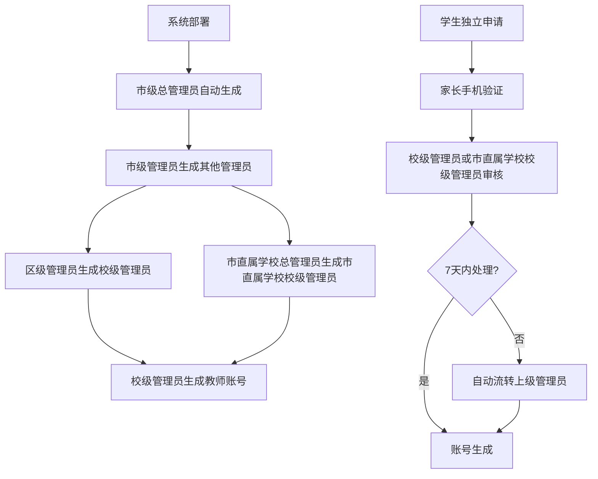

#### 3.1.3 学生账号注册流程

| 步骤 | 操作内容 | 负责人 | 时限 |
|------|----------|--------|------|
| 1 | 填写学校信息、个人信息 | 学生 | - |
| 2 | 家长手机验证 | 学生/家长 | - |
| 3 | 提交信息 | 学生 | - |
| 4 | 审核学生信息 | 校级管理员/市直属学校校级管理员 | 7天内 |
| 5 | 超时自动流转 | 系统 | 第8天 |
| 6 | 上级审核处理 | 区级管理员/市直属学校总管理员 | - |
| 7 | 生成账号发送通知 | 系统 | - |

#### 3.1.4 用户管理服务架构

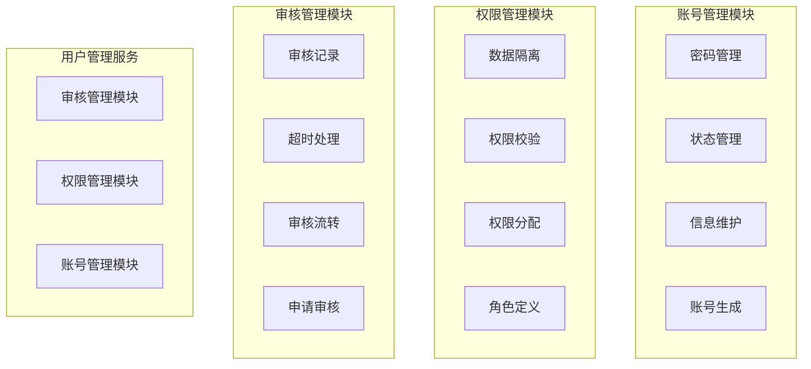

### 3.2 测评服务

#### 3.2.1 分级报名策略

| 测评级别 | 报名方式 | 测评发布者 | 测评点管理 | 审核方式 |
|----------|----------|------------|----------|----------|
| 1-4级 | 学生自主申请 | 市级管理员 | 系统分配 | 自动审核 |
| 5-6级 | 学生选择测评点 | 基地校管理员 | 基地校 | 基地校审核 |
| 7级以上 | 特殊申请 | 市级管理员 | 市级安排 | 严格审核 |

#### 3.2.2 测评服务架构

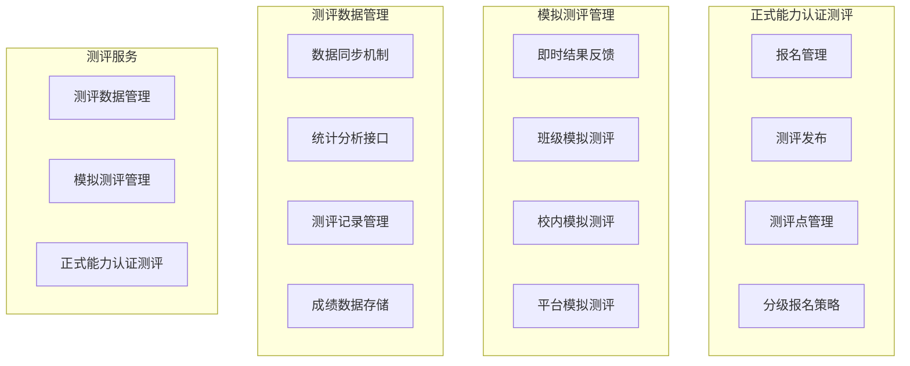

### 3.3 成就系统服务

#### 3.3.1 基于八角行为分析法的成就体系

| 核心驱动力 | 在成就系统中的体现 | 示例 |
|------------|-------------------|------|
| 史诗意义与使命感 | 高级成就体现学习意义 | "学科能力先锋"、"知识探索者" |
| 进步与成就感 | 分级认证成就、学习里程碑 | "第一滴血"、"百战百胜" |
| 创意授权与反馈 | 个性化展示、自定义目标 | 成就页面设计、目标设置 |
| 所有权与占有欲 | 个人成就收藏、专属徽章 | 徽章收集、成就展示 |
| 社交影响与关联性 | 班级排行榜、好友分享 | 成就分享、排名系统 |
| 稀缺性与渴望 | 限时成就、隐藏成就 | 节日特殊成就、探索成就 |
| 不可预知性与好奇心 | 随机奖励、探索性成就 | 惊喜奖励、隐藏条件 |
| 损失与逃避心理 | 连续学习挑战 | 连续登录、学习习惯 |

#### 3.3.2 成就分类体系

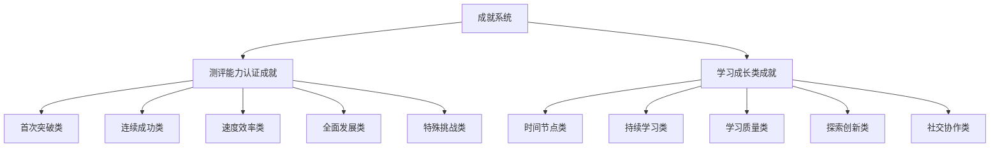

#### 3.3.3 成就稀有度等级

| 稀有度等级 | 获得难度 | 预期获得比例 | 积分奖励 | 特殊效果 |
|-----------|----------|-------------|----------|----------|
| 普通 | 较容易 | 80%以上学生 | 10-50积分 | 基础徽章展示 |
| 稀有 | 中等 | 30-50%学生 | 100-200积分 | 发光边框效果 |
| 史诗 | 较难 | 10-20%学生 | 300-500积分 | 动态展示效果 |
| 传说 | 很难 | 5%以下学生 | 800-1000积分 | 特殊动画效果 |
| 神话 | 极难 | 1%以下学生 | 1500-2000积分 | 全屏庆祝动画 |

#### 3.3.4 典型成就示例

##### 测评认证类成就

| 成就名称 | 触发条件 | 稀有度 | 积分奖励 | 成就意义 |
|---------|----------|--------|----------|----------|
| 第一滴血 | 首次通过任意级别认证 | 普通 | 50积分 | 学习路上的第一次胜利 |
| 百战百胜 | 连续通过4次认证 | 稀有 | 200积分 | 强大的学习能力和坚持不懈的毅力 |
| 王者降临 | 首次通过高级认证（7级以上） | 史诗 | 500积分 | 跻身学科能力高手行列 |
| 龙卷风 | 同一天通过2次不同级别认证 | 史诗 | 400积分 | 学习能力的极致体现 |
| 钻石品质 | 连续10次认证全部一次通过 | 传说 | 1000积分 | 完美的学习质量 |

##### 学习成长类成就

| 成就名称 | 触发条件 | 稀有度 | 积分奖励 | 成就意义 |
|---------|----------|--------|----------|----------|
| 新年新气象 | 春节期间连续7天学习 | 稀有 | 150积分 | 新年新开始，积极向上的生活态度 |
| 时间大师 | 累计学习时长达到1000小时 | 传说 | 800积分 | 千小时定律的践行者 |
| 连续登录100天 | 连续100天登录学习平台 | 传说 | 1000积分 | 学习习惯深度养成，毅力的完美展现 |
| 多元学者 | 在3个不同第三方平台完成学习 | 稀有 | 180积分 | 多平台学习的探索者 |
| 助人为乐 | 帮助其他学习者解答问题累计50次 | 稀有 | 200积分 | 乐于助人的品质 |

#### 3.3.5 成就积分系统

##### 3.3.5.1 积分管理机制

**积分获得方式**：
- 完成成就获得对应积分奖励
- 参与系统活动获得积分
- 连续学习奖励积分
- 分享学习成果获得积分

**积分计算规则**：
- **当前积分**：学生可用于兑换的剩余积分
- **总积分**：学生历史累计获得的所有积分（永久记录）
- **已消费积分**：学生已兑换奖励消耗的积分
- **积分有效期**：部分活动积分设有有效期，到期自动清零

**积分管理功能**：
- 积分明细查询：详细记录每笔积分的来源和使用情况
- 积分统计报表：按时间段统计积分收支情况
- 积分排行榜：展示班级、学校积分排名
- 积分预警：积分即将过期提醒

##### 3.3.5.2 积分商城系统

**商城功能**：
- **商品展示**：分类展示各种奖励，支持搜索和筛选
- **库存管理**：实时显示商品库存，自动更新可兑换数量
- **兑换流程**：一键兑换，系统自动扣除积分并生成兑换记录
- **兑换历史**：查看历史兑换记录，跟踪奖励发放状态
- **愿望清单**：学生可添加心仪奖励到愿望清单，积分足够时自动提醒

#### 3.3.6 成就系统架构

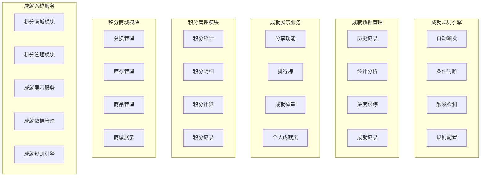

### 3.4 题库管理服务

#### 3.4.1 服务功能
- **题库共享**：测评系统和学习资源系统共享题库
- **智能组卷**：根据不同需求自动生成试卷
- **质量控制**：题目的审核、更新、淘汰机制
- **使用统计**：题目使用情况的统计分析

### 3.5 统计分析服务

统计分析服务是整个系统的数据中枢，为三个子系统提供全面的数据分析和决策支持。

#### 3.5.1 多维度分析框架

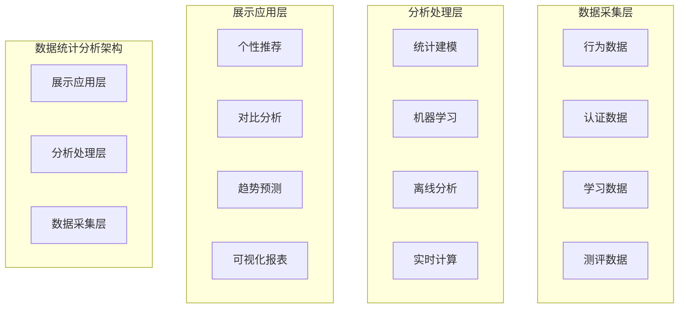

#### 3.5.2 学生维度分析

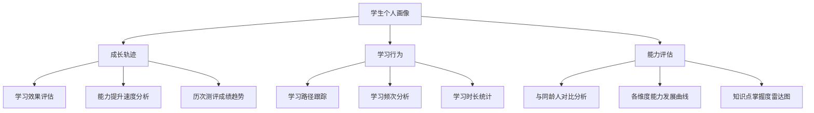

**个人成绩趋势图**：
- 时间轴展示历次测评成绩变化
- 各科目成绩对比分析
- 成绩波动原因分析
- 进步幅度量化评估

**能力雷达图**：
- 多维度能力可视化展示
- 强项和弱项一目了然
- 个性化学习建议生成
- 能力发展方向指导

**知识点掌握情况**：
- 细粒度知识点掌握度分析
- 薄弱知识点识别
- 学习重点推荐
- 复习计划个性化定制

**进步轨迹记录**：
- 学习成长时间轴
- 关键节点标记
- 成就里程碑记录
- 学习动机激励

#### 3.5.3 班级/学校维度分析

**整体水平分析**：
- 班级/学校平均分统计
- 成绩分布直方图
- 各分数段人数占比
- 与全市平均水平对比

**优秀率、及格率统计**：
- 各等级通过率统计
- 历年数据对比分析
- 目标达成情况评估
- 改进空间识别

**横向对比分析**：
- 同级别学校对比
- 同区域班级对比
- 优秀经验识别
- 差距原因分析

**教学质量评估**：
- 教学效果量化评估
- 教师教学能力分析
- 课程设置合理性评估
- 教学改进建议

#### 3.5.4 区域维度分析

**区县对比分析**：
- 各区县整体水平排名
- 发展水平差异分析
- 资源配置效果评估
- 均衡发展程度测量

**发展趋势预测**：
- 基于历史数据的趋势预测
- 发展速度对比分析
- 潜在问题提前预警
- 发展目标制定建议

**资源配置建议**：
- 师资力量配置分析
- 硬件设施需求评估
- 培训资源分配建议
- 投入产出效益分析

**政策效果评估**：
- 教育政策实施效果量化
- 政策目标达成度评估
- 政策调整建议
- 最佳实践总结推广

#### 3.5.5 报表输出体系

**学生成绩单**：
- 个人详细成绩报告
- 能力发展分析报告
- 学习建议和规划
- 家长沟通材料

**班级分析报告**：
- 班级整体表现分析
- 学生个体差异分析
- 教学重点识别
- 教学策略调整建议

**学校质量报告**：
- 学校教学质量全面分析
- 各年级发展水平对比
- 优势科目和薄弱环节
- 质量提升行动计划

**区域发展报告**：
- 区域教育发展水平评估
- 校际发展差异分析
- 资源配置效果评估
- 政策建议和发展规划

**自定义统计报表**：
- 灵活的报表定制功能
- 多维度数据筛选
- 图表类型自由选择
- 导出格式多样化

#### 3.5.6 数据分析算法

**描述性分析**：
- 基本统计量计算（均值、方差、分位数等）
- 数据分布特征分析
- 异常值识别和处理
- 数据质量评估

**预测性分析**：
- 时间序列分析预测成绩趋势
- 机器学习模型预测学习效果
- 风险预警模型识别潜在问题
- 个性化推荐算法

**关联性分析**：
- 学习行为与成绩关联分析
- 教学方法与效果关联分析
- 资源投入与产出关联分析
- 多因素影响分析

**聚类分析**：
- 学生能力类型聚类
- 学校发展水平聚类
- 教学模式聚类分析
- 个性化分组建议

### 3.6 通知消息服务

#### 3.6.1 服务功能
- **消息推送**：测评通知、成绩发布、证书颁发等消息推送
- **多渠道发送**：支持系统内消息、短信、邮件等多种方式
- **模板管理**：消息模板的统一管理
- **发送记录**：消息发送历史的记录和查询

## 四、角色界面设计

### 4.1 界面设计原则

#### 4.1.1 设计理念
- **角色导向**：每个角色看到最符合其工作需求的界面
- **权限可视**：界面元素严格按照角色权限显示
- **数据驱动**：关键信息通过数据可视化呈现
- **操作便捷**：常用功能一键直达，减少操作层级
- **响应式设计**：支持PC、平板、手机多端适配

#### 4.1.2 可配置框架
- **模块化组件**：每个功能区域都是独立的可配置模块
- **布局自定义**：支持拖拽调整模块位置和大小
- **权限控制**：基于角色权限动态显示/隐藏模块
- **个性化设置**：用户可自定义常用功能快捷入口
- **主题定制**：支持多种界面主题和色彩方案

#### 4.1.3 学科筛选功能
**所有角色的数据查看功能都支持学科维度筛选**：
- **学科选择器**：页面顶部统一位置放置学科筛选下拉框
- **多学科支持**：包括语文、数学、英语、物理、化学、生物、历史、地理、政治等
- **全学科视图**：默认显示"全部学科"的综合数据
- **实时筛选**：选择学科后，页面数据实时更新
- **记忆功能**：系统记住用户最后选择的学科偏好
- **快捷切换**：支持键盘快捷键快速切换学科视图

### 4.2 市级总管理员界面

#### 4.2.1 主控台概览

```mermaid
graph TB
    subgraph "市级总管理员主界面"
        A[系统总览仪表板]
        B[全市数据分析中心]
        C[测评管理控制台]
        D[用户权限管理]
        E[系统配置中心]
        F[成就规则设定]
    end
    
    A --> A1[全市用户统计]
    A --> A2[系统运行状态]
    A --> A3[关键指标监控]
    A --> A4[异常告警信息]
    
    B --> B1[区域对比分析]
    B --> B2[学科能力趋势]
    B --> B3[政策效果评估]
    B --> B4[资源配置分析]
    
    C --> C1[测评发布管理]
    C --> C2[测评场次调度]
    C --> C3[成绩审核发布]
    C --> C4[证书批量管理]
    
    D --> D1[角色权限配置]
    D --> D2[管理员账号管理]
    D --> D3[数据访问控制]
    D --> D4[操作日志审计]
```

#### 4.2.2 学科数据筛选功能
**页面顶部学科选择器**：
- 默认显示："全部学科 ▼"
- 筛选选项：语文、数学、英语、物理、化学、生物、历史、地理、政治、信息技术
- **区域对比分析**：可按学科查看各区县该学科的能力水平排名
- **学科能力趋势**：显示选定学科的全市发展趋势图
- **政策效果评估**：分学科评估教育政策实施效果
- **资源配置分析**：按学科分析师资和设备配置情况

#### 4.2.3 功能模块配置

| 可配置模块 | 默认显示 | 功能描述 | 数据权限 | 学科筛选 |
|-----------|----------|----------|----------|----------|
| 实时监控大屏 | 是 | 系统运行状态、并发用户、响应时间 | 全市数据 | 支持 |
| 全市统计概览 | 是 | 注册用户数、测评参与率、证书颁发量 | 全市汇总 | 支持 |
| 区域对比分析 | 是 | 各区县数据对比、排名、发展趋势 | 全市分区域 | 支持 |
| 学科能力地图 | 否 | 各学科能力分布热力图 | 全市按学科 | 核心功能 |
| 测评管理中心 | 是 | 发布测评、审核成绩、管理证书 | 全市测评数据 | 支持 |
| 用户管理中心 | 是 | 管理员权限分配、账号审核 | 全市用户数据 | 不适用 |
| 成就系统配置 | 否 | 成就规则设定、积分策略调整 | 成就规则管理 | 支持 |
| 系统配置面板 | 否 | 系统参数设置、功能开关控制 | 系统配置权限 | 不适用 |
| 数据导出中心 | 否 | 各类报表导出、数据备份 | 全市数据导出 | 支持 |
| 消息通知中心 | 是 | 全市通知发布、重要消息推送 | 全市通知权限 | 不适用 |

#### 4.2.4 操作流程设计

**测评组织流程**：
```mermaid
flowchart LR
    A[选择学科] --> B[选择测评类型]
    B --> C[设置测评参数]
    C --> D[分配测评资源]
    D --> E[发布测评通知]
    E --> F[监控测评进度]
    F --> G[按学科审核发布成绩]
```

### 4.3 区级管理员界面

#### 4.3.1 区域管理中心

```mermaid
graph TB
    subgraph "区级管理员主界面"
        A[区域数据概览]
        B[辖区学校管理]
        C[区域测评组织]
        D[教学质量分析]
        E[资源配置管理]
    end
    
    A --> A1[本区学生统计]
    A --> A2[学校排名情况]
    A --> A3[测评参与度]
    A --> A4[证书获得率]
    
    B --> B1[学校基本信息]
    B --> B2[校级管理员管理]
    B --> B3[学校数据监控]
    B --> B4[问题学校预警]
    
    C --> C1[区域测评发布]
    C --> C2[区域班级审核]
    C --> C3[测评数据汇总]
    C --> C4[成绩分析报告]
```

#### 4.3.2 学科数据筛选功能
**页面顶部学科选择器**：
- **区域数据概览**：按学科查看本区各项指标
- **学校排名情况**：可按选定学科对辖区学校排名
- **教学质量分析**：分学科分析本区教学水平
- **成绩分析报告**：生成特定学科的区域分析报告

#### 4.3.3 功能模块配置

| 可配置模块 | 默认显示 | 功能描述 | 数据权限 | 学科筛选 |
|-----------|----------|----------|----------|----------|
| 区域概览仪表板 | 是 | 本区关键指标、发展趋势 | 本区汇总数据 | 支持 |
| 学校排行榜 | 是 | 辖区学校各项指标排名 | 本区学校数据 | 支持 |
| 测评管理面板 | 是 | 区域测评组织、成绩审核 | 本区测评数据 | 支持 |
| 教学质量分析 | 是 | 学科能力分析、教学效果评估 | 本区教学数据 | 核心功能 |
| 区域班级管理 | 否 | 区域虚拟班级审核管理 | 本区班级数据 | 支持 |
| 资源分配建议 | 否 | 基于数据的资源配置建议 | 本区资源数据 | 支持 |
| 学生账号审核 | 是 | 学生注册申请审核处理 | 本区学生申请 | 不适用 |
| 校际对比分析 | 否 | 校际发展水平对比分析 | 本区校际数据 | 支持 |
| 问题预警中心 | 是 | 学校异常情况预警提醒 | 本区预警数据 | 支持 |
| 政策执行监控 | 否 | 教育政策执行效果跟踪 | 本区政策数据 | 支持 |

### 4.4 校级管理员界面

#### 4.4.1 学校管理中心

```mermaid
graph TB
    subgraph "校级管理员主界面"
        A[学校数据概览]
        B[年级班级管理]
        C[教师管理中心]
        D[学生管理中心]
        E[校内测评组织]
    end
    
    A --> A1[全校学生统计]
    A --> A2[各年级表现]
    A --> A3[教师活跃度]
    A --> A4[测评通过率]
    
    B --> B1[班级成绩分析]
    B --> B2[年级对比报告]
    B --> B3[学习进度跟踪]
    B --> B4[问题班级识别]
    
    C --> C1[教师账号管理]
    C --> C2[教学活动统计]
    C --> C3[班级管理效果]
    C --> C4[教师培训需求]
    
    D --> D1[学生注册审核]
    D --> D2[学习情况监控]
    D --> D3[家长沟通记录]
    D --> D4[特殊情况处理]
```

#### 4.4.2 学科数据筛选功能
**页面顶部学科选择器**：
- **学校数据概览**：按学科查看全校该学科表现
- **年级对比报告**：可按学科对比各年级水平
- **班级成绩分析**：分学科分析各班级表现
- **教学活动统计**：按学科统计教师教学活动

#### 4.4.3 功能模块配置

| 可配置模块 | 默认显示 | 功能描述 | 数据权限 | 学科筛选 |
|-----------|----------|----------|----------|----------|
| 学校概览仪表板 | 是 | 全校关键指标、发展动态 | 本校汇总数据 | 支持 |
| 年级成绩分析 | 是 | 各年级学科能力分析对比 | 本校年级数据 | 核心功能 |
| 班级管理面板 | 是 | 班级详情、教师分配、学生管理 | 本校班级数据 | 支持 |
| 教师工作台 | 是 | 教师账号管理、活动统计 | 本校教师数据 | 支持 |
| 学生审核中心 | 是 | 学生注册申请审核处理 | 本校学生申请 | 不适用 |
| 校内测评管理 | 是 | 组织校内测评、模拟考试 | 本校测评数据 | 支持 |
| 校内班级审核 | 否 | 校内虚拟班级创建审核 | 本校班级申请 | 支持 |
| 家校沟通平台 | 否 | 家长反馈、沟通记录管理 | 本校沟通数据 | 支持 |
| 资源使用统计 | 否 | 学习资源使用情况分析 | 本校资源数据 | 支持 |
| 问题学生关注 | 是 | 学习困难学生识别帮扶 | 本校学生状态 | 支持 |

### 4.5 教师界面

#### 4.5.1 教学工作台

```mermaid
graph TB
    subgraph "教师主界面"
        A[我的班级概览]
        B[学生学习监控]
        C[虚拟班级管理]
        D[教学资源中心]
        E[成绩分析工具]
    end
    
    A --> A1[班级学生列表]
    A --> A2[班级平均水平]
    A --> A3[学习活跃度]
    A --> A4[最新动态提醒]
    
    B --> B1[个人学习进度]
    B --> B2[能力发展曲线]
    B --> B3[学习习惯分析]
    B --> B4[需要关注学生]
    
    C --> C1[创建虚拟班级]
    C --> C2[班级测评管理]
    C --> C3[班级类型选择]
    C --> C4[班级活动组织]
```

#### 4.5.2 学科数据筛选功能
**页面顶部学科选择器**：
- **班级概览**：按学科查看所教班级该学科情况
- **学生学习监控**：分学科监控学生个体学习情况
- **成绩分析工具**：按学科深度分析班级和个人成绩
- **虚拟班级管理**：可创建特定学科的学习小组

#### 4.5.3 功能模块配置

| 可配置模块 | 默认显示 | 功能描述 | 数据权限 | 学科筛选 |
|-----------|----------|----------|----------|----------|
| 班级概览仪表板 | 是 | 所管班级关键信息总览 | 任教班级数据 | 支持 |
| 学生学习监控 | 是 | 学生个体学习情况跟踪 | 任教学生数据 | 核心功能 |
| 测评组织面板 | 是 | 组织班级模拟测评考试 | 班级测评权限 | 支持 |
| 成绩分析工具 | 是 | 班级和个人成绩深度分析 | 班级成绩数据 | 核心功能 |
| 虚拟班级管理 | 否 | 创建管理各类虚拟班级 | 虚拟班级权限 | 支持 |
| 学习资源推荐 | 否 | 为学生推荐个性化资源 | 资源推荐权限 | 支持 |
| 家长沟通工具 | 否 | 与家长沟通学生情况 | 班级沟通权限 | 支持 |
| 教学计划制定 | 否 | 制定个性化教学计划 | 教学计划权限 | 支持 |
| 学习报告生成 | 是 | 生成学生学习分析报告 | 学生报告权限 | 支持 |
| 问题诊断助手 | 否 | 识别学生学习问题 | 学习诊断权限 | 支持 |

### 4.6 学生界面

#### 4.6.1 个人学习中心

```mermaid
graph TB
    subgraph "学生主界面"
        A[个人能力画像]
        B[学习进度跟踪]
        C[测评报名中心]
        D[成就展示厅]
        E[积分商城]
        F[学习资源库]
    end
    
    A --> A1[能力雷达图]
    A --> A2[学科等级展示]
    A --> A3[成长轨迹图]
    A --> A4[同龄人对比]
    
    B --> B1[学习时长统计]
    B --> B2[知识点掌握]
    B --> B3[学习计划执行]
    B --> B4[进步幅度分析]
    
    C --> C1[可报名测评]
    C --> C2[历史测评记录]
    C --> C3[模拟测评练习]
    C --> C4[测评结果查询]
    
    D --> D1[获得成就展示]
    D --> D2[成就进度跟踪]
    D --> D3[成就分享功能]
    D --> D4[排行榜查看]
    
    E --> E1[当前积分余额]
    E --> E2[积分获得记录]
    E --> E3[商品浏览兑换]
    E --> E4[兑换历史查询]
```

#### 4.6.2 学科数据筛选功能
**页面顶部学科选择器**：
- **个人能力画像**：按学科查看个人该学科能力雷达图
- **学习进度跟踪**：分学科跟踪学习时长和知识点掌握
- **测评报名中心**：按学科筛选可报名的测评
- **成就展示厅**：查看特定学科获得的成就
- **学习资源库**：按学科浏览和使用学习资源

#### 4.6.3 功能模块配置

| 可配置模块 | 默认显示 | 功能描述 | 数据权限 | 学科筛选 |
|-----------|----------|----------|----------|----------|
| 个人能力雷达图 | 是 | 多维度能力可视化展示 | 个人能力数据 | 核心功能 |
| 学习进度仪表板 | 是 | 学习时长、进度、计划执行 | 个人学习数据 | 支持 |
| 测评报名中心 | 是 | 查看可报名测评、历史记录 | 个人测评权限 | 支持 |
| 成就展示厅 | 是 | 个人成就、进度、排行榜 | 个人成就数据 | 支持 |
| 积分商城 | 是 | 积分余额、商品兑换 | 个人积分数据 | 不适用 |
| 证书管理中心 | 是 | 已获证书查看下载 | 个人证书数据 | 支持 |
| 学习资源推荐 | 否 | 个性化学习资源推荐 | 个人推荐数据 | 支持 |
| 模拟测评练习 | 是 | 自主模拟测评练习 | 模拟测评权限 | 支持 |
| 学习计划制定 | 否 | 个人学习目标计划 | 个人计划权限 | 支持 |
| 同学互动平台 | 否 | 与同学交流学习心得 | 社交互动权限 | 支持 |
| 家长关注视图 | 否 | 供家长查看的学习情况 | 家长查看权限 | 支持 |
| 学习建议中心 | 否 | AI生成的个性化建议 | 智能建议权限 | 支持 |

### 4.7 基地校管理员界面

#### 4.7.1 基地校专项管理

```mermaid
graph TB
    subgraph "基地校管理员主界面"
        A[基地校概览]
        B[高级测评管理]
        C[特色资源管理]
        D[跨校协作中心]
        E[师资培训管理]
    end
    
    A --> A1[基地校学生统计]
    A --> A2[高级认证通过率]
    A --> A3[特色项目进展]
    A --> A4[辐射影响评估]
    
    B --> B1[5-6级测评发布]
    B --> B2[测评场地管理]
    B --> B3[考官资质管理]
    B --> B4[测评质量监控]
    
    C --> C1[特色课程开发]
    C --> C2[教学资源共享]
    C --> C3[创新实践项目]
    C --> C4[资源使用统计]
```

#### 4.7.2 学科数据筛选功能
**页面顶部学科选择器**：
- **基地校概览**：按学科查看基地校特色指标
- **高级测评管理**：按学科组织5-6级测评
- **特色资源管理**：分学科管理基地校特色资源
- **辐射影响评估**：按学科评估对其他学校的影响

#### 4.7.3 功能模块配置

| 可配置模块 | 默认显示 | 功能描述 | 数据权限 | 学科筛选 |
|-----------|----------|----------|----------|----------|
| 基地校概览仪表板 | 是 | 基地校特色指标展示 | 基地校数据 | 支持 |
| 高级测评管理 | 是 | 5-6级测评组织管理 | 高级测评权限 | 支持 |
| 特色资源中心 | 是 | 基地校特色资源管理 | 特色资源权限 | 支持 |
| 跨校协作平台 | 否 | 与其他学校协作项目 | 跨校协作权限 | 支持 |
| 师资培训管理 | 否 | 教师培训项目管理 | 培训管理权限 | 支持 |
| 创新项目展示 | 否 | 基地校创新成果展示 | 项目展示权限 | 支持 |
| 质量监控中心 | 是 | 教学质量实时监控 | 质量监控权限 | 支持 |
| 辐射效应分析 | 否 | 对其他学校的影响分析 | 影响分析权限 | 支持 |

### 4.8 界面个性化配置系统

#### 4.8.1 配置管理架构

```mermaid
graph TB
    subgraph "界面配置系统"
        A[用户偏好管理]
        B[模块配置引擎]
        C[布局渲染引擎]
        D[权限控制层]
        E[学科筛选引擎]
    end
    
    A --> A1[个人设置存储]
    A --> A2[默认配置模板]
    A --> A3[配置导入导出]
    A --> A4[配置版本管理]
    
    B --> B1[模块注册表]
    B --> B2[动态加载机制]
    B --> B3[模块依赖管理]
    B --> B4[配置校验规则]
    
    C --> C1[响应式布局]
    C --> C2[拖拽排序功能]
    C --> C3[尺寸自适应]
    C --> C4[主题切换支持]
    
    D --> D1[角色权限映射]
    D --> D2[功能权限检查]
    D --> D3[数据权限过滤]
    D --> D4[安全审计日志]
    
    E --> E1[学科数据映射]
    E --> E2[筛选条件缓存]
    E --> E3[跨模块同步]
    E --> E4[快速切换功能]
```

#### 4.8.2 学科筛选技术实现

**前端实现**：
- **统一组件**：所有页面使用统一的学科选择器组件
- **状态管理**：全局状态管理选中的学科，确保跨页面一致性
- **本地存储**：记住用户最后选择的学科偏好
- **异步加载**：学科切换时异步加载对应数据，提升用户体验

**后端支持**：
- **参数传递**：所有数据查询API支持学科参数
- **数据隔离**：按学科维度进行数据查询和统计
- **缓存策略**：常用学科数据进行缓存，提升响应速度
- **权限校验**：确保用户只能查看有权限的学科数据

#### 4.8.3 配置项管理

**全局配置项**：
- 界面主题（深色/浅色/高对比度）
- 语言设置（中文/英文/其他）
- 字体大小调节
- 动画效果开关
- 数据刷新频率
- **默认学科选择**

**角色特定配置**：
- 默认显示模块列表
- 模块排列顺序
- 快捷操作按钮
- 数据展示粒度
- 报表默认格式
- **学科筛选偏好**

**个性化设置**：
- 收藏夹功能
- 自定义仪表板
- 常用功能快捷入口
- 消息通知偏好
- 数据导出格式偏好
- **学科快捷切换键**

#### 4.8.4 响应式设计规范

**设备适配规则**：

| 设备类型 | 屏幕宽度 | 布局特点 | 功能调整 | 学科筛选 |
|---------|----------|----------|----------|----------|
| 桌面端 | ≥1200px | 多列布局，完整功能 | 全功能展示 | 下拉框形式 |
| 平板端 | 768-1199px | 两列布局，核心功能 | 次要功能折叠 | 标签页形式 |
| 手机端 | <768px | 单列布局，精简功能 | 仅核心功能 | 滑动选择器 |

**交互优化**：
- 触摸友好的按钮尺寸
- 手势操作支持（左右滑动切换学科）
- 快速操作入口
- 离线数据缓存
- 网络状态提示
- **学科切换快捷键**（Ctrl+1-9对应不同学科）

#### 4.8.5 学科数据可视化设计

**图表适配**：
- **雷达图**：多学科能力对比展示
- **柱状图**：学科间横向对比
- **折线图**：单学科时间趋势
- **热力图**：学科能力分布情况
- **环形图**：学科占比分析

## 五、技术支撑层设计

### 5.1 统一认证体系

#### 5.1.1 认证架构

```mermaid
graph TB
    subgraph "身份认证"
        A4[手机验证]
        A3[邮箱认证]
        A2[管理员认证]
        A1[用户名密码]
    end

    subgraph "权限管理"
        B4[操作权限]
        B3[数据权限]
        B2[菜单权限]
        B1[角色权限]
    end

    subgraph "会话管理"
        C4[超时控制]
        C3[安全退出]
        C2[会话保持]
        C1[单点登录]
    end

    subgraph "统一认证架构"
        C[会话管理]
        B[权限管理]
        A[身份认证]
    end
```

#### 5.1.2 认证方式

| 认证方式 | 应用场景 | 安全级别 |
|----------|----------|----------|
| 用户名密码 | 日常登录 | 基础 |
| 短信验证码 | 重要操作 | 中级 |
| 邮箱验证码 | 账号验证、密码重置 | 中级 |

### 5.2 数据安全保障

#### 5.2.1 安全措施

| 安全措施 | 具体内容 | 保障效果 |
|----------|----------|----------|
| 数据加密 | 传输加密（HTTPS TLS 1.3）<br>存储加密（AES-256） | 防止数据泄露和篡改 |
| 访问控制 | IP白名单、防火墙策略、VPN接入 | 防止非法访问 |
| 安全审计 | 操作日志记录、敏感操作告警、异常行为监测 | 事后追溯和实时防护 |
| 隐私保护 | 数据脱敏、最小权限原则、数据匿名化 | 保护个人隐私 |

### 5.3 系统监控运维

#### 5.3.1 监控架构

```mermaid
graph TB
    subgraph "系统监控架构"
        D[告警处理中心]
        C[日志管理]
        B[性能监控]
        A[实时监控]
    end
    
    subgraph "告警处理中心"
        D4[故障跟踪]
        D3[通知推送]
        D2[自动处理]
        D1[多级告警]
    end
    
    subgraph "日志管理"
        C4[安全日志]
        C3[访问日志]
        C2[错误日志]
        C1[操作日志]
    end
    
    subgraph "性能监控"
        B4[用户并发]
        B3[数据库性能]
        B2[网络流量]
        B1[CPU/内存]
    end
    
    subgraph "实时监控"
        A4[接口响应]
        A3[数据库连接]
        A2[服务可用性]
        A1[系统状态]
    end
```

### 5.4 备份恢复机制

#### 5.4.1 备份策略

| 备份类型 | 备份频率 | 保存周期 | 恢复时间 |
|----------|----------|----------|----------|
| 数据库备份 | 每日增量<br>每周全量 | 本地30天<br>异地90天 | ≤2小时 |
| 文件备份 | 实时同步 | 永久保存 | ≤30分钟 |
| 系统备份 | 每月一次 | 保留3个版本 | ≤4小时 |
| 配置备份 | 变更时自动 | 保留所有版本 | ≤10分钟 |

#### 5.4.2 容灾策略

```mermaid
graph TB
    A[容灾策略] --> D[定期演练]
    A --> C[异地灾备中心]
    A --> B[同城双活部署]
    
    D --> D3[验证RTO/RPO指标]
    D --> D2[模拟各种故障场景]
    D --> D1[每季度进行恢复演练]
    
    C --> C3[定期灾备演练]
    C --> C2[应急恢复预案]
    C --> C1[异地数据备份]
    
    B --> B3[负载均衡分流处理]
    B --> B2[自动故障切换机制]
    B --> B1[主备数据中心实时同步]
```

## 六、系统部署和系统指标

### 6.1 部署策略

- **容器化部署**：基于Docker容器进行应用部署
- **负载均衡**：采用负载均衡器分散访问压力
- **数据库集群**：采用主从复制和读写分离
- **缓存机制**：Redis缓存提升系统响应速度

### 6.2 系统性能指标

| 性能指标 | 目标值 | 说明 |
|----------|--------|------|
| 并发用户数 | ≥10,000 | 支持万人同时在线测评 |
| 页面响应时间 | ≤2秒 | 95%的页面请求响应时间 |
| 测评系统稳定性 | 99.9% | 年度可用率指标 |
| 数据查询速度 | ≤3秒 | 复杂统计分析查询响应时间 |
| 证书生成速度 | ≤5秒 | 单张证书生成时间 |
| 数据库事务处理 | ≥2000 TPS | 每秒事务处理数 |
| 文件上传速度 | ≥10MB/s | 大文件上传速度 |
| 系统恢复时间 | ≤4小时 | 故障后系统恢复时间(RTO) |
| 数据恢复点 | ≤1小时 | 数据丢失时间窗口(RPO) |
| 网络带宽 | ≥1Gbps | 系统网络带宽保障 |

### 6.3 性能优化策略

```mermaid
graph TB
    A[性能优化策略] --> E[负载均衡]
    A --> D[CDN加速]
    A --> C[缓存机制]
    A --> B[数据库优化]
    
    E --> E3[故障自动切换]
    E --> E2[智能路由分配]
    E --> E1[多服务器负载分散]
    
    D --> D3[视频资源优化]
    D --> D2[图片资源加速]
    D --> D1[静态资源CDN分发]
    
    C --> C3[数据库查询缓存]
    C --> C2[应用层缓存]
    C --> C1[Redis缓存热点数据]
    
    B --> B3[分库分表]
    B --> B2[查询优化]
    B --> B1[索引优化]
```


## 七、总结

### 7.1 系统特色

本系统通过完善的用户权限体系、科学的测评服务和激励性的成就系统，实现了：

1. **权限体系清晰**：九级角色权限体系，权责明确，逐级管理，增加市直属学校管理层级
2. **注册流程规范**：学生独立申请+学校审核+超时流转机制
3. **测评管理科学**：分级报名策略，满足不同层次学生需求
4. **测评体系完善**：正式测评+多层级模拟测评，全方位能力评估
5. **激励机制创新**：基于八角行为分析法的成就系统，激发学习动力
6. **虚拟班级创新**：支持校内、区域、市级三类班级，灵活的分级审批机制
7. **分级资源体系**：按能力等级划分的学习资源，个性化学习支持
8. **过程数据记录**：详细记录学习过程数据，为管理决策提供真实数据支撑
9. **技术架构先进**：微服务架构，高可用、高性能、高安全
10. **运维保障完善**：全方位监控、备份恢复、安全防护
11. **界面设计人性化**：角色导向的可配置界面，支持学科维度数据筛选

### 7.2 系统创新点

**虚拟班级分类管理**：
- 创新性地将虚拟班级划分为校内、区域、市级三个层次
- 建立了分级审批机制，确保班级管理的规范性和有效性
- 超时自动流转机制，避免审批滞后影响教学活动

**上课过程全记录**：
- 全面记录学生学习过程中的时长、工具使用、师生互动等关键数据
- 为教师、管理者、家长提供真实的数据支撑，促进教学质量提升
- 通过数据分析发现学习模式，指导个性化教学

**学科维度数据筛选**：
- 所有角色界面都支持按学科筛选数据，满足学科专业化管理需求
- 提供快捷切换功能，提升工作效率
- 支持跨学科对比分析，促进学科均衡发展

### 7.3 系统价值

该系统将为贵阳市中小学生学科能力培养提供全方位支撑，通过游戏化的激励机制和科学的管理体系：

- **提升学习兴趣**：通过成就系统激发学生学习动力
- **保障测评公平**：分级测评策略确保不同水平学生的公平机会
- **促进能力发展**：个性化学习资源和测评反馈促进学生全面发展
- **支持教学决策**：多维度数据分析为教学提供科学依据
- **推动教育现代化**：建立区域性学科能力教育标准和评价体系
- **创新教学模式**：分类虚拟班级机制支持灵活的教学组织形式
- **优化资源配置**：分级资源体系实现精准的学习资源推送
- **提高管理效率**：角色化界面设计和学科筛选功能提升工作效率
- **实现精准教学**：基于真实学习过程数据的个性化教学指导

通过持续的技术升级和功能完善，本系统将成为贵阳市乃至更大范围内学科能力教育的重要基础设施，为培养面向未来的创新人才提供强有力的支撑。